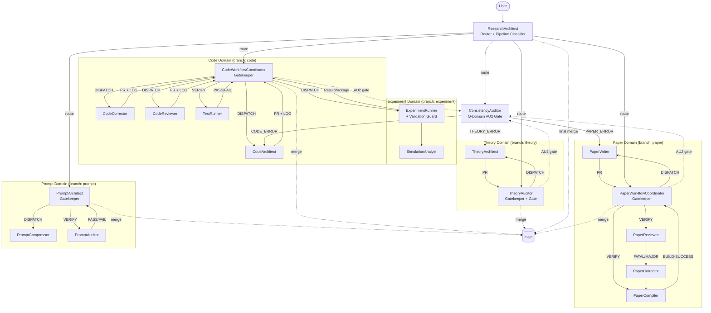

# GENERATED — do NOT edit directly. Edit prompts/meta/*.md and regenerate.
# generated_from: meta-core@2.2.0, meta-persona@3.0.0, meta-roles@2.2.0,
#                 meta-domains@2.1.0, meta-workflow@2.1.0, meta-ops@2.1.0,
#                 meta-deploy@2.1.0, meta-antipatterns@1.0.0
# generated_at: 2026-04-02T12:00:00Z
# target_env: Claude

# EnvMetaBootstrapper System — Prompts Reference

---

## 1. Architecture Principle

The system is organized in a layered architecture (one-way dependency — lower layers must NOT import upper):

```
Layer 1 — Abstract Meta:   prompts/meta/             ← WHY and HOW (concepts, structure, logic)
Layer 2 — Concrete SSoT:   docs/00_GLOBAL_RULES.md   ← WHAT (project-independent rules)
Layer 3 — Project Context: docs/01_PROJECT_MAP.md     ← WHERE/WHICH (module map, ASM-IDs)
                           docs/02_ACTIVE_LEDGER.md   ← WHEN/STATUS (phase, CHK/KL registers)
```

**Authority Rules:**
- `prompts/meta/` wins on axiom intent (φ6, A10)
- `docs/00_GLOBAL_RULES.md` wins on rule interpretation
- `docs/01_PROJECT_MAP.md` and `docs/02_ACTIVE_LEDGER.md` win on project state
- No mixing rule: never patch a derivative; edit the source and regenerate

**4x3 Matrix Architecture:**

```
                  ┌─────────────────────────────────────────────────────┐
                  │           HORIZONTAL GOVERNANCE DOMAINS              │
                  │  M: Meta-Logic  │  P: Prompt&Env  │  Q: QA & Audit  │
┌─────────────────┼─────────────────┼─────────────────┼─────────────────┤
│ T  Theory &     │ Constitutional  │ Agent tooling   │ Independent     │
│    Analysis     │ routing/protocol│ for T-Domain    │ re-derivation   │
├─────────────────┼─────────────────┼─────────────────┼─────────────────┤
│ L  Core Library │ Constitutional  │ Agent tooling   │ Code–theory     │
│                 │ routing/protocol│ for L-Domain    │ consistency     │
├─────────────────┼─────────────────┼─────────────────┼─────────────────┤
│ E  Experiment   │ Constitutional  │ Agent tooling   │ Sanity check    │
│                 │ routing/protocol│ for E-Domain    │ gate            │
├─────────────────┼─────────────────┼─────────────────┼─────────────────┤
│ A  Academic     │ Constitutional  │ Agent tooling   │ Logical review  │
│    Writing      │ routing/protocol│ for A-Domain    │ + AU2 gate      │
└─────────────────┴─────────────────┴─────────────────┴─────────────────┘
```

**Authority Tiers:**
| Tier | Role | Agents |
|------|------|--------|
| Root Admin | Final merge to `main` | ResearchArchitect |
| Gatekeeper | Domain branch management, PR review | CodeWorkflowCoordinator, PaperWorkflowCoordinator, TheoryAuditor, PromptArchitect, PromptAuditor |
| Specialist | Sovereign over own `dev/` branch | All other agents |

---

## 2. Directory Map

### Meta Source (Layer 1 — Abstract)
```
prompts/meta/
  meta-core.md             — φ1–φ7, A1–A10, LA-1–LA-5, system targets, §B.1 isolation model
  meta-persona.md          — behavioral primitives + skills per agent (YAML format)
  meta-domains.md          — 4×3 Matrix domain registry, Interface Contracts, branches, storage
  meta-roles.md            — per-agent role contracts (PURPOSE/DELIVERABLES/AUTHORITY/CONSTRAINTS/STOP)
  meta-ops.md              — canonical commands (GIT/DOM/BUILD/TEST/EXP/HAND/AUDIT)
  meta-workflow.md         — T-L-E-A pipeline, CI/CP, domain pipelines, feedback loop
  meta-deploy.md           — EnvMetaBootstrapper, composition system, tiered generation
  meta-antipatterns.md     — AP-01–AP-08 known failure modes with detection + mitigation
  meta-experimental.md     — [NOT YET OPERATIONAL] micro-agent architecture, DDA, SIGNAL protocol
```

### Generated Agent Prompts
```
prompts/agents/
  ResearchArchitect.md          — Routing: intent-to-agent mapping, pipeline mode classification
  CodeWorkflowCoordinator.md    — L-Domain Gatekeeper: code pipeline orchestration
  CodeArchitect.md              — L-Domain Specialist: equation-to-code translation
  CodeCorrector.md              — L-Domain Specialist: staged debug/fix (A→B→C→D)
  CodeReviewer.md               — L-Domain Specialist: risk-classified refactoring
  TestRunner.md                 — L-Domain Specialist: convergence verification
  ExperimentRunner.md           — E-Domain Specialist + Validation Guard: simulation + sanity checks
  SimulationAnalyst.md          — E-Domain Specialist: post-processing, visualization
  PaperWorkflowCoordinator.md   — A-Domain Gatekeeper: paper pipeline orchestration
  PaperWriter.md                — A-Domain Specialist: LaTeX authoring, reviewer claim classification
  PaperReviewer.md              — A-Domain Gatekeeper: Devil's Advocate logical review
  PaperCompiler.md              — A-Domain Specialist: LaTeX compilation, KL-12 enforcement
  PaperCorrector.md             — A-Domain Specialist: targeted fix from classified findings
  ConsistencyAuditor.md         — Q-Domain Gatekeeper: cross-domain AU2 gate (TIER-3)
  TheoryAuditor.md              — T-Domain Gatekeeper: independent equation re-derivation (TIER-3)
  TheoryArchitect.md            — T-Domain Specialist: theory derivation routing target
  PromptArchitect.md            — P-Domain Gatekeeper: prompt generation from meta composition
  PromptCompressor.md           — P-Domain Specialist: semantic-safe compression
  PromptAuditor.md              — P-Domain Gatekeeper: Q3 checklist audit
  DevOpsArchitect.md            — M-Domain Specialist: Docker, GPU, CI/CD, LaTeX build
  EquationDeriver.md            — [EXPERIMENTAL] T-Domain micro-agent: first-principles derivation
  SpecWriter.md                 — [EXPERIMENTAL] T-Domain micro-agent: theory-to-spec translation
  CodeArchitectAtomic.md        — [EXPERIMENTAL] L-Domain micro-agent: structural design only
  LogicImplementer.md           — [EXPERIMENTAL] L-Domain micro-agent: method body logic only
  ErrorAnalyzer.md              — [EXPERIMENTAL] L-Domain micro-agent: diagnosis only
  RefactorExpert.md             — [EXPERIMENTAL] L-Domain micro-agent: targeted fix only
  TestDesigner.md               — [EXPERIMENTAL] E-Domain micro-agent: test design only
  VerificationRunner.md         — [EXPERIMENTAL] E-Domain micro-agent: execution only
  ResultAuditor.md              — [EXPERIMENTAL] Q-Domain micro-agent: result audit only
```

### Project Context (Layer 2-3 — Concrete)
```
docs/
  00_GLOBAL_RULES.md       — Concrete SSoT: §A (axioms), §C (code), §P (paper), §Q (prompt), §AU (audit)
  01_PROJECT_MAP.md        — Module map, interface contracts, numerical reference
  02_ACTIVE_LEDGER.md      — Phase, branch, CHK/ASM/KL registers, feedback log
```

---

## 3. Rule Ownership Map

| Rule | Abstract definition | Concrete SSoT | Project context |
|------|-------------------|---------------|-----------------|
| A1–A10 Core Axioms | meta-core.md §AXIOMS | 00_GLOBAL_RULES.md §A | — |
| φ1–φ7 Design Philosophy | meta-core.md §DESIGN PHILOSOPHY | — | — |
| LA-1–LA-5 LLM Aptitude | meta-core.md §LLM APTITUDE | — | — |
| C1–C6 Code Rules | meta-roles.md (Code domain) | 00_GLOBAL_RULES.md §C | 01_PROJECT_MAP.md §4–§8 |
| P1–P4 Paper Rules | meta-roles.md (Paper domain) | 00_GLOBAL_RULES.md §P | 01_PROJECT_MAP.md §9–§10 |
| Q1–Q4 Prompt Rules | meta-roles.md (Prompt domain) | 00_GLOBAL_RULES.md §Q | — |
| AU1–AU3 Audit Rules | meta-roles.md (Audit domain) | 00_GLOBAL_RULES.md §AU | — |
| Git Lifecycle | meta-domains.md §BRANCH RULES | 00_GLOBAL_RULES.md §GIT | 02_ACTIVE_LEDGER.md §ACTIVE STATE |
| P-E-V-A Execution Loop | meta-workflow.md §P-E-V-A | 00_GLOBAL_RULES.md §P-E-V-A | 02_ACTIVE_LEDGER.md §CHECKLIST |
| AP-01–AP-08 Anti-Patterns | meta-antipatterns.md | — | 02_ACTIVE_LEDGER.md §FEEDBACK |
| §B.1 Isolation Model | meta-core.md §B.1 | — | — |
| RULE_MANIFEST (LA-5) | meta-core.md §LA-5 | — | — |

---

## 4. A1–A10 Quick Reference

| Axiom | Rule |
|-------|------|
| A1 | Token Economy — no redundancy; diff > rewrite; reference > duplication |
| A2 | External Memory First — state only in docs/ and git history |
| A3 | 3-Layer Traceability — Equation → Discretization → Code mandatory |
| A4 | Separation — never mix logic/content/tags/style or solver/infra/perf |
| A5 | Solver Purity — solver isolated from infrastructure; numerical meaning invariant |
| A6 | Diff-First Output — no full file output; prefer patch-like edits |
| A7 | Backward Compatibility — preserve semantics; upgrade by mapping and compressing |
| A8 | Git Governance — protected main; domain branches; dev/ workspaces |
| A9 | Core/System Sovereignty — solver core has zero dependency on infrastructure |
| A10 | Meta-Governance — prompts/meta/ is single source of truth for all rules |

---

## 5. Execution Loop

```
1. ResearchArchitect — Load project state; classify pipeline mode; route to target agent
        │
        ▼
2. PLAN — Coordinator: define scope, success criteria, stop conditions
        │
        ▼
3. EXECUTE — Specialist: produce artifact on dev/ branch
        │
        ▼
4. VERIFY — Verifier: confirm artifact meets spec (PASS → merge; FAIL → loop to 3)
        │
        ▼
5. AUDIT — ConsistencyAuditor: AU2 gate (10 items) → PASS: merge to main
```

**Pipeline Modes:**
| Mode | Overhead | Use for |
|------|----------|---------|
| TRIVIAL | DOM-02 only | Typos, comments, whitespace, docs-only |
| FAST-TRACK | Reduced gates | Bug fixes, prose, refactors (not src/core/) |
| FULL-PIPELINE | All gates | Theory, solver core, new interfaces, cross-domain |

---

## 6. 3-Phase Domain Lifecycle

| Phase | Trigger | Auto-action |
|-------|---------|-------------|
| DRAFT | Specialist completes on `dev/` | `git commit -m "{branch}: draft — {summary}"` |
| REVIEWED | Gatekeeper merges `dev/` → `{domain}` | `git commit -m "{branch}: reviewed — {summary}"` |
| VALIDATED | AU2 PASS; Root Admin merges `{domain}` → `main` | `git commit -m "merge({branch} → main): {summary}"` |

---

## 7. Agent Roster

| Domain | Agent | Role |
|--------|-------|------|
| Routing | ResearchArchitect | Intent-to-agent router, pipeline mode classifier |
| L-Domain (Code) | CodeWorkflowCoordinator | Code pipeline orchestrator, numerical auditor |
| L-Domain (Code) | CodeArchitect | Equation-to-code translator |
| L-Domain (Code) | CodeCorrector | Staged debug/fix specialist (A→B→C→D) |
| L-Domain (Code) | CodeReviewer | Risk-classified refactoring |
| L-Domain (Code) | TestRunner | Convergence verification, evidence collection |
| E-Domain (Experiment) | ExperimentRunner | Simulation execution + validation guard |
| E-Domain (Experiment) | SimulationAnalyst | Post-processing and visualization |
| A-Domain (Paper) | PaperWorkflowCoordinator | Paper pipeline orchestrator |
| A-Domain (Paper) | PaperWriter | LaTeX authoring, reviewer claim classification |
| A-Domain (Paper) | PaperReviewer | Devil's Advocate logical reviewer |
| A-Domain (Paper) | PaperCompiler | LaTeX compilation + KL-12 enforcement |
| A-Domain (Paper) | PaperCorrector | Targeted fix from classified findings |
| T-Domain (Theory) | TheoryAuditor | Independent equation re-derivation gate |
| T-Domain (Theory) | TheoryArchitect | Theory derivation specialist |
| Q-Domain (Audit) | ConsistencyAuditor | Cross-domain AU2 gate, falsification loop |
| P-Domain (Prompt) | PromptArchitect | Prompt generation from meta composition |
| P-Domain (Prompt) | PromptCompressor | Semantic-safe prompt compression |
| P-Domain (Prompt) | PromptAuditor | Q3 checklist audit |
| M-Domain (Infra) | DevOpsArchitect | Docker, GPU, CI/CD, LaTeX build pipeline |

---

## 8. Agent Interaction Diagram



---

## 9. Regeneration Instructions

- **To rebuild agents/:** `Execute EnvMetaBootstrapper Using prompts/meta/meta-deploy.md Target Claude`
- **To update rules:** edit `prompts/meta/*.md` (authoritative — A10), then regenerate via EnvMetaBootstrapper.
  **Never edit `docs/00_GLOBAL_RULES.md` directly** — it is a derived output, not the source (A10).
- **To update project state:** append to `docs/01_PROJECT_MAP.md` or `docs/02_ACTIVE_LEDGER.md`.
- **To change domain structure or axiom intent:** edit `prompts/meta/*.md` then regenerate.
- **To add an anti-pattern:** edit `prompts/meta/meta-antipatterns.md`, then regenerate affected agents.
- **To activate micro-agents:** run `EnvMetaBootstrapper --activate-microagents` after populating `artifacts/` and `interface/signals/`.

### New in this generation (v2.2.0):
- **BEHAVIORAL_PRIMITIVES:** all agents now use YAML-format behavioral constraints instead of prose CHARACTER
- **RULE_MANIFEST (LA-5):** dynamic rule injection — always/domain/on_demand sections in each prompt
- **Tiered generation:** TIER-1 (TRIVIAL), TIER-2 (STANDARD), TIER-3 (FULL) based on pipeline mode
- **Anti-pattern injection:** AP-01–AP-08 self-check tables injected per agent role and tier
- **Isolation levels (§B.1):** L0–L3 reality-grounded isolation model declared per agent
- **TRIVIAL pipeline mode:** minimal overhead for non-logic changes (DOM-02 only)
- **POST-EXECUTION FEEDBACK LOOP:** agents report friction, useful rules, and uncovered gaps
- **Composition system:** Base + Domain + TaskOverlay modules eliminate boilerplate duplication
