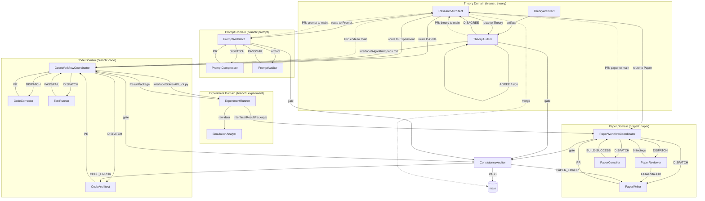

# GENERATED -- do NOT edit directly. Edit prompts/meta/*.md and regenerate.

# EnvMetaBootstrapper System -- 3-Layer Architecture Reference

---

## Section 1 -- Architecture Principle

```
Layer 1 -- Abstract Meta:   prompts/meta/             <- WHY and HOW (concepts, structure, logic)
Layer 2 -- Concrete SSoT:   docs/00_GLOBAL_RULES.md   <- WHAT (project-independent rules)
Layer 3 -- Project Context: docs/01_PROJECT_MAP.md     <- WHERE/WHICH (module map, ASM-IDs)
                            docs/02_ACTIVE_LEDGER.md   <- WHEN/STATUS (phase, CHK/KL registers)
```

**Authority rules (conflict resolution):**

| Conflict domain         | Winning layer                                                    |
|-------------------------|------------------------------------------------------------------|
| Axiom intent            | Layer 1 -- `prompts/meta/` (A10)                                 |
| Rule interpretation     | Layer 2 -- `docs/00_GLOBAL_RULES.md`                             |
| Project state / context | Layer 3 -- `docs/01_PROJECT_MAP.md`, `docs/02_ACTIVE_LEDGER.md`  |

Layer 3 may reference Layer 2 and Layer 1. Layer 2 may reference Layer 1.
Layer 1 must not reference Layer 2 or Layer 3. Any upward dependency is a
structural violation -- fix at source (phi6).

No mixing rule: each layer is authoritative for its scope only. When two rules
conflict, return to the phi-principles (meta-core.md) and apply the conflict
resolution hierarchy: phi3 > phi1 > phi7 > phi5 > phi2 > phi6 > phi4.

---

## Section 2 -- Directory Map

### Composite Agents (`prompts/agents/`)

| Domain | Agent files |
|--------|------------|
| **Routing** | `ResearchArchitect.md` |
| **Theory** | `TheoryAuditor.md` |
| **Code** | `CodeWorkflowCoordinator.md`, `CodeArchitect.md`, `CodeCorrector.md`, `CodeReviewer.md`, `TestRunner.md` |
| **Experiment** | `ExperimentRunner.md`, `SimulationAnalyst.md` |
| **Paper** | `PaperWorkflowCoordinator.md`, `PaperWriter.md`, `PaperReviewer.md`, `PaperCompiler.md`, `PaperCorrector.md` |
| **Audit** | `ConsistencyAuditor.md` |
| **Prompt** | `PromptArchitect.md`, `PromptCompressor.md`, `PromptAuditor.md` |
| **Infrastructure** | `DevOpsArchitect.md` (no dedicated agent file yet) |

### Atomic Micro-Agents (`prompts/agents/`) [EXPERIMENTAL]

| Domain | Agent files |
|--------|------------|
| **T -- Theory** | `EquationDeriver.md`, `SpecWriter.md` |
| **L -- Library** | `CodeArchitectAtomic.md`, `LogicImplementer.md`, `ErrorAnalyzer.md`, `RefactorExpert.md` |
| **E/Q -- Eval** | `TestDesigner.md`, `VerificationRunner.md`, `ResultAuditor.md` |

### Meta Layer (`prompts/meta/`)

| File | Layer | Question |
|------|-------|----------|
| `meta-core.md` | 1 -- Static Foundation | FOUNDATION -- phi1-phi7, A1-A10, system targets |
| `meta-persona.md` | 1 -- Static Foundation | WHO -- agent character and skills |
| `meta-domains.md` | 2 -- Dynamic Execution | STRUCTURE -- 4x3 matrix domain registry, branches, storage |
| `meta-roles.md` | 2 -- Dynamic Execution | WHAT -- per-agent role contracts |
| `meta-ops.md` | 2 -- Dynamic Execution | EXECUTE -- canonical commands, handoff protocols |
| `meta-workflow.md` | 3 -- Orchestration | HOW -- pipelines, coordination protocols |
| `meta-deploy.md` | 3 -- Orchestration | DEPLOY -- EnvMetaBootstrapper |

### Project Context (`docs/`)

| File | Purpose |
|------|---------|
| `docs/00_GLOBAL_RULES.md` | Concrete SSoT -- all enforceable rules (A1-A10, C1-C6, P1-P4, Q1-Q4, AU1-AU3) |
| `docs/01_PROJECT_MAP.md` | Module map, interface contracts, numerical reference, legacy register |
| `docs/02_ACTIVE_LEDGER.md` | Phase state, branch status, CHK/KL registers, integrity manifest |

### Project Directories (Storage Sovereignty)

```
theory/         T-Domain  (Mathematical Truth)
src/twophase/   L-Domain  (Functional Truth -- solver source)
tests/          L-Domain  (verification)
experiment/     E-Domain  (Empirical Truth)
results/        E-Domain  (simulation output)
paper/          A-Domain  (Logical Truth -- LaTeX)
prompts/        P-Domain  (Agent intelligence)
audit_logs/     Q-Domain  (Audit trails -- append-only)
interface/      Cross-domain contracts (Gatekeeper-owned)
artifacts/      Micro-agent intermediate outputs (T/L/E/Q) [EXPERIMENTAL]
```

---

## Section 3 -- Rule Ownership Map

| Rule | Abstract definition (meta file + section) | Concrete SSoT (00 section) | Project context (01-02 section) |
|------|------------------------------------------|---------------------------|-------------------------------|
| A1 Token Economy | meta-core.md AXIOMS | 00 section A | -- |
| A2 External Memory First | meta-core.md AXIOMS | 00 section A | 02 (append-only ledger) |
| A3 3-Layer Traceability | meta-core.md AXIOMS | 00 section A | 01 section 6 (symbol map) |
| A4 Separation | meta-core.md AXIOMS | 00 section A | -- |
| A5 Solver Purity | meta-core.md AXIOMS | 00 section A | 01 (module map) |
| A6 Diff-First Output | meta-core.md AXIOMS | 00 section A | -- |
| A7 Backward Compatibility | meta-core.md AXIOMS | 00 section A | 01 section 8 (legacy register) |
| A8 Git Governance | meta-core.md AXIOMS | 00 section GIT | 02 (branch/phase state) |
| A9 Core/System Sovereignty | meta-core.md AXIOMS | 00 section A | 01 (module map) |
| A10 Meta-Governance | meta-core.md AXIOMS | 00 section A | -- |
| C1-C6 SOLID / Code | meta-roles.md CODE DOMAIN | 00 section C | 01 section C2 (legacy register) |
| P1-P4 LaTeX / Paper | meta-roles.md PAPER DOMAIN | 00 section P | 01 section P3-D (param register) |
| Q1-Q4 Prompt | meta-roles.md PROMPT DOMAIN | 00 section Q | -- |
| AU1-AU3 Audit | meta-roles.md AUDIT DOMAIN | 00 section AU | 02 (audit verdicts) |
| Git lifecycle (3-phase) | meta-domains.md BRANCH RULES | 00 section GIT | 02 section ACTIVE STATE |
| P-E-V-A loop | meta-workflow.md P-E-V-A | 00 section P-E-V-A | 02 section CHECKLIST |
| Domain registry | meta-domains.md DOMAIN REGISTRY | -- | 01 section 11 |
| Handoff protocols | meta-ops.md HANDOFF PROTOCOL | -- | -- |

---

## Section 4 -- A1-A10 Quick Reference

| Axiom | Rule |
|-------|------|
| A1 | **Token Economy** -- no redundancy; diff > rewrite; reference > duplication |
| A2 | **External Memory First** -- state only in docs/02, docs/01, git history; append-only; ID-based |
| A3 | **3-Layer Traceability** -- Equation -> Discretization -> Code chain is mandatory |
| A4 | **Separation** -- never mix logic/content/tags/style; solver/infrastructure/performance |
| A5 | **Solver Purity** -- solver isolated from infrastructure; numerical meaning invariant |
| A6 | **Diff-First Output** -- no full file output unless explicitly required; patch-like edits |
| A7 | **Backward Compatibility** -- preserve semantics when migrating; upgrade by mapping |
| A8 | **Git Governance** -- protected main; domain branches; dev/ workspaces; merge via PR only |
| A9 | **Core/System Sovereignty** -- solver core is master; infrastructure is servant; zero dependency |
| A10 | **Meta-Governance** -- prompts/meta/ is single source of truth; docs/ are derived outputs |

---

## Section 5 -- Execution Loop

The P-E-V-A loop governs ALL domain work. No phase may be skipped.

```
                        +------------------------+
                        | 1. ResearchArchitect    |
                        |    Session intake;      |
                        |    load 02_ACTIVE_LEDGER|
                        |    Route to domain      |
                        +-----------+------------+
                                    |
                                    v
                        +-----------+------------+
                        | 2. PLAN                 |
                        |    Coordinator defines   |
                        |    scope, success        |
                        |    criteria, stop conds  |
                        +-----------+------------+
                                    |
                                    v
                        +-----------+------------+
                    +-->| 3. EXECUTE              |
                    |   |    Specialist produces   |
                    |   |    artifact on dev/      |
                    |   |    -> DRAFT commit       |
                    |   +-----------+------------+
                    |               |
                    |               v
                    |   +-----------+------------+
                    +<--| 4. VERIFY               |
                 FAIL   |    TestRunner /          |
                        |    PaperCompiler+Reviewer|
                        |    / PromptAuditor       |
                        |    -> REVIEWED commit    |
                        +-----------+------------+
                                    |  PASS
                                    v
                        +-----------+------------+
                    +<--| 5. AUDIT                |
                 FAIL   |    ConsistencyAuditor    |
                        |    AU2 gate (10 items)   |
                        |    -> VALIDATED commit   |
                        +-----------+------------+
                                    |  PASS
                                    v
                               merge to main
```

**Rules:**
- FAIL at VERIFY -> return to EXECUTE (not PLAN unless scope changes)
- FAIL at AUDIT -> return to EXECUTE
- Loop counter tracked per phase (P6); MAX_REVIEW_ROUNDS = 5
- AUDIT agent must be independent of EXECUTE agent (phi7 Broken Symmetry)
- PLAN always starts with ResearchArchitect loading docs/02_ACTIVE_LEDGER.md

---

## Section 6 -- 3-Phase Domain Lifecycle

Every domain artifact progresses through three mandatory phases tied to git commits.

| Phase | Trigger | Auto-action (commit message) |
|-------|---------|------------------------------|
| **DRAFT** | Specialist completes artifact on `dev/` branch | `[DRAFT] {domain}: {description}` -- committed on `dev/{agent_role}` |
| **REVIEWED** | Gatekeeper approves PR; all GA-1 through GA-6 conditions satisfied; Verifier PASS | `[REVIEWED] {domain}: {description}` -- Gatekeeper merges `dev/` PR into domain branch |
| **VALIDATED** | ConsistencyAuditor AU2 PASS (all 10 items); Root Admin final check | `[VALIDATED] {domain}: {description}` -- Root Admin merges domain branch into `main` |

**Transition rules:**
- DRAFT -> REVIEWED requires: independent verification (not self-verified), evidence attached (LOG-ATTACHED), no territory violations, upstream contract satisfied
- REVIEWED -> VALIDATED requires: ConsistencyAuditor AU2 PASS across all 10 gate items
- A task is NOT done until it is merged into `main` (Main-Merge Rule)

---

## Section 7 -- Agent Roster

All composite agents (not micro-agents). Roles derived from meta-roles.md PURPOSE fields.

| Domain | Agent | Role |
|--------|-------|------|
| Routing | ResearchArchitect | Session intake and workflow router; maps user intent to correct domain and agent; Root Admin for main merges |
| Theory | TheoryArchitect | Mathematical first-principles specialist; derives governing equations independently of implementation |
| Theory | TheoryAuditor | Independent re-derivation gate for T-Domain; Gatekeeper that signs interface/AlgorithmSpecs.md |
| Code | CodeWorkflowCoordinator | Code domain orchestrator and code quality auditor; dispatches specialists; Gatekeeper for code branch |
| Code | CodeArchitect | Translates mathematical equations from paper into production Python modules with numerical tests |
| Code | CodeCorrector | Active debug specialist; isolates numerical failures through staged experiments and minimal fixes |
| Code | CodeReviewer | Code quality reviewer; risk classification and SOLID enforcement (absorbed into CodeWorkflowCoordinator) |
| Code | TestRunner | Senior numerical verifier; interprets test outputs, diagnoses failures, issues PASS/FAIL verdicts |
| Experiment | ExperimentRunner | Reproducible experiment executor; runs benchmarks and validates via 4 mandatory sanity checks |
| Experiment | SimulationAnalyst | Post-processing specialist; extracts physical quantities and generates publication-quality visualizations |
| Paper | PaperWorkflowCoordinator | Paper domain orchestrator; drives write-review-commit loop; Gatekeeper for paper branch |
| Paper | PaperWriter | Academic editor and LaTeX author; drafting and editorial refinements; defines mathematical truth (absorbs PaperCorrector) |
| Paper | PaperReviewer | Rigorous peer reviewer; classifies findings as FATAL/MAJOR/MINOR; classification only, never fixes |
| Paper | PaperCompiler | LaTeX compliance and repair engine; ensures zero compilation errors; structural fixes only, never prose |
| Paper | PaperCorrector | Targeted LaTeX corrections from classified findings (role absorbed into PaperWriter) |
| Audit | ConsistencyAuditor | Cross-system validator; independently re-derives equations; AU2 release gate for all domains |
| Prompt | PromptArchitect | Generates role-specific agent prompts by composition from meta files; Gatekeeper for prompt branch |
| Prompt | PromptCompressor | Compresses existing prompts to reduce token footprint while preserving semantic equivalence |
| Prompt | PromptAuditor | Verifies prompt correctness against Q3 checklist (9 items); read-only audit; issues PASS/FAIL |
| Infrastructure | DevOpsArchitect | Infrastructure and environment specialist; Docker, GPU, CI/CD pipelines, LaTeX build systems |

---

## Section 8 -- Agent Interaction Diagram



---

## Section 9 -- Regeneration Instructions

- **Rebuild all derived files:**
  ```
  Execute EnvMetaBootstrapper Using prompts/meta/meta-deploy.md Target [Claude|Codex|Ollama|Mixed]
  ```

- **Edit source (authoritative -- A10):**
  All changes to system rules, axioms, or agent contracts must be made in
  `prompts/meta/*.md`. These seven files are the single source of truth.

- **Never edit `docs/00_GLOBAL_RULES.md` directly** -- it is a derived output.
  Change the source in `prompts/meta/`, then regenerate via EnvMetaBootstrapper.

- **Update project state:**
  Append entries to `docs/01_PROJECT_MAP.md` (module map, legacy register) or
  `docs/02_ACTIVE_LEDGER.md` (phase state, CHK/KL registers). These are Layer 3
  project-context files and are NOT regenerated by the bootstrapper.

- **First command after deployment:**
  ```
  Execute ResearchArchitect
  ```
