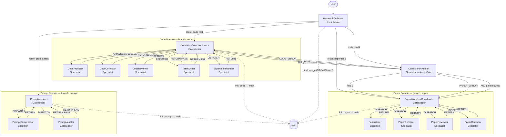

# GENERATED — do NOT edit directly. Edit prompts/meta/*.md and regenerate.

# Prompt System — 3-Layer Architecture

## Section 1 — Architecture Principle

```
Layer 1 — Abstract Meta:   prompts/meta/             ← WHY and HOW (concepts, structure, logic)
Layer 2 — Concrete SSoT:   docs/00_GLOBAL_RULES.md   ← WHAT (project-independent rules)
Layer 3 — Project Context: docs/01_PROJECT_MAP.md     ← WHERE/WHICH (module map, ASM-IDs)
                           docs/02_ACTIVE_LEDGER.md   ← WHEN/STATUS (phase, CHK/KL registers)
```

**Authority rules:**
- `prompts/meta/` wins on axiom intent (A10)
- `docs/00_GLOBAL_RULES.md` wins on rule interpretation
- `docs/01_PROJECT_MAP.md` and `docs/02_ACTIVE_LEDGER.md` win on project state

**No mixing rule:** Rule changes → edit `prompts/meta/` first → regenerate via EnvMetaBootstrapper.
Never edit `docs/00_GLOBAL_RULES.md` directly — it is a derived output.

---

## Section 2 — Directory Map

```
prompts/
├── meta/                          ← Layer 1 (Abstract Meta — source of truth)
│   ├── meta-core.md               FOUNDATION: φ1–φ7, A1–A10, system targets
│   ├── meta-domains.md            STRUCTURE: domain registry, branches, storage
│   ├── meta-persona.md            WHO: agent character + skills
│   ├── meta-roles.md              WHAT: per-agent role contracts
│   ├── meta-workflow.md           HOW: P-E-V-A loop, domain pipelines, handoff rules
│   ├── meta-ops.md                EXECUTE: canonical commands, handoff protocols
│   └── meta-deploy.md             DEPLOY: EnvMetaBootstrapper
│
├── agents/                        ← Generated agent prompts (Layer 1 outputs)
│   ├── ResearchArchitect.md       Routing domain — session intake and workflow router
│   ├── CodeWorkflowCoordinator.md Code domain — master orchestrator
│   ├── CodeArchitect.md           Code domain — equation-to-code translator
│   ├── CodeCorrector.md           Code domain — debug specialist
│   ├── CodeReviewer.md            Code domain — senior software architect
│   ├── TestRunner.md              Code domain — numerical verifier
│   ├── ExperimentRunner.md        Code domain — reproducible experiment executor
│   ├── PaperWorkflowCoordinator.md Paper domain — master orchestrator
│   ├── PaperWriter.md             Paper domain — academic editor + CFD professor
│   ├── PaperReviewer.md           Paper domain — peer reviewer
│   ├── PaperCompiler.md           Paper domain — LaTeX compliance engine
│   ├── PaperCorrector.md          Paper domain — targeted fix executor
│   ├── ConsistencyAuditor.md      Audit domain — cross-system release gate
│   ├── PromptArchitect.md         Prompt domain — prompt generator
│   ├── PromptCompressor.md        Prompt domain — token reducer
│   └── PromptAuditor.md           Prompt domain — Q3 checklist verifier
│
└── README.md                      ← This file

docs/
├── 00_GLOBAL_RULES.md             ← Layer 2: Concrete SSoT (project-independent rules)
├── 01_PROJECT_MAP.md              ← Layer 3: Module map, interfaces, ASM register
└── 02_ACTIVE_LEDGER.md            ← Layer 3: Live state, CHK/KL registers
```

---

## Section 3 — Rule Ownership Map

| Rule | Abstract definition | Concrete SSoT | Project context |
|------|--------------------|--------------------|----------------|
| A1–A10 (Axioms) | meta-core.md §AXIOMS | 00_GLOBAL_RULES.md §A | — |
| SOLID C1 | meta-core.md A9 / meta-roles.md §Code | 00_GLOBAL_RULES.md §C1 | 01_PROJECT_MAP.md §C2 Legacy Register |
| C2 (Preserve-tested) | meta-roles.md CodeArchitect CONSTRAINTS | 00_GLOBAL_RULES.md §C2 | 01_PROJECT_MAP.md §C2 Legacy Register |
| C3 (Builder Pattern) | meta-roles.md CodeReviewer | 00_GLOBAL_RULES.md §C3 | — |
| C4 (Solver Policy) | meta-roles.md §Code domain | 00_GLOBAL_RULES.md §C4 | — |
| C5 (Code Quality) | meta-roles.md §Code domain | 00_GLOBAL_RULES.md §C5 | — |
| C6 (MMS Standard) | meta-roles.md TestRunner | 00_GLOBAL_RULES.md §C6 | — |
| P1 (LaTeX Authoring) | meta-roles.md PaperCompiler | 00_GLOBAL_RULES.md §P1 | — |
| KL-12 (texorpdfstring) | meta-ops.md BUILD-01 | 00_GLOBAL_RULES.md KL-12 | 02_ACTIVE_LEDGER.md §LESSONS |
| P3 (Whole-Paper Consistency) | meta-roles.md PaperWriter | 00_GLOBAL_RULES.md §P3 | 01_PROJECT_MAP.md §P3-D Register |
| P4 (Reviewer Skepticism) | meta-core.md φ1 / meta-roles.md PaperWriter | 00_GLOBAL_RULES.md §P4 | — |
| Q1 (Standard Template) | meta-deploy.md Stage 3 | 00_GLOBAL_RULES.md §Q1 | — |
| Q2 (Environment Profiles) | meta-deploy.md §ENVIRONMENT PROFILES | 00_GLOBAL_RULES.md §Q2 | — |
| Q3 (Audit Checklist) | meta-deploy.md Stage 5 | 00_GLOBAL_RULES.md §Q3 | — |
| Q4 (Compression Rules) | meta-roles.md PromptCompressor | 00_GLOBAL_RULES.md §Q4 | — |
| AU1 (Authority Chain) | meta-core.md φ3 | 00_GLOBAL_RULES.md §AU1 | — |
| AU2 (Gate Conditions) | meta-ops.md AUDIT-01 | 00_GLOBAL_RULES.md §AU2 | 02_ACTIVE_LEDGER.md §CHECKLIST |
| AU3 (Verification A–E) | meta-ops.md AUDIT-02 | 00_GLOBAL_RULES.md §AU3 | — |
| Git 3-Phase Lifecycle | meta-domains.md §DOMAIN REGISTRY | 00_GLOBAL_RULES.md §GIT | 02_ACTIVE_LEDGER.md §ACTIVE STATE |
| P-E-V-A Loop | meta-workflow.md §P-E-V-A | 00_GLOBAL_RULES.md §P-E-V-A | 02_ACTIVE_LEDGER.md §ACTIVE STATE |

---

## Section 4 — A1–A10 Quick Reference

| Axiom | Rule |
|-------|------|
| A1 | Token Economy — no redundancy; diff > rewrite; reference > duplication |
| A2 | External Memory First — state only in docs/02_ACTIVE_LEDGER.md, docs/01_PROJECT_MAP.md, git history |
| A3 | 3-Layer Traceability — Equation → Discretization → Code chain is mandatory |
| A4 | Separation — never mix logic/content/tags/style; solver/infra/performance |
| A5 | Solver Purity — solver isolated from infrastructure; infra must not affect numerical results |
| A6 | Diff-First Output — no full file output unless explicitly required |
| A7 | Backward Compatibility — preserve semantics when migrating; never discard meaning without deprecation |
| A8 | Git Governance — main protected; dev/{agent_role} sovereign; merge path enforced |
| A9 | Core/System Sovereignty — src/core/ has zero dependency on src/system/; violation = CRITICAL_VIOLATION |
| A10 | Meta-Governance — prompts/meta/ is single source of truth; docs/ are derived outputs only |

---

## Section 5 — Execution Loop

```
1. ResearchArchitect    — loads docs/02_ACTIVE_LEDGER.md; aligns git environment; routes to domain
       ↓
2. PLAN                 — Coordinator parses spec; identifies gaps; records in 02_ACTIVE_LEDGER.md
       ↓
3. EXECUTE              — Specialist implements artifact on dev/{agent_role} branch
       ↓
4. VERIFY               — TestRunner / PaperCompiler+Reviewer / PromptAuditor issues PASS or FAIL
       ↓
5. AUDIT                — ConsistencyAuditor / PromptAuditor runs AU2 gate (10 items)
       ↓
   AU2 PASS             — Root Admin (ResearchArchitect) executes merge {domain} → main (GIT-04 Phase B)
```

Rules:
- FAIL at VERIFY → return to EXECUTE (not to PLAN unless scope changes)
- FAIL at AUDIT → return to EXECUTE
- MAX_REVIEW_ROUNDS = 5; threshold breach → escalate to user
- AUDIT agent must be independent of EXECUTE agent (φ7)

---

## Section 6 — 3-Phase Domain Lifecycle

| Phase | Trigger | Commit message |
|-------|---------|----------------|
| DRAFT | Primary creation agent completes and returns to coordinator | `{branch}: draft — {summary}` |
| REVIEWED | Review phase exits with no blocking findings (TestRunner PASS / 0 FATAL+0 MAJOR / Q3 PASS) | `{branch}: reviewed — {summary}` |
| VALIDATED | Gate auditor (ConsistencyAuditor or PromptAuditor) issues PASS + MERGE CRITERIA met | `merge({branch} → main): {summary}` |

---

## Section 7 — Agent Roster

| Domain | Agent | Role |
|--------|-------|------|
| Routing | ResearchArchitect | Session intake and workflow router; Root Admin for final merges |
| Code | CodeWorkflowCoordinator | Code pipeline orchestrator; Gatekeeper |
| Code | CodeArchitect | Translates paper equations into production Python modules |
| Code | CodeCorrector | Isolates and fixes numerical failures via staged protocols A–D |
| Code | CodeReviewer | Risk-classifies refactoring changes; architecture reviewer |
| Code | TestRunner | Executes pytest + convergence analysis; issues formal PASS/FAIL verdicts |
| Code | ExperimentRunner | Runs benchmark simulations; validates all 4 mandatory sanity checks |
| Paper | PaperWorkflowCoordinator | Paper pipeline orchestrator; Gatekeeper |
| Paper | PaperWriter | Academic editor; produces diff-only LaTeX patches |
| Paper | PaperReviewer | No-punches-pulled peer reviewer; classification only (output in Japanese) |
| Paper | PaperCompiler | LaTeX compliance engine; BUILD-01 scan + BUILD-02 compilation |
| Paper | PaperCorrector | Applies minimal fixes for VERIFIED and LOGICAL_GAP findings only |
| Audit | ConsistencyAuditor | Cross-system mathematical auditor; AU2 gate (10 items) |
| Prompt | PromptArchitect | Generates environment-optimized prompts from meta files; Gatekeeper |
| Prompt | PromptCompressor | Reduces token usage without semantic loss |
| Prompt | PromptAuditor | Q3 checklist verifier (9 items); Gatekeeper for prompt merges |

---

## Section 8 — Agent Interaction Diagram



---

## Section 9 — Regeneration Instructions

**To rebuild all agents:**
```
Execute EnvMetaBootstrapper Using prompts/meta/meta-deploy.md Target Claude
```

**To update rules:**
1. Edit `prompts/meta/*.md` — this is the authoritative source (A10)
2. Regenerate: `Execute EnvMetaBootstrapper Using prompts/meta/meta-deploy.md Target [env]`
3. **Never edit `docs/00_GLOBAL_RULES.md` directly** — it is a derived output, not the source (A10)

**To update project state:**
- Append to `docs/01_PROJECT_MAP.md` (module map, ASM register, C2 legacy register)
- Append to `docs/02_ACTIVE_LEDGER.md` (phase, CHK/KL entries — append-only for IDs)

**To change domain structure or axiom intent:**
- Edit `prompts/meta/meta-domains.md` or `prompts/meta/meta-core.md`
- Then regenerate via EnvMetaBootstrapper

**To add a new agent:**
- Add role to `prompts/meta/meta-roles.md`
- Add character/skills to `prompts/meta/meta-persona.md`
- Add to domain pipeline in `prompts/meta/meta-workflow.md`
- Then regenerate via EnvMetaBootstrapper

**First command after deployment:**
```
Execute ResearchArchitect
```
