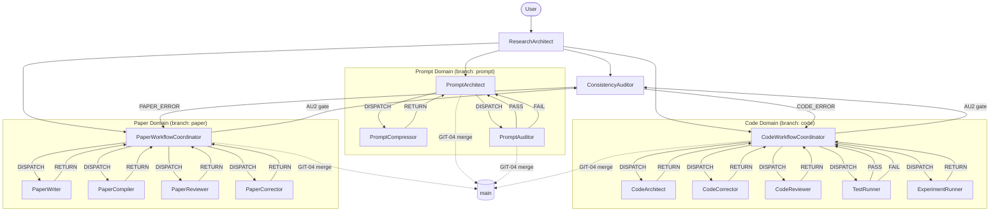

# prompts/ — 3-Layer, Domain-Oriented Architecture
# GENERATED — do NOT edit directly. Edit prompts/meta/*.md and regenerate.

────────────────────────────────────────────────────────
## 1. Architecture Principle

```
Layer 1 — Abstract Meta:   prompts/meta/             ← WHY and HOW (concepts, structure, logic)
Layer 2 — Concrete SSoT:   docs/00_GLOBAL_RULES.md   ← WHAT (project-independent rules)
Layer 3 — Project Context: docs/01_PROJECT_MAP.md     ← WHERE/WHICH (module map, ASM-IDs)
                           docs/02_ACTIVE_LEDGER.md   ← WHEN/STATUS (phase, CHK/KL registers)
```

**Authority rules:**
- `prompts/meta/` wins on axiom intent (A10)
- `docs/00_GLOBAL_RULES.md` wins on rule interpretation
- `docs/01_PROJECT_MAP.md` / `docs/02_ACTIVE_LEDGER.md` win on project state
- No mixing rule: changing a rule → edit `prompts/meta/` first → regenerate

────────────────────────────────────────────────────────
## 2. Directory Map

```
prompts/
├── meta/                          ← Layer 1: Abstract Meta (authoritative source — never edit agents/ directly)
│   ├── meta-core.md               ← FOUNDATION: φ1–φ7, A1–A10, system targets
│   ├── meta-domains.md            ← STRUCTURE: domain registry, branches, storage, lock protocol
│   ├── meta-persona.md            ← WHO: agent character and skills
│   ├── meta-roles.md              ← WHAT: per-agent role contracts
│   ├── meta-workflow.md           ← HOW: pipelines, coordination protocols
│   ├── meta-ops.md                ← EXECUTE: canonical commands and handoff protocols
│   └── meta-deploy.md             ← DEPLOY: EnvMetaBootstrapper
│
├── agents/                        ← Layer 1 derived outputs (generated; do NOT edit directly)
│   ├── ResearchArchitect.md       — Routing domain
│   ├── CodeWorkflowCoordinator.md — Code domain
│   ├── CodeArchitect.md           — Code domain
│   ├── CodeCorrector.md           — Code domain
│   ├── CodeReviewer.md            — Code domain
│   ├── TestRunner.md              — Code domain
│   ├── ExperimentRunner.md        — Code domain
│   ├── PaperWorkflowCoordinator.md — Paper domain
│   ├── PaperWriter.md             — Paper domain
│   ├── PaperReviewer.md           — Paper domain
│   ├── PaperCompiler.md           — Paper domain
│   ├── PaperCorrector.md          — Paper domain
│   ├── ConsistencyAuditor.md      — Audit domain
│   ├── PromptArchitect.md         — Prompt domain
│   ├── PromptCompressor.md        — Prompt domain
│   └── PromptAuditor.md           — Prompt domain
│
└── README.md                      ← This file (generated)

docs/
├── 00_GLOBAL_RULES.md             ← Layer 2: Concrete SSoT (project-independent rules)
├── 01_PROJECT_MAP.md              ← Layer 3: Module map, interfaces, ASM register
└── 02_ACTIVE_LEDGER.md            ← Layer 3: Live state — phase, CHK/KL registers
```

────────────────────────────────────────────────────────
## 3. Rule Ownership Map

| Rule | Abstract definition (meta file + §) | Concrete SSoT (00 §) | Project context (01–02 §) |
|------|--------------------------------------|----------------------|---------------------------|
| A1–A10 | meta-core.md §AXIOMS | §A | — |
| φ1–φ7 | meta-core.md §DESIGN PHILOSOPHY | (derived) | — |
| SOLID C1 | meta-persona.md + meta-roles.md §C | §C1 | — |
| Preserve-tested C2 | meta-roles.md §C | §C2 | 01 §C2 Legacy Register |
| Builder C3 | meta-roles.md §C | §C3 | — |
| Solver policy C4 | meta-roles.md §C | §C4 | — |
| Code quality C5 | meta-persona.md §CodeArchitect | §C5 | — |
| MMS test C6 | meta-roles.md §CodeArchitect | §C6 | — |
| LaTeX P1 | meta-roles.md §P | §P1 | — |
| KL-12 | meta-ops.md BUILD-01 | §KL-12 | 02 §LESSONS §B |
| Consistency P3 | meta-roles.md §P | §P3 | 01 §P3-D Register |
| Reviewer skepticism P4 | meta-roles.md §PaperWriter | §P4 | 02 §LESSONS §B |
| Q1 template | meta-deploy.md §Stage 3 | §Q1 | — |
| Q2 env profiles | meta-deploy.md §ENVIRONMENT PROFILES | §Q2 | — |
| Q3 audit checklist | meta-deploy.md §Stage 5 | §Q3 | — |
| Q4 compression | meta-roles.md §PromptCompressor | §Q4 | — |
| AU1 authority chain | meta-roles.md §ConsistencyAuditor | §AU1 | — |
| AU2 gate | meta-ops.md §AUDIT-01 | §AU2 | 02 §CHECKLIST |
| AU3 procedures | meta-ops.md §AUDIT-02 | §AU3 | — |
| Git lifecycle | meta-ops.md §GIT-01–05 | §GIT | 02 §ACTIVE STATE |
| P-E-V-A loop | meta-workflow.md §P-E-V-A | §P-E-V-A | 02 §CHECKLIST |
| Domain lock | meta-domains.md §DOMAIN LOCK | — | — |

────────────────────────────────────────────────────────
## 4. A1–A10 Quick Reference

| Axiom | Rule (one line) |
|-------|----------------|
| A1 | Token Economy: no redundancy; diff > rewrite; reference > duplication |
| A2 | External Memory First: all state in docs/02_ACTIVE_LEDGER.md, docs/01_PROJECT_MAP.md, git |
| A3 | 3-Layer Traceability: Equation → Discretization → Code is mandatory |
| A4 | Separation: never mix logic/content/tags/style or solver/infra/performance |
| A5 | Solver Purity: solver isolated from infra; numerical meaning invariant under refactoring |
| A6 | Diff-First Output: no full file output unless explicitly required |
| A7 | Backward Compatibility: preserve semantics; never discard meaning without deprecation |
| A8 | Git Governance: `main` protected; merge only after VALIDATED phase |
| A9 | Core/System Sovereignty: src/core/ never imports src/system/; violation = CRITICAL_VIOLATION |
| A10 | Meta-Governance: prompts/meta/ is SSoT; docs/ are derived; never edit docs/ to change a rule |

────────────────────────────────────────────────────────
## 5. Execution Loop

```
1. ResearchArchitect
   └─ Loads docs/02_ACTIVE_LEDGER.md + docs/01_PROJECT_MAP.md
   └─ Maps intent → agent; runs GIT-01 Step 0; issues DISPATCH (HAND-01)
        │
2. PLAN (Coordinator: CodeWorkflowCoordinator | PaperWorkflowCoordinator | PromptArchitect)
   └─ GIT-01 + DOM-01 PRE-CHECK; records task plan in docs/02_ACTIVE_LEDGER.md
        │
3. EXECUTE (Specialist: CodeArchitect | PaperWriter | PromptArchitect | ...)
   └─ HAND-03 Acceptance Check; produces artifact; issues HAND-02 RETURN
   └─ git: DRAFT commit (GIT-02)
        │
4. VERIFY (TestRunner | PaperCompiler + PaperReviewer | PromptAuditor)
   └─ PASS → git: REVIEWED commit (GIT-03); continue
   └─ FAIL → STOP or loop back to EXECUTE (P6: MAX_REVIEW_ROUNDS = 5)
        │
5. AUDIT (ConsistencyAuditor | PromptAuditor)
   └─ AUDIT-01: AU2 gate (10 items)
   └─ PASS → git: VALIDATED commit + merge → main (GIT-04)
   └─ FAIL → route per error type (PAPER_ERROR | CODE_ERROR | authority conflict)
```

────────────────────────────────────────────────────────
## 6. 3-Phase Domain Lifecycle

| Phase | Trigger | Auto-action (commit message) |
|-------|---------|------------------------------|
| DRAFT | Primary creation agent (CodeArchitect, PaperWriter, PromptArchitect) completes | `{branch}: draft — {summary}` |
| REVIEWED | TestRunner PASS / PaperReviewer 0 FATAL+0 MAJOR / PromptAuditor Q3 PASS | `{branch}: reviewed — {summary}` |
| VALIDATED | ConsistencyAuditor AU2 PASS / PromptAuditor gate PASS | `{branch}: validated — {summary}` + merge to main |

────────────────────────────────────────────────────────
## 7. Agent Roster

| Domain | Agent | Role (one line) |
|--------|-------|----------------|
| Routing | ResearchArchitect | Session intake and workflow router — maps user intent to the correct agent |
| Code | CodeWorkflowCoordinator | Code domain orchestrator — drives PLAN→EXECUTE→VERIFY→AUDIT pipeline |
| Code | CodeArchitect | Equation-to-Python translator — implements paper math as production modules + MMS tests |
| Code | CodeCorrector | Debug specialist — isolates numerical failures via staged protocols A→B→C→D |
| Code | CodeReviewer | Risk-classified refactorer — eliminates dead code without altering numerical behavior |
| Code | TestRunner | Convergence analyst — executes tests, issues formal PASS/FAIL verdicts |
| Code | ExperimentRunner | Reproducibility guardian — runs benchmarks, validates 4 mandatory sanity checks |
| Paper | PaperWorkflowCoordinator | Paper domain orchestrator — drives writing→compile→review→correct loop |
| Paper | PaperWriter | CFD academic editor — transforms data/derivations into rigorous LaTeX (skeptical verifier) |
| Paper | PaperReviewer | No-punches-pulled peer reviewer — classifies findings FATAL/MAJOR/MINOR in Japanese |
| Paper | PaperCompiler | LaTeX compliance engine — pre-scan + compile; structural fixes only |
| Paper | PaperCorrector | Surgical fix executor — applies minimal corrections to VERIFIED or LOGICAL_GAP findings |
| Audit | ConsistencyAuditor | Cross-system mathematical gate — re-derives from first principles; AU2 release gate |
| Prompt | PromptArchitect | Prompt generator — composes environment-optimized prompts from meta files |
| Prompt | PromptCompressor | Semantic-safe compressor — removes redundancy without weakening axioms |
| Prompt | PromptAuditor | Q3 checklist executor — read-only audit; issues PASS triggers GIT-03 + GIT-04 |

────────────────────────────────────────────────────────
## 8. Agent Interaction Diagram



────────────────────────────────────────────────────────
## 9. Regeneration Instructions

**To rebuild agents/:**
```
Execute EnvMetaBootstrapper Using prompts/meta/meta-deploy.md Target Claude
```

**To update rules:**
Edit `prompts/meta/*.md` (authoritative — A10), then regenerate via EnvMetaBootstrapper.
**Never edit docs/00_GLOBAL_RULES.md directly** — it is a derived output, not the source (A10).

**To update project state:**
Append to `docs/01_PROJECT_MAP.md` or `docs/02_ACTIVE_LEDGER.md` directly (these are project-context files, not rule files — they may be updated directly per their append-only protocol).

**To change domain structure or axiom intent:**
Edit `prompts/meta/*.md` then regenerate.

**First command after regeneration:**
```
Execute ResearchArchitect
```
