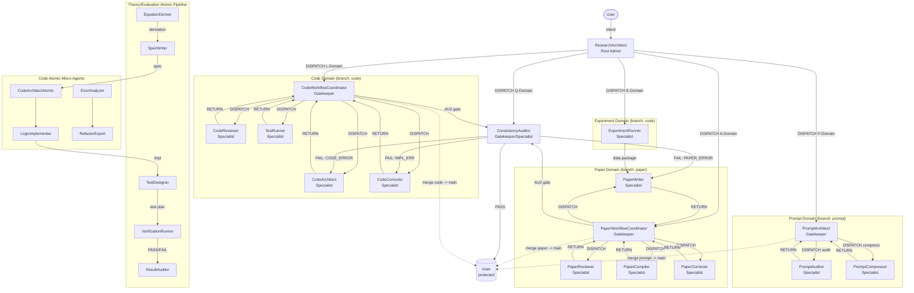

# GENERATED — do NOT edit directly. Edit prompts/meta/*.md and regenerate.
# prompts/README.md — Prompt System Documentation
# Last regenerated: 2026-03-31 | Target environment: Claude

---

## Section 1 — Architecture Principle

3-layer architecture (one-way dependency — lower layers must NOT import upper):

```
Layer 1 — Abstract Meta:   prompts/meta/             <- WHY and HOW (concepts, structure, logic)
Layer 2 — Concrete SSoT:   docs/00_GLOBAL_RULES.md   <- WHAT (project-independent rules)
Layer 3 — Project Context: docs/01_PROJECT_MAP.md     <- WHERE/WHICH (module map, ASM-IDs)
                           docs/02_ACTIVE_LEDGER.md   <- WHEN/STATUS (phase, CHK/KL registers)
```

**Authority rules:**
- `prompts/meta/` wins on axiom intent (A10 — single source of truth)
- `docs/00_GLOBAL_RULES.md` wins on rule interpretation
- `docs/01_PROJECT_MAP.md` and `docs/02_ACTIVE_LEDGER.md` win on project state
- No mixing rule: rules belong in meta/ -> 00; project state belongs in 01/02; never reversed

---

## Section 2 — Directory Map

```
prompts/
+-- README.md                        <- this file (generated)
+-- agents/                          <- generated agent prompts (do not edit directly)
|   +-- ResearchArchitect.md         <- Routing domain
|   +-- CodeWorkflowCoordinator.md   <- Code domain (composite)
|   +-- CodeArchitect.md
|   +-- CodeCorrector.md
|   +-- CodeReviewer.md
|   +-- TestRunner.md
|   +-- ExperimentRunner.md
|   +-- CodeArchitectAtomic.md       <- Code domain (atomic)
|   +-- LogicImplementer.md
|   +-- ErrorAnalyzer.md
|   +-- RefactorExpert.md
|   +-- PaperWorkflowCoordinator.md  <- Paper domain
|   +-- PaperWriter.md
|   +-- PaperReviewer.md
|   +-- PaperCompiler.md
|   +-- PaperCorrector.md
|   +-- EquationDeriver.md           <- Theory domain (atomic)
|   +-- SpecWriter.md
|   +-- TestDesigner.md              <- Evaluation domain (atomic)
|   +-- VerificationRunner.md
|   +-- ResultAuditor.md
|   +-- ConsistencyAuditor.md        <- Audit domain
|   +-- PromptArchitect.md           <- Prompt domain
|   +-- PromptAuditor.md
|   +-- PromptCompressor.md
+-- meta/                            <- source of truth (A10 — edit these, never agents/)
|   +-- meta-core.md                 <- FOUNDATION: core philosophy, A1-A10
|   +-- meta-persona.md              <- WHO: agent character and skills
|   +-- meta-domains.md              <- STRUCTURE: domain registry, branches, storage, lock
|   +-- meta-roles.md                <- WHAT: per-agent role contracts
|   +-- meta-ops.md                  <- EXECUTE: canonical commands and handoff protocols (JIT)
|   +-- meta-workflow.md             <- HOW: P-E-V-A loop, domain pipelines, coordination
|   +-- meta-deploy.md               <- DEPLOY: EnvMetaBootstrapper workflow

docs/
+-- 00_GLOBAL_RULES.md               <- Concrete SSoT (A C P Q AU GIT P-E-V-A)
+-- 01_PROJECT_MAP.md                <- Module map, interface contracts
+-- 02_ACTIVE_LEDGER.md              <- Live state: phase, CHK/ASM/KL registers

artifacts/
+-- T/                               <- Theory artifacts (equations, derivations)
+-- L/                               <- Logic artifacts (code patches, implementations)
+-- E/                               <- Experiment artifacts (results, logs)
+-- Q/                               <- Quality artifacts (audit reports, checklists)

interface/
+-- signals/                         <- Inter-agent signal files
+-- AlgorithmSpecs.md                <- T->L contract template
+-- SolverAPI_v1.py                  <- L->E contract template
+-- TechnicalReport.md               <- T/E->A contract template
```

---

## Section 3 — Rule Ownership Map

| Rule | Abstract definition (meta file + section) | Concrete SSoT (docs/00 section) | Project context (docs/01-02 section) |
|------|------------------------------------------|--------------------------------|-------------------------------------|
| A1-A10 | meta-core.md AXIOMS | A -- Core Axioms A1-A10 | -- |
| SOLID C1-C6 | meta-roles.md Code constraints | C1-C6 | docs/01 C2 Legacy Register |
| LaTeX P1-P4 | meta-roles.md Paper constraints | P1-P4, KL-12 | docs/01 P3-D Register |
| Q1 Template | meta-deploy.md Q1 | Q1 | -- |
| Q2 Env Profiles | meta-deploy.md Q2 | Q2 | -- |
| Q3 Audit Checklist | meta-deploy.md Q3 | Q3 | docs/02 CHECKLIST 1 |
| Q4 Compression | meta-deploy.md Q4 | Q4 | -- |
| AU1 Authority Chain | meta-roles.md ConsistencyAuditor | AU1 | docs/01 section 6 |
| AU2 Gate Conditions | meta-ops.md AUDIT-01 | AU2 | docs/02 CHECKLIST 2 |
| AU3 Verification Procedures | meta-ops.md AUDIT-02 | AU3 | -- |
| Git 3-Phase Lifecycle | meta-workflow.md GIT / meta-domains.md | GIT | docs/02 ACTIVE STATE |
| P-E-V-A Loop | meta-workflow.md P-E-V-A | P-E-V-A | docs/02 ACTIVE STATE |
| Domain sovereignty | meta-core.md A9 | A (A9) | -- |
| Broken Symmetry | meta-core.md 0-B | A (A7 implicit), AU3 | -- |
| Falsification Loop | meta-core.md 0-C | AU3 | -- |

---

## Section 4 — A1-A10 Quick Reference

Derived from prompts/meta/meta-core.md AXIOMS. All axioms apply unconditionally to every agent.

| ID | Name | Rule |
|----|------|------|
| A1 | Token Economy | No redundancy; diff > rewrite; reference > duplication. Compact, compositional rules over verbose explanations. |
| A2 | External Memory First | State only in: docs/02_ACTIVE_LEDGER.md, docs/01_PROJECT_MAP.md, git history. Append-only; short entries; ID-based (CHK, ASM, KL); never rely on implicit memory. |
| A3 | 3-Layer Traceability | Equation -> Discretization -> Code is mandatory. Every scientific or numerical claim must preserve this chain. |
| A4 | Separation | Never mix: logic/content/tags/style; solver/infrastructure/performance; theory/discretization/implementation/verification. |
| A5 | Solver Purity | Solver isolated from infrastructure; infrastructure must not affect numerical results. Numerical meaning invariant under logging, I/O, visualization, config, or refactoring. |
| A6 | Diff-First Output | No full file output unless explicitly required. Prefer patch-like edits; preserve locality; explain only what changed and why. |
| A7 | Backward Compatibility | Preserve semantics when migrating; upgrade by mapping and compressing. Never discard meaning without explicit deprecation. |
| A8 | Git Governance | Branches: `main` (protected); `code`, `paper`, `prompt` (domain integration staging); direct main edits forbidden. dev/{agent_role}: individual workspaces. Merge path: dev -> domain (Gatekeeper PR) -> main (Root Admin PR) after VALIDATED phase. |
| A9 | Core/System Sovereignty | "The solver core is the master; the infrastructure is the servant." `src/core/` has zero dependency on `src/system/`. Direct access to solver core from infrastructure = CRITICAL_VIOLATION -- escalate immediately. |
| A10 | Meta-Governance | `prompts/meta/` is the SINGLE SOURCE OF TRUTH. `docs/` files are DERIVED outputs -- never edit docs/ directly to change a rule. Reconstruction of docs/ from prompts/meta/ alone must always be possible. |

---

## Section 5 — Execution Loop

Master execution frame for all domain work (meta-workflow.md P-E-V-A). No phase may be skipped.

```
1. ResearchArchitect
   +-- Loads docs/02_ACTIVE_LEDGER.md; classifies intent; runs GIT-01 Step 0
       +-- Issues HAND-01 DISPATCH to target Coordinator or Specialist

2. PLAN
   +-- Coordinator (or ResearchArchitect) defines scope, success criteria, stop conditions
       +-- Records task spec in docs/02_ACTIVE_LEDGER.md

3. EXECUTE
   +-- Specialist produces the artifact (code / patch / paper / prompt)
       +-- DRAFT commit on dev/{agent_role}

4. VERIFY
   +-- Independent agent (TestRunner / PaperCompiler+Reviewer / PromptAuditor)
       +-- PASS -> REVIEWED commit; FAIL -> return to EXECUTE (not PLAN unless scope changes)

5. AUDIT
   +-- ConsistencyAuditor or PromptAuditor runs AU2 gate (10 items)
       +-- PASS -> VALIDATED commit + merge to main; FAIL -> return to EXECUTE
```

**Loop rules:** MAX_REVIEW_ROUNDS = 5; exceeding without escalation = concealed failure.
AUDIT agent must be independent of EXECUTE agent (Broken Symmetry principle).

---

## Section 6 — 3-Phase Domain Lifecycle

Derived from meta-workflow.md GIT and docs/00_GLOBAL_RULES.md GIT.

| Phase | Trigger | Auto-action (commit message pattern) |
|-------|---------|--------------------------------------|
| DRAFT | Specialist completes implementation on dev/ branch | `{branch}: draft -- {summary}` |
| REVIEWED | Gatekeeper merges dev/ PR after all GA-1-GA-6 conditions satisfied | `{branch}: reviewed -- {summary}` |
| VALIDATED | ConsistencyAuditor/PromptAuditor AU2 PASS; Root Admin merges to main | `merge({branch} -> main): {summary}` |

**MERGE CRITERIA (all three required for REVIEWED transition):**
- TEST-PASS: 100% unit/validation test success
- BUILD-SUCCESS: successful compilation/static analysis
- LOG-ATTACHED: execution logs in PR comment (tests/last_run.log or equivalent)

---

## Section 7 — Agent Roster

25 agents total, in domain order. Role descriptions derived from meta-roles.md PURPOSE fields.

| Domain | Agent | Role |
|--------|-------|------|
| Routing (M) | ResearchArchitect | Research intake and workflow router; maps user intent to correct agent; Root Admin |
| Code (L) | CodeWorkflowCoordinator | Code domain master orchestrator; guarantees math/numerical consistency between paper and simulator |
| Code (L) | CodeArchitect | Translates paper equations into production-ready Python modules with rigorous numerical tests |
| Code (L) | CodeCorrector | Surgical bug-fixer; applies minimal patches to restore correctness; never refactors |
| Code (L) | CodeReviewer | Code quality auditor; enforces SOLID principles and C1-C6; reports only -- never auto-fixes |
| Code (L) | TestRunner | Senior numerical verifier; interprets test outputs; diagnoses root cause; issues formal verdicts |
| Code (E) | ExperimentRunner | Runs production simulations; records reproducible experiment packages |
| Code (L, Atomic) | CodeArchitectAtomic | Atomic code architect; single-file implementation tasks without orchestrator overhead |
| Code (L, Atomic) | LogicImplementer | Translates algorithm specs into code; pure implementation -- no design decisions |
| Code (L, Atomic) | ErrorAnalyzer | Diagnoses runtime errors and test failures; produces root-cause analysis reports |
| Code (L, Atomic) | RefactorExpert | Applies targeted refactoring (extract method, rename, inline) preserving behavior |
| Paper (A) | PaperWorkflowCoordinator | Paper domain master orchestrator; enforces review loop limit (MAX_REVIEW_ROUNDS=5) |
| Paper (A) | PaperWriter | Transforms scientific data into mathematically rigorous LaTeX manuscript |
| Paper (A) | PaperReviewer | Systematic paper reviewer; finds FATAL/MAJOR/MINOR issues; reports only -- never auto-fixes |
| Paper (A) | PaperCompiler | Compiles LaTeX; diagnoses compile errors; enforces KL-12 texorpdfstring rule |
| Paper (A) | PaperCorrector | Applies targeted patches to paper/sections/*.tex; diff-only; never rewrites |
| Theory (T, Atomic) | EquationDeriver | Derives governing equations and discretization formulae; produces formal derivation artifacts |
| Theory (T, Atomic) | SpecWriter | Converts derivations into algorithm specification documents (T->L interface) |
| Evaluation (E, Atomic) | TestDesigner | Designs test cases from specifications; produces test plans with expected outputs |
| Evaluation (E, Atomic) | VerificationRunner | Executes verification test suites; produces pass/fail reports with diagnostics |
| Audit (Q, Atomic) | ResultAuditor | Audits experiment results against theoretical predictions; produces deviation reports |
| Audit (Q) | ConsistencyAuditor | Mathematical auditor and cross-system validator; release gate for both paper and code domains |
| Prompt (P) | PromptArchitect | Generates minimal, role-specific, environment-optimized agent prompts from meta system |
| Prompt (P) | PromptAuditor | Verifies prompt correctness against Q3 checklist; read-only; never auto-repairs |
| Prompt (P) | PromptCompressor | Compresses agent prompts per Q4 rules without weakening axioms or STOP conditions |

---

## Section 8 — Agent Interaction Diagram



---

## Section 9 — Regeneration Instructions

**To rebuild all agent prompts:**
```
Execute EnvMetaBootstrapper Using prompts/meta/meta-deploy.md Target Claude
```

**To update rules:** Edit `prompts/meta/*.md` (authoritative -- A10), then regenerate via EnvMetaBootstrapper.
**Never edit `docs/00_GLOBAL_RULES.md` directly** -- it is a derived output, not the source (A10).

**To update project state:** Append to `docs/01_PROJECT_MAP.md` or `docs/02_ACTIVE_LEDGER.md`.

**To change domain structure or axiom intent:** Edit `prompts/meta/*.md` then regenerate.

**New artifact directories (created by EnvMetaBootstrapper):**
- `artifacts/T/` -- Theory artifacts (derivations, equations)
- `artifacts/L/` -- Logic artifacts (code patches, implementations)
- `artifacts/E/` -- Experiment artifacts (results, logs, reproducibility packages)
- `artifacts/Q/` -- Quality artifacts (audit reports, checklists)
- `interface/signals/` -- Inter-agent signal files for handoff coordination

**File precedence:** prompts/meta/ -> docs/00 -> docs/01 -> docs/02 -> prompts/agents/

**JIT Rule:** Operation syntax (GIT-SP, DOM-01, HAND-01, etc.) is defined in `prompts/meta/meta-ops.md`.
Agent prompts reference operation IDs only -- consult meta-ops.md at execution time for canonical syntax.
