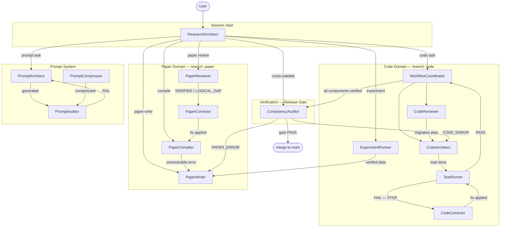

# Research-to-Paper-to-Code Workflow System

A deterministic, self-evolving prompt architecture for transforming ideas into validated scientific papers, correct numerical solvers, and robust infrastructure.

Designed NOT to maximize LLM creativity — designed to maximize **Correctness, Traceability, Reproducibility, and Structural Integrity**.

---

## 1. Core Axioms

Defined in `meta/meta-tasks.md`. All agents obey these unconditionally.

| Axiom | Rule |
|-------|------|
| A1 Token Economy | diff > rewrite; reference > duplication; no redundancy |
| A2 External Memory First | all state in `docs/`; never rely on implicit context |
| A3 3-Layer Traceability | Equation → Discretization → Code chain must be preserved |
| A4 Separation | never mix logic/content/tags/style; never mix solver/infra |
| A5 Solver Purity | infrastructure must not affect numerical results |
| A6 Diff-First Output | no full file rewrites unless explicitly required |
| A7 Backward Compatibility | preserve semantics; upgrade by mapping, never by discarding |
| A8 Git Governance | `main` protected; `paper`/`code` branches only; merge-only into `main` |

---

## 2. Directory Structure

```
project-root/
├── prompts/
│   ├── meta/                     # Meta system (canonical source)
│   │   ├── meta-deploy.md        # Deploy & environment optimization
│   │   ├── meta-tasks.md         # Agent roles, constraints, task specs
│   │   ├── meta-persona.md       # Agent personality, skills, decision styles
│   │   └── meta-workflow.md      # Inter-agent coordination, state machine, handoffs
│   │
│   └── agents/                   # Generated agent prompt files
│       ├── GLOBAL_RULES.md       # Shared axiom inheritance (A1–A8, P1, P5, P6)
│       ├── ResearchArchitect.md
│       ├── WorkflowCoordinator.md
│       ├── CodeArchitect.md
│       ├── CodeCorrector.md
│       ├── CodeReviewer.md
│       ├── TestRunner.md
│       ├── ExperimentRunner.md
│       ├── PaperWriter.md
│       ├── PaperReviewer.md
│       ├── PaperCompiler.md
│       ├── PaperCorrector.md
│       ├── ConsistencyAuditor.md
│       ├── PromptArchitect.md
│       ├── PromptCompressor.md
│       └── PromptAuditor.md
│
├── docs/                         # External Memory (mandatory)
│   ├── ACTIVE_STATE.md           # Current phase, branch, last decision, next action
│   ├── CHECKLIST.md              # CHK-ID task tracking
│   ├── ASSUMPTION_LEDGER.md      # ASM-ID assumption registry
│   ├── LESSONS.md                # LES-ID failure patterns and fix recipes
│   ├── ARCHITECTURE.md           # High-level design (authority source)
│   ├── CODING_POLICY.md          # SOLID rules and code governance
│   └── LATEX_RULES.md            # LaTeX authoring rules (tcolorbox, labels, refs)
│
├── paper/                        # LaTeX workspace
└── src/
    └── twophase/                 # Solver + infrastructure (domain boundary enforced in code)
```

**Note on `GLOBAL_RULES.md`:** All 15 agent prompts inherit A1–A8, P1, P5, P6 and universal stop triggers from this file by reference. Per A1, axioms are not restated per-agent.

---

## 3. Meta System Overview

The `meta/` directory is the **canonical source** for the entire agent system.
From these 4 files alone, all 15 agents can be reconstructed from scratch.

| File | Purpose |
|------|---------|
| `meta-deploy.md` | Bootstrap workflow; environment profiles (Claude/Codex/Ollama/Mixed); 6-stage deployment; validation checklist |
| `meta-tasks.md` | Global axioms (A1–A8); per-agent task specifications (PURPOSE, INPUTS, PROCEDURE, OUTPUT, STOP) |
| `meta-persona.md` | Per-agent personality, skills, decision styles, and critical behaviors |
| `meta-workflow.md` | Workflow state machine; agent handoff map; control protocols P1–P8; meta-evolution policy |

---

## 4. Initial Deployment (Bootstrapping)

### From Scratch

Place the 4 meta files in `prompts/meta/`. Then run:

```
Execute EnvMetaBootstrapper
Using meta-deploy.md
Input meta-tasks.md, meta-persona.md, meta-workflow.md
Target Claude
```

The bootstrapper will:
1. Initialize external memory files under `docs/`
2. Generate `agents/GLOBAL_RULES.md` (shared axiom inheritance)
3. Generate all 15 agent prompts (environment-optimized)
4. Run PromptAuditor on all generated prompts
5. Output an audit report and deployment notes

### First Agent to Run

```
Execute ResearchArchitect
```

ResearchArchitect loads `docs/ACTIVE_STATE.md`, maps your intent, and routes to the appropriate agent.

### File-Generation Mode (recommended for Claude Code)

Instruct the LLM to write files directly — no copy-paste:

> *"You are a file-generating agent. Read meta-tasks.md, meta-persona.md, and meta-workflow.md. Generate all agent prompt files directly into prompts/agents/. DO NOT print prompts inline."*

---

## 5. The Execution Loop

1. **Load state:** ResearchArchitect reads `docs/ACTIVE_STATE.md`
2. **Single-action discipline:** one agent, one objective per step (P5)
3. **Agent executes:** outputs a diff/patch; never rewrites full files
4. **Record decisions:** findings → `docs/ACTIVE_STATE.md`; new constraints → `docs/ASSUMPTION_LEDGER.md` (ASM-ID); violations → `docs/CHECKLIST.md` (CHK-ID)
5. **Hand off:** agent routes result to next agent per the handoff map in `meta-workflow.md`
6. **Audit before merge:** ConsistencyAuditor runs the release checklist; only then merge to `main`

---

## 6. Agent Roster

| Domain | Agent | Role |
|--------|-------|------|
| Coordination | ResearchArchitect | Session start, intent routing |
| Coordination | WorkflowCoordinator | Master orchestrator, state machine controller |
| Code | CodeArchitect | Equation → Python implementation + MMS tests |
| Code | CodeCorrector | Staged numerical debugging (protocols A–D) |
| Code | CodeReviewer | Refactoring without numerical change |
| Code | TestRunner | Convergence analysis, PASS/FAIL verdict |
| Code | ExperimentRunner | Reproducible benchmark execution |
| Paper | PaperWriter | LaTeX manuscript authoring (skeptical verifier) |
| Paper | PaperReviewer | Rigorous peer review — output in Japanese |
| Paper | PaperCompiler | LaTeX compilation and repair (KL-12 guard) |
| Paper | PaperCorrector | Minimal targeted fixes from verified findings only |
| Verification | ConsistencyAuditor | Cross-validates equations ↔ code ↔ paper (authority chain) |
| Prompt system | PromptArchitect | Generates role-specific agent prompts |
| Prompt system | PromptCompressor | Reduces token usage without semantic loss |
| Prompt system | PromptAuditor | Validates prompt correctness (read-only) |

---

## 7. Agent Collaboration Diagram



**Reading the diagram:**
- Solid arrows show normal handoff direction
- `FAIL — STOP` means the agent halts and waits for user direction before CCor is invoked
- ConsistencyAuditor is the sole release gate — nothing merges to `main` without its PASS verdict
- The Prompt System is self-contained and loops internally until PAud returns PASS

---

## 8. Control Protocols

Defined in `meta-workflow.md`. Key protocols:

| Protocol | Purpose |
|----------|---------|
| P1 LAYER_STASIS | When editing one layer, all others are READ-ONLY |
| P2 NON_INTERFERENCE_AUDIT | Infrastructure changes must not alter numerical results |
| P3 ASSUMPTION_TO_CONSTRAINT | Stable assumptions promoted to constraints with ASM-ID |
| P4 CONTEXT_COMPRESSION_GATE | Token efficiency before DONE / schema migration / prompt regeneration |
| P5 SINGLE-ACTION DISCIPLINE | One agent, one objective per step — no multi-goal execution |
| P6 BOUNDED LOOP CONTROL | Retry counter per phase; escalate on threshold breach; never loop silently |
| P7 LEGACY MIGRATION | Old prompts/schemas mapped, compressed, and upgraded; semantics preserved |
| P8 BRANCH-SCOPED EXECUTION | Pull from `main` before starting; never mix paper/code edits in one step |

---

## 9. Meta Rules

- **diff > rewrite** — minimal changes only
- **stop early > guess** — STOP and escalate when information is missing; never hallucinate
- **explicit > implicit** — all decisions in `docs/` with IDs; never rely on LLM context window
- **one agent per step** — no multi-goal execution inside a single action
- **test failure = halt** — TestRunner and WorkflowCoordinator never auto-fix; they STOP and ask
- **authority chain** — MMS-passing code > ARCHITECTURE.md > paper (ConsistencyAuditor enforces)
