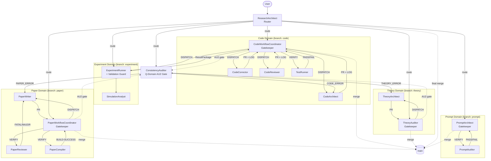

# GENERATED — do NOT edit directly. Edit prompts/meta/*.md and regenerate.
# generated_at: 2026-04-03
# target_env: Claude

# EnvMetaBootstrapper System — Prompts Reference

---

## 1. Architecture Principle

```
Layer 1 — Abstract Meta:   prompts/meta/             ← WHY and HOW (concepts, structure, logic)
Layer 2 — Concrete SSoT:   docs/00_GLOBAL_RULES.md   ← WHAT (project-independent rules)
Layer 3 — Project Context: docs/01_PROJECT_MAP.md     ← WHERE/WHICH (module map, ASM-IDs)
                           docs/02_ACTIVE_LEDGER.md   ← WHEN/STATUS (phase, CHK/KL registers)
```

**Authority Rules:**
- `prompts/meta/` wins on axiom intent (φ6, A10)
- `docs/00_GLOBAL_RULES.md` wins on rule interpretation
- `docs/01–02` win on project state
- No mixing rule: never patch a derivative; edit the source and regenerate

**Agent Prompt Format:** YAML (inherits `_base.yaml` for shared axioms, primitives, rules).
Agent files contain ONLY overrides and domain-specific content.

---

## 2. Directory Map

### Meta Source (Layer 1)
```
prompts/meta/
  meta-core.md             — φ1–φ7, A1–A10, LA-1–LA-5, §B.1 isolation model
  meta-persona.md          — behavioral primitives + skills per agent
  meta-domains.md          — 4×3 Matrix domain registry, Interface Contracts, branches
  meta-roles.md            — per-agent role contracts (PURPOSE/DELIVERABLES/AUTHORITY/CONSTRAINTS/STOP)
  meta-ops.md              — canonical commands (GIT/DOM/BUILD/TEST/EXP/HAND/AUDIT)
  meta-workflow.md         — T-L-E-A pipeline, CI/CP, domain pipelines
  meta-deploy.md           — EnvMetaBootstrapper, YAML template, tiered generation
  meta-antipatterns.md     — AP-01–AP-08 known failure modes
  meta-experimental.md     — [NOT YET OPERATIONAL] micro-agent architecture
```

### Agent Prompts (YAML format)
```
prompts/agents/
  _base.yaml                    — Universal foundation (all agents inherit)
  ResearchArchitect.md          — M-Domain Router: intent mapping, pipeline mode
  TheoryArchitect.md            — T-Domain Specialist: theory derivation
  TheoryAuditor.md              — T-Domain Gatekeeper: independent re-derivation (L3)
  CodeWorkflowCoordinator.md    — L-Domain Gatekeeper: code pipeline orchestration
  CodeArchitect.md              — L-Domain Specialist: equation-to-code translation
  CodeCorrector.md              — L-Domain Specialist: debug/fix + diagnosis (absorbs ErrorAnalyzer)
  CodeReviewer.md               — L-Domain Specialist: risk-classified refactoring
  TestRunner.md                 — L-Domain Specialist: convergence verification
  ExperimentRunner.md           — E-Domain Specialist + Validation Guard
  SimulationAnalyst.md          — E-Domain Specialist: post-processing
  PaperWorkflowCoordinator.md   — A-Domain Gatekeeper: paper pipeline orchestration
  PaperWriter.md                — A-Domain Specialist: LaTeX authoring (absorbs PaperCorrector)
  PaperReviewer.md              — A-Domain Gatekeeper: Devil's Advocate review
  PaperCompiler.md              — A-Domain Specialist: LaTeX compilation + KL-12
  ConsistencyAuditor.md         — Q-Domain Gatekeeper: cross-domain AU2 gate (absorbs ResultAuditor)
  PromptArchitect.md            — P-Domain Gatekeeper: prompt generation (absorbs PromptCompressor)
  PromptAuditor.md              — P-Domain Gatekeeper: Q3 checklist audit
  DevOpsArchitect.md            — M-Domain Specialist: Docker, GPU, CI/CD
  _deprecated/                  — PaperCorrector, ErrorAnalyzer, PromptCompressor, ResultAuditor
  _experimental/                — 7 micro-agents (NOT YET OPERATIONAL)
```

---

## 3. Rule Ownership Map

| Rule | Abstract (meta/) | Concrete SSoT (00) | Project (01-02) |
|------|-----------------|--------------------|-----------------| 
| A1–A10 Core Axioms | meta-core.md §AXIOMS | §A | — |
| φ1–φ7 Design Philosophy | meta-core.md §DESIGN PHILOSOPHY | — | — |
| C1–C6 Code Rules | meta-roles.md (Code) | §C | §4–§8 |
| P1–P4 Paper Rules | meta-roles.md (Paper) | §P | §9–§10 |
| Q1–Q4 Prompt Rules | meta-roles.md (Prompt) | §Q | — |
| AU1–AU3 Audit Rules | meta-roles.md (Audit) | §AU | — |
| Git Lifecycle | meta-domains.md §BRANCH RULES | §GIT | §ACTIVE STATE |
| P-E-V-A Loop | meta-workflow.md §P-E-V-A | §P-E-V-A | §CHECKLIST |
| AP-01–AP-08 | meta-antipatterns.md | — | §FEEDBACK |

---

## 4. A1–A10 Quick Reference

| Axiom | Rule |
|-------|------|
| A1 | Token Economy — diff > rewrite; reference > duplication |
| A2 | External Memory First — state only in docs/ and git |
| A3 | 3-Layer Traceability — Equation → Discretization → Code |
| A4 | Separation — never mix logic/content/tags/style |
| A5 | Solver Purity — solver isolated from infrastructure |
| A6 | Diff-First Output — prefer patch-like edits |
| A7 | Backward Compatibility — preserve semantics |
| A8 | Git Governance — protected main; domain branches |
| A9 | Core/System Sovereignty — solver core ≠ infrastructure |
| A10 | Meta-Governance — prompts/meta/ is SSoT |

---

## 5. Execution Loop

```
1. ResearchArchitect — Classify pipeline mode; route to target agent
       │
2. PLAN — Coordinator: define scope, success criteria, stop conditions
       │
3. EXECUTE — Specialist: produce artifact on dev/ branch
       │
4. VERIFY — Verifier: PASS → merge; FAIL → loop to 3
       │
5. AUDIT — ConsistencyAuditor: AU2 gate → PASS: merge to main
```

| Mode | Gates | Use for |
|------|-------|---------|
| TRIVIAL | DOM-02 only | Typos, comments, whitespace |
| FAST-TRACK | Reduced | Bug fixes, prose, refactors |
| FULL-PIPELINE | All | Theory, solver core, cross-domain |

---

## 6. 3-Phase Domain Lifecycle

| Phase | Trigger | Commit |
|-------|---------|--------|
| DRAFT | Specialist completes on dev/ | `{branch}: draft — {summary}` |
| REVIEWED | Gatekeeper merges dev/ → domain | `{branch}: reviewed — {summary}` |
| VALIDATED | AU2 PASS; Root Admin merges → main | `merge({branch} → main): {summary}` |

---

## 7. Agent Roster (18 active)

| Domain | Agent | Role |
|--------|-------|------|
| Routing | ResearchArchitect | Intent router, pipeline mode classifier |
| T-Domain | TheoryArchitect | Theory derivation specialist |
| T-Domain | TheoryAuditor | Independent re-derivation gate (L3) |
| L-Domain | CodeWorkflowCoordinator | Code pipeline orchestrator |
| L-Domain | CodeArchitect | Equation-to-code translator |
| L-Domain | CodeCorrector | Staged debug/fix + diagnosis |
| L-Domain | CodeReviewer | Risk-classified refactoring |
| L-Domain | TestRunner | Convergence verification |
| E-Domain | ExperimentRunner | Simulation + validation guard |
| E-Domain | SimulationAnalyst | Post-processing, visualization |
| A-Domain | PaperWorkflowCoordinator | Paper pipeline orchestrator |
| A-Domain | PaperWriter | LaTeX authoring + corrections |
| A-Domain | PaperReviewer | Devil's Advocate reviewer |
| A-Domain | PaperCompiler | LaTeX compilation + KL-12 |
| Q-Domain | ConsistencyAuditor | Cross-domain AU2 gate |
| P-Domain | PromptArchitect | Prompt generation + compression |
| P-Domain | PromptAuditor | Q3 checklist audit |
| M-Domain | DevOpsArchitect | Docker, GPU, CI/CD |

---

## 8. Agent Interaction Diagram



---

## 9. Regeneration Instructions

- **Rebuild agents/:** `Execute EnvMetaBootstrapper Using prompts/meta/meta-deploy.md Target Claude`
- **Update rules:** edit `prompts/meta/*.md` then regenerate. **Never edit docs/00_GLOBAL_RULES.md directly** (A10).
- **Update project state:** append to `docs/01_PROJECT_MAP.md` or `docs/02_ACTIVE_LEDGER.md`.
- **Activate micro-agents:** run `EnvMetaBootstrapper --activate-microagents` after populating `artifacts/` + `interface/signals/`.

### Changes in this generation:
- **YAML format:** All agent prompts converted from Markdown to YAML with `_base.yaml` inheritance
- **18 active agents** (was 29): 4 absorbed, 7 moved to `_experimental/`
- **71% size reduction:** 165KB → 48KB total agent prompt size
- **Q3 audit: 18/18 PASS** (all 9 items per agent)
