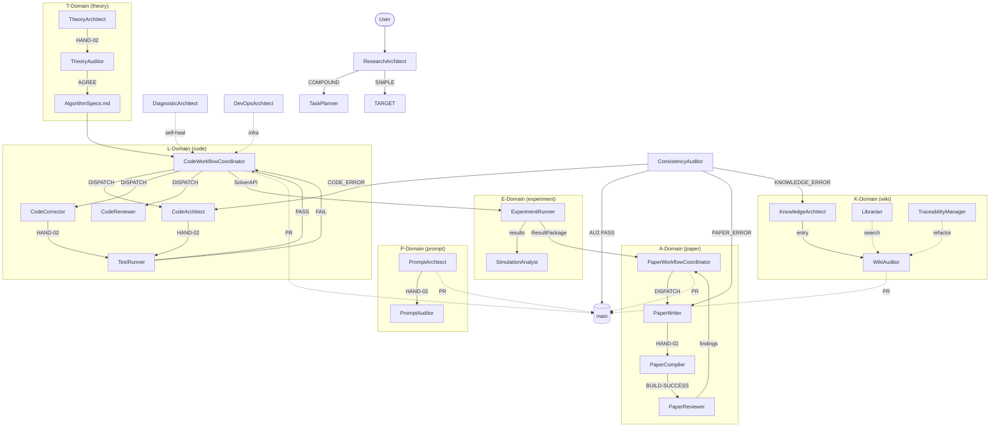

# GENERATED — do NOT edit directly. Edit prompts/meta/*.md and regenerate.
# Prompt System Architecture
# Generated by EnvMetaBootstrapper | Target: Claude | Date: 2026-04-08

## 1. Architecture Principle

```
Layer 1 — Abstract Meta:   prompts/meta/             ← WHY and HOW (concepts, structure, logic)
Layer 2 — Concrete SSoT:   docs/00_GLOBAL_RULES.md   ← WHAT (project-independent rules)
Layer 3 — Project Context: docs/01_PROJECT_MAP.md     ← WHERE/WHICH (module map, ASM-IDs)
                           docs/02_ACTIVE_LEDGER.md   ← WHEN/STATUS (phase, CHK/KL registers)
```

**Authority rules:**
- `prompts/meta/` wins on axiom intent (A10)
- `docs/00_GLOBAL_RULES.md` wins on rule interpretation
- `docs/01–02` win on project state
- No mixing rule

## 2. Directory Map

### Meta files (Layer 1 — source of truth)
```
prompts/meta/
  meta-core.md           — φ1–φ7, A1–A11, LA-1–LA-5, system targets
  meta-persona.md        — Agent behavioral primitives + skills
  meta-domains.md        — 4×4 Matrix domain registry, K-Domain axioms
  meta-roles.md          — Per-agent role contracts
  meta-ops.md            — Canonical operations + handoff protocols
  meta-workflow.md       — P-E-V-A loop, domain pipelines
  meta-deploy.md         — EnvMetaBootstrapper deployment spec
  meta-project.md        — Project-specific rules (PR-1–PR-6)
  meta-antipatterns.md   — Known failure modes with mitigation
  meta-experimental.md   — Micro-agent architecture (OPERATIONAL)
```

### Agent prompts (Layer 2 — generated output)
```
prompts/agents/
  _base.yaml               — Universal agent foundation (inherited by all)

  # Routing (M-Domain)
  ResearchArchitect.md      — Protocol Enforcer / Router
  TaskPlanner.md            — Compound Task Decomposer

  # Theory (T-Domain)
  TheoryArchitect.md        — First-Principles Specialist
  TheoryAuditor.md          — Independent Re-Derivation Gate

  # Code (L-Domain)
  CodeWorkflowCoordinator.md — Domain Orchestrator + Code Quality Auditor
  CodeArchitect.md           — Equation-to-Code Specialist
  CodeCorrector.md           — Debug/Fix Specialist
  CodeReviewer.md            — Refactor/Review Specialist
  TestRunner.md              — Numerical Verifier

  # Experiment (E-Domain)
  ExperimentRunner.md        — Simulation Executor + Validation Guard
  SimulationAnalyst.md       — Post-Processing Specialist

  # Paper (A-Domain)
  PaperWorkflowCoordinator.md — Paper Pipeline Orchestrator
  PaperWriter.md              — Academic Editor (absorbs PaperCorrector)
  PaperReviewer.md            — Devil's Advocate Reviewer
  PaperCompiler.md            — LaTeX Compliance Engine

  # Audit (Q-Domain)
  ConsistencyAuditor.md      — Cross-Domain Falsification Gate

  # Prompt (P-Domain)
  PromptArchitect.md         — Prompt Engineer (absorbs PromptCompressor)
  PromptAuditor.md           — Q3 Checklist Auditor

  # Infrastructure (M-Domain)
  DevOpsArchitect.md         — Docker/CI/GPU Specialist
  DiagnosticArchitect.md     — Self-Healing Agent

  # Knowledge (K-Domain)
  KnowledgeArchitect.md      — Wiki Compiler
  WikiAuditor.md             — Pointer Integrity Gate
  Librarian.md               — Search & Impact Analysis
  TraceabilityManager.md     — Pointer Maintenance

  # Micro-Agents (OPERATIONAL)
  EquationDeriver.md         — T-Domain: equation derivation
  SpecWriter.md              — T-Domain: spec generation
  CodeArchitectAtomic.md     — L-Domain: structural design
  LogicImplementer.md        — L-Domain: method body logic
  ErrorAnalyzer.md           — L-Domain: diagnosis only
  RefactorExpert.md          — L-Domain: targeted fixes
  TestDesigner.md            — E-Domain: test design
  VerificationRunner.md      — E-Domain: test execution
  ResultAuditor.md           — Q-Domain: result audit
```

### Docs (Layer 3 — project context)
```
docs/
  00_GLOBAL_RULES.md       — Concrete SSoT (project-independent rules)
  01_PROJECT_MAP.md        — Module map, interface contracts, ASM register
  02_ACTIVE_LEDGER.md      — Phase, branch, CHK/KL registers
  03_PROJECT_RULES.md      — Project-specific rules (derived from meta-project.md)
  interface/               — Cross-domain contracts
    AlgorithmSpecs.md      — T→L contract
    SolverAPI_v1.py        — L→E contract
    TechnicalReport.md     — T/E→A contract
    signals/               — SIGNAL protocol files (micro-agent coordination)
  wiki/                    — K-Domain compiled knowledge
    theory/                — Theory wiki entries (WIKI-T-*)
    code/                  — Code wiki entries (WIKI-L-*)
    experiment/            — Experiment wiki entries (WIKI-E-*)
    paper/                 — Paper wiki entries (WIKI-P-*)
    cross-domain/          — Cross-domain wiki entries (WIKI-X-*)
```

## 3. Rule Ownership Map

| Rule | Abstract (meta/) | Concrete SSoT (00§) | Project (01–02§) |
|------|-----------------|---------------------|-------------------|
| A1–A11 | meta-core.md §AXIOMS | §A | — |
| φ1–φ7 | meta-core.md §DESIGN PHILOSOPHY | — | — |
| C1–C6 | meta-roles.md §CODE DOMAIN | §C | §1 (module map) |
| P1–P4, KL-12 | meta-roles.md §PAPER DOMAIN | §P | §9 (paper structure) |
| Q1–Q4 | meta-deploy.md §Q2 | §Q | — |
| AU1–AU3 | meta-roles.md §AUDIT DOMAIN | §AU | — |
| K-A1–K-A5 | meta-domains.md §K-Domain Axioms | §A (A11) | — |
| Git lifecycle | meta-workflow.md §GIT BRANCH GOVERNANCE | §GIT | §ACTIVE STATE |
| P-E-V-A | meta-workflow.md §P-E-V-A | §P-E-V-A | — |
| PR-1–PR-6 | meta-project.md §PR | — | 03_PROJECT_RULES.md |

## 4. A1–A11 Quick Reference

| Axiom | Rule |
|-------|------|
| A1 | Token Economy — no redundancy; diff > rewrite; reference > duplication |
| A2 | External Memory First — state only in docs/ and git |
| A3 | 3-Layer Traceability — Equation → Discretization → Code |
| A4 | Separation — never mix logic/content/tags/style |
| A5 | Solver Purity — solver isolated from infrastructure |
| A6 | Diff-First Output — no full file output unless required |
| A7 | Backward Compatibility — preserve semantics when migrating |
| A8 | Git Governance — protected main; domain branches; dev/ workspaces |
| A9 | Core/System Sovereignty — solver core is master; infrastructure is servant |
| A10 | Meta-Governance — prompts/meta/ is the single source of truth |
| A11 | Knowledge-First Retrieval — prefer compiled wiki over internal reasoning |

## 5. Execution Loop

```
1. ResearchArchitect  — Absorb state; classify intent; route to domain
2. PLAN               — Coordinator defines scope, success criteria, stop conditions
3. EXECUTE            — Specialist produces artifact on dev/ branch
4. VERIFY             — Verifier confirms artifact meets spec (PASS/FAIL)
5. AUDIT              — ConsistencyAuditor AU2 gate (cross-system consistency)
```

## 6. 3-Phase Domain Lifecycle

| Phase | Trigger | Commit message format |
|-------|---------|----------------------|
| DRAFT | Specialist completes on dev/ | `{branch}: draft — {summary}` |
| REVIEWED | Gatekeeper merges dev/ → {domain} | `{branch}: reviewed — {summary}` |
| VALIDATED | Root Admin merges {domain} → main | `main: validated — {summary}` |

## 7. Agent Roster

### Composite Agents (24)

| Domain | Agent | Role |
|--------|-------|------|
| M/Routing | ResearchArchitect | Protocol Enforcer / Router |
| M/Routing | TaskPlanner | Compound Task Decomposer |
| T | TheoryArchitect | First-Principles Specialist |
| T | TheoryAuditor | Independent Re-Derivation Gate |
| L | CodeWorkflowCoordinator | Domain Orchestrator + Code Quality Auditor |
| L | CodeArchitect | Equation-to-Code Specialist |
| L | CodeCorrector | Debug/Fix Specialist |
| L | CodeReviewer | Refactor/Review Specialist |
| L | TestRunner | Numerical Verifier |
| E | ExperimentRunner | Simulation Executor + Validation Guard |
| E | SimulationAnalyst | Post-Processing Specialist |
| A | PaperWorkflowCoordinator | Paper Pipeline Orchestrator |
| A | PaperWriter | Academic Editor (absorbs PaperCorrector) |
| A | PaperReviewer | Devil's Advocate Reviewer |
| A | PaperCompiler | LaTeX Compliance Engine |
| Q | ConsistencyAuditor | Cross-Domain Falsification Gate |
| P | PromptArchitect | Prompt Engineer (absorbs PromptCompressor) |
| P | PromptAuditor | Q3 Checklist Auditor |
| M | DevOpsArchitect | Docker/CI/GPU Specialist |
| M | DiagnosticArchitect | Self-Healing Agent |
| K | KnowledgeArchitect | Wiki Compiler |
| K | WikiAuditor | Pointer Integrity Gate |
| K | Librarian | Search & Impact Analysis |
| K | TraceabilityManager | Pointer Maintenance |

### Micro-Agents (9)

| Domain | Agent | Function |
|--------|-------|----------|
| T | EquationDeriver | Derive equations from first principles |
| T | SpecWriter | Convert derivations to implementation specs |
| L | CodeArchitectAtomic | Design class structures and interfaces |
| L | LogicImplementer | Write method body logic |
| L | ErrorAnalyzer | Diagnose errors from logs |
| L | RefactorExpert | Apply targeted fixes |
| E | TestDesigner | Design test cases and MMS solutions |
| E | VerificationRunner | Execute tests and simulations |
| Q | ResultAuditor | Audit results against theory |

### Deprecated (→ prompts/agents/_deprecated/)
PaperCorrector, PromptCompressor (absorbed into composite agents)

## 8. Agent Interaction Diagram



## 9. Regeneration Instructions

- **To rebuild agents/:** `Execute EnvMetaBootstrapper Using prompts/meta/meta-deploy.md Target [env]`
- **To update rules:** edit `prompts/meta/*.md` (authoritative — A10), then regenerate via EnvMetaBootstrapper. **Never edit docs/00_GLOBAL_RULES.md directly** — it is a derived output.
- **To update project state:** append to `docs/01_PROJECT_MAP.md` or `docs/02_ACTIVE_LEDGER.md`.
- **To change domain structure or axiom intent:** edit `prompts/meta/*.md` then regenerate.
