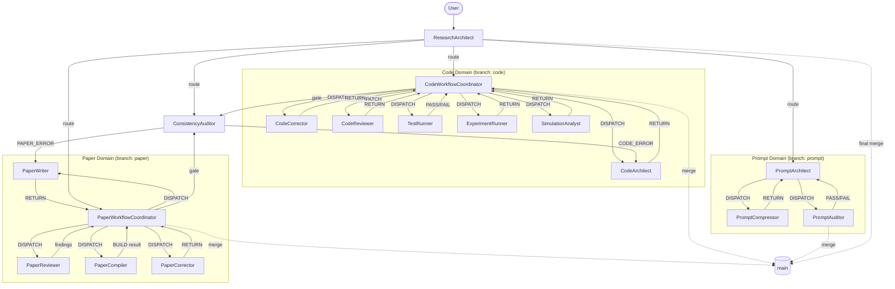

# GENERATED — do NOT edit directly. Edit prompts/meta/*.md and regenerate.

# Agent System — 3-Layer Architecture

## Section 1 — Architecture Principle

```
Layer 1 — Abstract Meta:   prompts/meta/             <- WHY and HOW (concepts, structure, logic)
Layer 2 — Concrete SSoT:   docs/00_GLOBAL_RULES.md   <- WHAT (project-independent rules)
Layer 3 — Project Context: docs/01_PROJECT_MAP.md     <- WHERE/WHICH (module map, ASM-IDs)
                           docs/02_ACTIVE_LEDGER.md   <- WHEN/STATUS (phase, CHK/KL registers)
```

**Authority rules:**
- `prompts/meta/` wins on axiom intent (A10)
- `docs/00_GLOBAL_RULES.md` wins on rule interpretation
- `docs/01_PROJECT_MAP.md` / `docs/02_ACTIVE_LEDGER.md` win on project state
- No mixing rule: each layer is authoritative for its scope only

---

## Section 2 — Directory Map

### Meta Files (Layer 1 — Abstract)
| File | Layer | Question |
|------|-------|----------|
| `meta/meta-core.md` | 1 — Static | FOUNDATION: phi1-phi7, A1-A10, system targets |
| `meta/meta-persona.md` | 1 — Static | WHO: agent character and skills |
| `meta/meta-domains.md` | 2 — Dynamic | STRUCTURE: 4x3 matrix domain registry |
| `meta/meta-roles.md` | 2 — Dynamic | WHAT: per-agent role contracts |
| `meta/meta-ops.md` | 2 — Dynamic | EXECUTE: canonical commands, handoff protocols |
| `meta/meta-workflow.md` | 3 — Orchestration | HOW: pipelines, coordination protocols |
| `meta/meta-deploy.md` | 3 — Orchestration | DEPLOY: EnvMetaBootstrapper |

### Agent Prompts (Generated — Layer 2 derivatives)
| Domain | File |
|--------|------|
| Routing | `agents/ResearchArchitect.md` |
| Code | `agents/CodeWorkflowCoordinator.md`, `agents/CodeArchitect.md`, `agents/CodeCorrector.md`, `agents/CodeReviewer.md`, `agents/TestRunner.md`, `agents/ExperimentRunner.md`, `agents/SimulationAnalyst.md` |
| Paper | `agents/PaperWorkflowCoordinator.md`, `agents/PaperWriter.md`, `agents/PaperReviewer.md`, `agents/PaperCompiler.md`, `agents/PaperCorrector.md` |
| Audit | `agents/ConsistencyAuditor.md` |
| Prompt | `agents/PromptArchitect.md`, `agents/PromptCompressor.md`, `agents/PromptAuditor.md` |
| Theory (Atomic) | `agents/EquationDeriver.md`, `agents/SpecWriter.md` |
| Code (Atomic) | `agents/CodeArchitectAtomic.md`, `agents/LogicImplementer.md`, `agents/ErrorAnalyzer.md`, `agents/RefactorExpert.md` |
| Evaluation (Atomic) | `agents/TestDesigner.md`, `agents/VerificationRunner.md`, `agents/ResultAuditor.md` |

### Documentation (Layer 2-3)
```
docs/
  00_GLOBAL_RULES.md    — Concrete SSoT (project-independent rules)
  01_PROJECT_MAP.md     — Module map, interface contracts, numerical reference
  02_ACTIVE_LEDGER.md   — Phase, branch, CHK/KL registers
```

### Project Directories
```
theory/       — T-Domain (Mathematical Truth)
lib/          — L-Domain interface landing
src/twophase/ — L-Domain (Functional Truth — solver source)
experiment/   — E-Domain (Empirical Truth)
paper/        — A-Domain (Logical Truth — LaTeX)
prompts/      — P-Domain (Agent intelligence)
audit_logs/   — Q-Domain (Audit trails)
interface/    — Cross-domain contracts (Gatekeeper-owned)
artifacts/    — Micro-agent intermediate outputs (T/L/E/Q)
```

---

## Section 3 — Rule Ownership Map

| Rule | Abstract definition | Concrete SSoT | Project context |
|------|-------------------|---------------|-----------------|
| A1-A10 Core Axioms | `meta-core.md` §AXIOMS | `00_GLOBAL_RULES.md` §A | — |
| SOLID C1-C6 | `meta-roles.md` §CODE DOMAIN | `00_GLOBAL_RULES.md` §C | `01_PROJECT_MAP.md` §8 (Legacy) |
| LaTeX P1-P4 | `meta-roles.md` §PAPER DOMAIN | `00_GLOBAL_RULES.md` §P | `01_PROJECT_MAP.md` §10 (P3-D) |
| Prompt Q1-Q4 | `meta-roles.md` §PROMPT DOMAIN | `00_GLOBAL_RULES.md` §Q | — |
| Audit AU1-AU3 | `meta-roles.md` §AUDIT DOMAIN | `00_GLOBAL_RULES.md` §AU | — |
| Git lifecycle | `meta-workflow.md` §GIT BRANCH | `00_GLOBAL_RULES.md` §GIT | `02_ACTIVE_LEDGER.md` §ACTIVE STATE |
| P-E-V-A loop | `meta-workflow.md` §P-E-V-A | `00_GLOBAL_RULES.md` §P-E-V-A | `02_ACTIVE_LEDGER.md` §CHECKLIST |
| Domain registry | `meta-domains.md` §DOMAIN REGISTRY | — | `01_PROJECT_MAP.md` §11 |
| Handoff protocols | `meta-ops.md` §HANDOFF PROTOCOL | — | — |

---

## Section 4 — A1-A10 Quick Reference

| Axiom | Rule |
|-------|------|
| A1 | Token Economy — no redundancy; diff > rewrite; reference > duplication |
| A2 | External Memory First — state only in docs/ and git; append-only; ID-based |
| A3 | 3-Layer Traceability — Equation -> Discretization -> Code is mandatory |
| A4 | Separation — never mix logic/content/tags/style; solver/infra/performance |
| A5 | Solver Purity — solver isolated from infrastructure; numerical meaning invariant |
| A6 | Diff-First Output — no full file output unless required; patch-like edits |
| A7 | Backward Compatibility — preserve semantics; upgrade by mapping |
| A8 | Git Governance — main protected; domain branches; merge path enforced |
| A9 | Core/System Sovereignty — solver core has zero dependency on infrastructure |
| A10 | Meta-Governance — prompts/meta/ is single source; docs/ are derived outputs |

---

## Section 5 — Execution Loop

```
1. ResearchArchitect  — absorb project state, map intent to domain
2. PLAN               — coordinator defines scope, success criteria, stop conditions
3. EXECUTE            — specialist produces artifact on dev/ branch
4. VERIFY             — independent verifier confirms artifact meets spec
5. AUDIT              — ConsistencyAuditor/PromptAuditor gate check (AU2 10 items)
   |
   +-- FAIL at VERIFY -> return to EXECUTE
   +-- FAIL at AUDIT  -> return to EXECUTE
   +-- PASS at AUDIT  -> merge dev/ -> {domain} -> main
```

---

## Section 6 — 3-Phase Domain Lifecycle

| Phase | Trigger | Auto-action |
|-------|---------|-------------|
| DRAFT | Specialist completes work on dev/ branch | `git commit -m "{branch}: draft -- {summary}"` |
| REVIEWED | Gatekeeper approves after TestRunner PASS / PaperReviewer 0 FATAL+0 MAJOR / PromptAuditor Q3 PASS | `git commit -m "{branch}: reviewed -- {summary}"` |
| VALIDATED | ConsistencyAuditor AU2 PASS (or PromptAuditor gate) | `git merge --no-ff -m "{branch}: validated -- {summary}"` + PR to main |

---

## Section 7 — Agent Roster

| Domain | Agent | Role |
|--------|-------|------|
| Routing | ResearchArchitect | Session intake, intent routing, environment orchestration |
| Code | CodeWorkflowCoordinator | Code pipeline orchestrator, code quality auditor (Gatekeeper) |
| Code | CodeArchitect | Equation-to-code translator (Specialist) |
| Code | CodeCorrector | Numerical debug specialist, staged isolation (Specialist) |
| Code | CodeReviewer | Risk classifier, SOLID enforcement (Specialist) |
| Code | TestRunner | Convergence analyst, formal verdict authority (Specialist) |
| Code | ExperimentRunner | Benchmark simulation executor, sanity check validator (Specialist) |
| Code | SimulationAnalyst | Post-processing, visualization, derived metrics (Specialist) |
| Paper | PaperWorkflowCoordinator | Paper pipeline orchestrator, review loop controller (Gatekeeper) |
| Paper | PaperWriter | Academic editor, mathematical truth definer (Specialist) |
| Paper | PaperReviewer | Peer reviewer, classification only (Gatekeeper/Devil's Advocate) |
| Paper | PaperCompiler | LaTeX compliance, zero compilation errors (Specialist) |
| Paper | PaperCorrector | Scope-enforced corrector, minimal intervention (Specialist) |
| Audit | ConsistencyAuditor | Cross-domain falsification, independent re-derivation (Gatekeeper) |
| Prompt | PromptArchitect | Meta-to-prompt compositor, axiom preserver (Gatekeeper) |
| Prompt | PromptCompressor | Semantic-equivalence compressor (Specialist) |
| Prompt | PromptAuditor | Q3 checklist executor, read-only auditor (Gatekeeper) |
| Theory (Atomic) | EquationDeriver | First-principles derivation (Specialist) |
| Theory (Atomic) | SpecWriter | Theory-to-spec translator (Specialist) |
| Code (Atomic) | CodeArchitectAtomic | Structural design, interfaces only (Specialist) |
| Code (Atomic) | LogicImplementer | Method body implementation (Specialist) |
| Code (Atomic) | ErrorAnalyzer | Forensic diagnosis, no fixes (Specialist) |
| Code (Atomic) | RefactorExpert | Targeted surgical fixes (Specialist) |
| Eval (Atomic) | TestDesigner | Test case design, MMS solutions (Specialist) |
| Eval (Atomic) | VerificationRunner | Execution automaton, log capture (Specialist) |
| Audit (Atomic) | ResultAuditor | Theory-vs-evidence auditor (Gatekeeper) |

---

## Section 8 — Agent Interaction Diagram



---

## Section 9 — Regeneration Instructions

- **To rebuild agents/:**
  ```
  Execute EnvMetaBootstrapper Using prompts/meta/meta-deploy.md Target [Claude|Codex|Ollama|Mixed]
  ```

- **To update rules:** Edit `prompts/meta/*.md` (authoritative source — A10), then regenerate via EnvMetaBootstrapper. **Never edit `docs/00_GLOBAL_RULES.md` directly** — it is a derived output, not the source.

- **To update project state:** Append to `docs/01_PROJECT_MAP.md` or `docs/02_ACTIVE_LEDGER.md`.

- **To change domain structure or axiom intent:** Edit `prompts/meta/*.md`, then regenerate.

- **First command after deployment:** `Execute ResearchArchitect`
