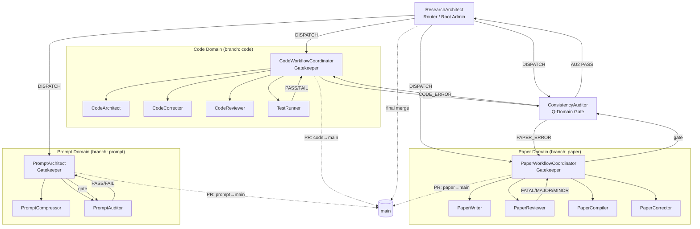

# GENERATED — do NOT edit directly. Edit prompts/meta/*.md and regenerate.
# EnvMetaBootstrapper — prompts/README.md
# Last regenerated: 2026-03-31

## Section 1 — Architecture Principle

3-layer architecture (one-way dependency — lower layers must NOT import upper):

```
Layer 1 — Abstract Meta:   prompts/meta/             ← WHY and HOW (concepts, structure, logic)
Layer 2 — Concrete SSoT:   docs/00_GLOBAL_RULES.md   ← WHAT (project-independent rules)
Layer 3 — Project Context: docs/01_PROJECT_MAP.md     ← WHERE/WHICH (module map, ASM-IDs)
                           docs/02_ACTIVE_LEDGER.md   ← WHEN/STATUS (phase, CHK/KL registers)
```

**Authority rules:**
- `prompts/meta/` wins on axiom intent
- `docs/00_GLOBAL_RULES.md` wins on rule interpretation
- `docs/01_PROJECT_MAP.md` / `docs/02_ACTIVE_LEDGER.md` win on project state
- No mixing rule (A10)

## Section 2 — Directory Map

```
prompts/
├── meta/                    ← Layer 1 — Abstract Meta (authoritative source; never edit derived files)
│   ├── meta-core.md         ← FOUNDATION: φ1–φ7, A1–A10, system targets
│   ├── meta-persona.md      ← WHO: agent character + skills
│   ├── meta-domains.md      ← STRUCTURE: domain registry, branches, storage, lock protocol
│   ├── meta-roles.md        ← WHAT: per-agent role contracts
│   ├── meta-ops.md          ← EXECUTE: canonical commands and handoff protocols
│   ├── meta-workflow.md     ← HOW: pipelines, coordination protocols
│   └── meta-deploy.md       ← DEPLOY: EnvMetaBootstrapper
├── agents/                  ← Layer 2 derived — generated agent prompts (do NOT edit directly)
│   ├── ResearchArchitect.md
│   ├── CodeWorkflowCoordinator.md
│   ├── CodeArchitect.md
│   ├── CodeCorrector.md
│   ├── CodeReviewer.md
│   ├── TestRunner.md
│   ├── ExperimentRunner.md
│   ├── PaperWorkflowCoordinator.md
│   ├── PaperWriter.md
│   ├── PaperReviewer.md
│   ├── PaperCompiler.md
│   ├── PaperCorrector.md
│   ├── ConsistencyAuditor.md
│   ├── PromptArchitect.md
│   ├── PromptCompressor.md
│   └── PromptAuditor.md
└── README.md                ← This file

docs/
├── 00_GLOBAL_RULES.md       ← Layer 2 — Concrete SSoT (project-independent rules)
├── 01_PROJECT_MAP.md        ← Layer 3 — Project Context: module map, ASM-IDs
└── 02_ACTIVE_LEDGER.md      ← Layer 3 — Project Context: phase, CHK/KL registers

interface/
├── AlgorithmSpecs.md        ← T→L interface contract
├── SolverAPI_v1.py          ← L→E interface contract
└── TechnicalReport.md       ← T/E→A interface contract
```

## Section 3 — Rule Ownership Map

| Rule | Abstract definition | Concrete SSoT | Project context |
|------|--------------------|-|---|
| A1–A10 | meta-core.md §AXIOMS | docs/00_GLOBAL_RULES.md §A | — |
| SOLID C1 | meta-core.md §A9, meta-roles.md | docs/00_GLOBAL_RULES.md §C1 | — |
| C2 Preserve-tested | meta-roles.md §CodeArchitect | docs/00_GLOBAL_RULES.md §C2 | docs/01_PROJECT_MAP.md §C2 Legacy Register |
| C3 Builder | meta-roles.md §CodeWorkflowCoordinator | docs/00_GLOBAL_RULES.md §C3 | — |
| C4 Solver policy | meta-domains.md §L-Domain | docs/00_GLOBAL_RULES.md §C4 | — |
| C5 Code quality | meta-persona.md §CodeArchitect | docs/00_GLOBAL_RULES.md §C5 | — |
| C6 MMS standard | meta-persona.md §CodeArchitect | docs/00_GLOBAL_RULES.md §C6 | — |
| P1 LaTeX authoring | meta-persona.md §PaperCompiler | docs/00_GLOBAL_RULES.md §P1 | — |
| KL-12 texorpdfstring | meta-ops.md BUILD-01 | docs/00_GLOBAL_RULES.md §KL-12 | docs/02_ACTIVE_LEDGER.md §LESSONS |
| P3-D multi-site params | meta-roles.md §PaperWriter | docs/00_GLOBAL_RULES.md §P3 | docs/01_PROJECT_MAP.md §P3-D Register |
| P4 Reviewer skepticism | meta-core.md §B, meta-persona.md §PaperWriter | docs/00_GLOBAL_RULES.md §P4 | — |
| Q1–Q4 Prompt rules | meta-deploy.md §Q2 | docs/00_GLOBAL_RULES.md §Q | — |
| AU1–AU3 Audit rules | meta-roles.md §ConsistencyAuditor | docs/00_GLOBAL_RULES.md §AU | — |
| Git 3-phase lifecycle | meta-domains.md §DOMAIN REGISTRY | docs/00_GLOBAL_RULES.md §GIT | docs/02_ACTIVE_LEDGER.md §ACTIVE STATE |
| P-E-V-A loop | meta-workflow.md §P-E-V-A | docs/00_GLOBAL_RULES.md §P-E-V-A | docs/02_ACTIVE_LEDGER.md §CHECKLIST |

## Section 4 — A1–A10 Quick Reference

| Axiom | Rule |
|-------|------|
| A1 | Token Economy — reference > restatement; diff > rewrite; compact > verbose |
| A2 | External Memory First — all state in docs/02_ACTIVE_LEDGER.md, docs/01_PROJECT_MAP.md, git |
| A3 | 3-Layer Traceability — Equation → Discretization → Code is mandatory |
| A4 | Separation — never mix: logic/content/tags/style; solver/infrastructure/performance |
| A5 | Solver Purity — solver isolated from infrastructure; numerical meaning invariant |
| A6 | Diff-First Output — no full file output unless required; patch-like edits |
| A7 | Backward Compatibility — preserve semantics; never discard meaning without deprecation |
| A8 | Git Governance — domain branches; no direct main commits; 3-phase lifecycle |
| A9 | Core/System Sovereignty — solver core must never import infrastructure |
| A10 | Meta-Governance — prompts/meta/ is SSoT; docs/ are derived outputs; never edit docs/ to change rules |

## Section 5 — Execution Loop

```
1. ResearchArchitect    — loads docs/02_ACTIVE_LEDGER.md; maps intent to agent; issues DISPATCH (HAND-01)
2. PLAN                 — Coordinator or ResearchArchitect defines scope; records in 02_ACTIVE_LEDGER.md
3. EXECUTE              — Specialist produces artifact on dev/{agent_role}; opens PR with LOG-ATTACHED
4. VERIFY               — Independent verifier (TestRunner / PaperCompiler+Reviewer / PromptAuditor) issues verdict
5. AUDIT                — ConsistencyAuditor AU2 gate (10 items); PASS → Root Admin merges to main
```

## Section 6 — 3-Phase Domain Lifecycle

| Phase | Trigger | Auto-action (commit message format) |
|-------|---------|--------------------------------------|
| DRAFT | Specialist completes artifact | `dev/{agent_role}: {summary} [LOG-ATTACHED]` |
| REVIEWED | Gatekeeper verifies evidence (GA-1–GA-6 all PASS) | `{domain}: reviewed — {summary}` |
| VALIDATED | ConsistencyAuditor AU2 PASS | `{domain}: VALIDATED — {summary}; merge to main` |

## Section 7 — Agent Roster

| Domain | Agent | Role |
|--------|-------|------|
| Routing (M) | ResearchArchitect | Session intake and workflow router; maps intent to agents; Root Admin for main merges |
| Code (L) | CodeWorkflowCoordinator | Code pipeline orchestrator; L-Domain Gatekeeper (Numerical Auditor) |
| Code (L) | CodeArchitect | Equation-to-code translator; implements solver modules from paper equations |
| Code (L) | CodeCorrector | Staged debug specialist; isolates numerical failures and applies minimal fixes |
| Code (L) | CodeReviewer | Senior software architect; risk-classifies refactors without altering numerical behavior |
| Code (L) | TestRunner | Convergence analyst; interprets test output; issues formal PASS/FAIL verdicts |
| Experiment (E) | ExperimentRunner | Reproducible experiment executor; validates results against 4 mandatory sanity checks |
| Paper (A) | PaperWorkflowCoordinator | Paper pipeline orchestrator; A-Domain Gatekeeper; loop controller |
| Paper (A) | PaperWriter | World-class academic editor; writes LaTeX patches from verified derivations |
| Paper (A) | PaperReviewer | No-punches-pulled peer reviewer; classifies findings FATAL/MAJOR/MINOR |
| Paper (A) | PaperCompiler | LaTeX compliance engine; zero compilation errors; minimal intervention only |
| Paper (A) | PaperCorrector | Targeted fix executor; applies only classified VERIFIED/LOGICAL_GAP findings |
| Audit (Q) | ConsistencyAuditor | Cross-domain falsification gate; independently re-derives from first principles |
| Prompt (P) | PromptArchitect | Environment-optimized prompt generator; builds from meta files only |
| Prompt (P) | PromptCompressor | Semantic-equivalence verifier; reduces token usage without meaning loss |
| Prompt (P) | PromptAuditor | Q3 checklist executor; read-only; reports facts only; never auto-repairs |

## Section 8 — Agent Interaction Diagram



## Section 9 — Regeneration Instructions

- **To rebuild agents/:** `Execute EnvMetaBootstrapper Using prompts/meta/meta-deploy.md Target Claude`
- **To update rules:** Edit `prompts/meta/*.md` (authoritative — A10), then regenerate via EnvMetaBootstrapper.
  **Never edit `docs/00_GLOBAL_RULES.md` directly** — it is a derived output, not the source (A10).
- **To update project state:** Append to `docs/01_PROJECT_MAP.md` or `docs/02_ACTIVE_LEDGER.md`.
- **To change domain structure or axiom intent:** Edit `prompts/meta/*.md` then regenerate.
