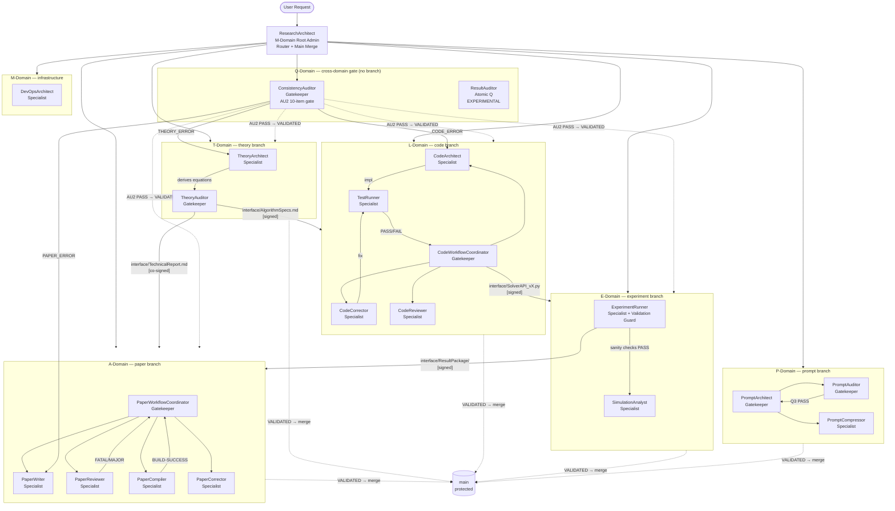

# GENERATED — do NOT edit directly. Edit prompts/meta/*.md and regenerate.
# generated_from: meta-core@2.1.0, meta-persona@2.0.0, meta-roles@2.1.0,
#                 meta-domains@2.0.0, meta-workflow@2.0.0, meta-ops@2.0.0,
#                 meta-deploy@2.0.0
# generated_at: 2026-04-02T00:00:00Z
# target_env: Claude

# EnvMetaBootstrapper System — Prompts Reference

---

## 1. Architecture Principle

The system is organized in three layers (one-way dependency — lower layers must NOT import upper):

```
Layer 1 — Abstract Meta:   prompts/meta/             ← WHY and HOW (concepts, structure, logic)
Layer 2 — Concrete SSoT:   docs/00_GLOBAL_RULES.md   ← WHAT (project-independent rules)
Layer 3 — Project Context: docs/01_PROJECT_MAP.md     ← WHERE/WHICH (module map, ASM-IDs)
                           docs/02_ACTIVE_LEDGER.md   ← WHEN/STATUS (phase, CHK/KL registers)
```

**Authority Rules:**
- `prompts/meta/` wins on axiom intent (φ6, A10)
- `docs/00_GLOBAL_RULES.md` wins on rule interpretation
- `docs/01_PROJECT_MAP.md` and `docs/02_ACTIVE_LEDGER.md` win on project state
- No mixing rule: never patch a derivative; edit the source and regenerate

**4×3 Matrix Architecture:**

```
                  ┌─────────────────────────────────────────────────────┐
                  │           HORIZONTAL GOVERNANCE DOMAINS              │
                  │  M: Meta-Logic  │  P: Prompt&Env  │  Q: QA & Audit  │
┌─────────────────┼─────────────────┼─────────────────┼─────────────────┤
│ T  Theory &     │ Constitutional  │ Agent tooling   │ Independent     │
│    Analysis     │ routing/protocol│ for T-Domain    │ re-derivation   │
├─────────────────┼─────────────────┼─────────────────┼─────────────────┤
│ L  Core Library │ Constitutional  │ Agent tooling   │ Code–theory     │
│                 │ routing/protocol│ for L-Domain    │ consistency     │
├─────────────────┼─────────────────┼─────────────────┼─────────────────┤
│ E  Experiment   │ Constitutional  │ Agent tooling   │ Sanity check    │
│                 │ routing/protocol│ for E-Domain    │ gate            │
├─────────────────┼─────────────────┼─────────────────┼─────────────────┤
│ A  Academic     │ Constitutional  │ Agent tooling   │ Logical review  │
│    Writing      │ routing/protocol│ for A-Domain    │ + AU2 gate      │
└─────────────────┴─────────────────┴─────────────────┴─────────────────┘
```

**Authority Tiers:**

| Tier | Agents | Git Authority | Git Obligations |
|------|--------|--------------|----------------|
| Root Admin | ResearchArchitect | Executes final merge `{domain}→main`; GIT-04 Phase B | Verify all 4 Root Admin check items + GA conditions before merge |
| Gatekeeper | CodeWorkflowCoordinator, PaperWorkflowCoordinator, TheoryAuditor, PromptArchitect, PromptAuditor | Write `interface/` contracts; enforce GA-1–GA-6; merge dev/ PRs into domain; open domain→main PR | Derive independently before approving claims; reject PRs where any GA condition fails |
| Specialist | All others | Sovereign dev/{agent_role} branch only | Attach LOG-ATTACHED with every PR; set `verified_independently: true` when acting as verifier |

---

## 2. Directory Map

```
prompts/
├── README.md                        ← This file (generated)
├── meta/
│   ├── meta-core.md                 ← FOUNDATION: design philosophy (φ1–φ7), axioms A1–A10, system targets
│   ├── meta-persona.md              ← WHO: agent CHARACTER + SKILLS (Specialist / Gatekeeper archetypes)
│   ├── meta-roles.md                ← WHAT: DELIVERABLES, AUTHORITY, CONSTRAINTS, STOP per agent
│   ├── meta-domains.md              ← STRUCTURE: domain registry, branch rules, storage sovereignty, lock protocol
│   ├── meta-workflow.md             ← HOW: T-L-E-A pipeline, CI/CP, domain pipelines, coordination protocols
│   ├── meta-ops.md                  ← EXECUTE: canonical commands (GIT/DOM/BUILD/TEST/EXP/HAND/AUDIT)
│   └── meta-deploy.md               ← DEPLOY: EnvMetaBootstrapper stages + environment profiles
└── agents/
    ├── ResearchArchitect.md         ← M-Domain router (Gatekeeper / Root Admin)
    ├── DevOpsArchitect.md           ← M-Domain infrastructure (Specialist)
    ├── CodeWorkflowCoordinator.md   ← L-Domain coordinator (Gatekeeper)
    ├── CodeArchitect.md             ← L-Domain equation→code translator (Specialist)
    ├── CodeCorrector.md             ← L-Domain debugger / staged isolator (Specialist)
    ├── CodeReviewer.md              ← L-Domain risk classifier (Specialist)
    ├── TestRunner.md                ← L-Domain convergence verifier (Specialist)
    ├── ExperimentRunner.md          ← E-Domain simulation executor (Specialist)
    ├── SimulationAnalyst.md         ← E-Domain post-processor (Specialist)
    ├── PaperWorkflowCoordinator.md  ← A-Domain coordinator / review-loop controller (Gatekeeper)
    ├── PaperWriter.md               ← A-Domain academic author + corrector (Specialist)
    ├── PaperReviewer.md             ← A-Domain peer reviewer / Devil's Advocate (Specialist)
    ├── PaperCompiler.md             ← A-Domain LaTeX compliance engine (Specialist)
    ├── PaperCorrector.md            ← A-Domain scope-enforced fix applier (Specialist)
    ├── TheoryArchitect.md           ← T-Domain first-principles deriver (Specialist)
    ├── TheoryAuditor.md             ← T-Domain independent re-deriver (Gatekeeper)
    ├── ConsistencyAuditor.md        ← Q-Domain cross-domain falsification gate (Gatekeeper)
    ├── PromptArchitect.md           ← P-Domain prompt generator (Gatekeeper)
    ├── PromptCompressor.md          ← P-Domain safe compressor (Specialist)
    ├── PromptAuditor.md             ← P-Domain Q3-checklist auditor (Gatekeeper)
    ├── EquationDeriver.md           ← Atomic T — first-principles derivation [EXPERIMENTAL]
    ├── SpecWriter.md                ← Atomic T — derivation→implementation spec [EXPERIMENTAL]
    ├── CodeArchitectAtomic.md       ← Atomic L — class/interface structure design [EXPERIMENTAL]
    ├── LogicImplementer.md          ← Atomic L — method body implementation [EXPERIMENTAL]
    ├── ErrorAnalyzer.md             ← Atomic L — root cause diagnosis only [EXPERIMENTAL]
    ├── RefactorExpert.md            ← Atomic L — targeted fix application [EXPERIMENTAL]
    ├── TestDesigner.md              ← Atomic E — test specification design [EXPERIMENTAL]
    ├── VerificationRunner.md        ← Atomic E — test/simulation execution [EXPERIMENTAL]
    └── ResultAuditor.md             ← Atomic Q — execution result audit [EXPERIMENTAL]

docs/
├── 00_GLOBAL_RULES.md               ← Concrete SSoT: axioms A1–A10, §C, §P, §Q, §AU, §GIT, §P-E-V-A
├── 01_PROJECT_MAP.md                ← Project context: module map, interface contracts, ASM register, §6 numerical ref
└── 02_ACTIVE_LEDGER.md              ← Live project state: phase, branch, decisions, CHK/KL registers
```

---

## 3. Rule Ownership Map

| Rule | Abstract definition (meta file + §) | Concrete SSoT (docs/00 §section) | Project context (docs/01–02 §) |
|------|-------------------------------------|----------------------------------|-------------------------------|
| A1 Token Economy | meta-core.md §AXIOMS A1 | docs/00_GLOBAL_RULES.md §A | — |
| A2 External Memory First | meta-core.md §AXIOMS A2 | docs/00_GLOBAL_RULES.md §A | docs/02_ACTIVE_LEDGER.md §ACTIVE STATE |
| A3 3-Layer Traceability | meta-core.md §AXIOMS A3 | docs/00_GLOBAL_RULES.md §A | docs/01_PROJECT_MAP.md §6 |
| A4 Separation | meta-core.md §AXIOMS A4 | docs/00_GLOBAL_RULES.md §A | — |
| A5 Solver Purity | meta-core.md §AXIOMS A5 | docs/00_GLOBAL_RULES.md §A | docs/01_PROJECT_MAP.md §4 |
| A6 Diff-First Output | meta-core.md §AXIOMS A6 | docs/00_GLOBAL_RULES.md §A | — |
| A7 Backward Compatibility | meta-core.md §AXIOMS A7 | docs/00_GLOBAL_RULES.md §A | — |
| A8 Git Governance | meta-core.md §AXIOMS A8 | docs/00_GLOBAL_RULES.md §A, §GIT | docs/02_ACTIVE_LEDGER.md §ACTIVE STATE |
| A9 Core/System Sovereignty | meta-core.md §AXIOMS A9 | docs/00_GLOBAL_RULES.md §A | docs/01_PROJECT_MAP.md §4 |
| A10 Meta-Governance | meta-core.md §AXIOMS A10 | docs/00_GLOBAL_RULES.md §A | — |
| C1 SOLID Principles | meta-roles.md §ATOMIC ROLE TAXONOMY | docs/00_GLOBAL_RULES.md §C1 | docs/01_PROJECT_MAP.md §4 |
| C2 Preserve Once-Tested | meta-roles.md §ATOMIC ROLE TAXONOMY | docs/00_GLOBAL_RULES.md §C2 | docs/01_PROJECT_MAP.md §8 (C2 Legacy Register) |
| C3 Builder Pattern | meta-roles.md §ATOMIC ROLE TAXONOMY | docs/00_GLOBAL_RULES.md §C3 | docs/01_PROJECT_MAP.md §4 |
| C4 Implicit Solver Policy | meta-roles.md §ATOMIC ROLE TAXONOMY | docs/00_GLOBAL_RULES.md §C4 | docs/01_PROJECT_MAP.md §5 |
| C5 Code Quality | meta-roles.md §ATOMIC ROLE TAXONOMY | docs/00_GLOBAL_RULES.md §C5 | — |
| C6 MMS Test Standard | meta-roles.md §ATOMIC ROLE TAXONOMY | docs/00_GLOBAL_RULES.md §C6 | docs/01_PROJECT_MAP.md §6 |
| P1 LaTeX Authoring | meta-roles.md §ATOMIC ROLE TAXONOMY | docs/00_GLOBAL_RULES.md §P1 | docs/01_PROJECT_MAP.md §9 |
| P3 Whole-Paper Consistency | meta-roles.md §ATOMIC ROLE TAXONOMY | docs/00_GLOBAL_RULES.md §P3 | docs/01_PROJECT_MAP.md §10 (P3-D Register) |
| P4 Reviewer Skepticism | meta-core.md §DESIGN PHILOSOPHY φ1 | docs/00_GLOBAL_RULES.md §P4 | docs/02_ACTIVE_LEDGER.md §LESSONS §B |
| KL-12 \texorpdfstring trap | meta-roles.md §ATOMIC ROLE TAXONOMY | docs/00_GLOBAL_RULES.md §KL-12 | docs/02_ACTIVE_LEDGER.md §LESSONS §B |
| Q1 Standard Template | meta-deploy.md §Stage 3 | docs/00_GLOBAL_RULES.md §Q1 | — |
| Q2 Environment Profiles | meta-deploy.md §ENVIRONMENT PROFILES | docs/00_GLOBAL_RULES.md §Q2 | — |
| Q3 Audit Checklist | meta-deploy.md §Stage 5 | docs/00_GLOBAL_RULES.md §Q3 | docs/02_ACTIVE_LEDGER.md §CHECKLIST §1 |
| Q4 Compression Rules | meta-persona.md §PromptCompressor | docs/00_GLOBAL_RULES.md §Q4 | — |
| AU1 Authority Chain | meta-core.md §DESIGN PHILOSOPHY φ3 | docs/00_GLOBAL_RULES.md §AU1 | — |
| AU2 Gate Conditions | meta-deploy.md §Stage 5 | docs/00_GLOBAL_RULES.md §AU2 | docs/02_ACTIVE_LEDGER.md §CHECKLIST §2 |
| AU3 Verification Procedures | meta-roles.md §GATEKEEPER APPROVAL | docs/00_GLOBAL_RULES.md §AU3 | docs/02_ACTIVE_LEDGER.md §CHECKLIST §2 |
| GA-1–GA-6 Gatekeeper Approval | meta-roles.md §GATEKEEPER APPROVAL | docs/00_GLOBAL_RULES.md §AU2 | docs/02_ACTIVE_LEDGER.md §CHECKLIST |
| Git Lifecycle (DRAFT/REVIEWED/VALIDATED) | meta-domains.md §DOMAIN REGISTRY | docs/00_GLOBAL_RULES.md §GIT | docs/02_ACTIVE_LEDGER.md §ACTIVE STATE |
| P-E-V-A Execution Loop | meta-workflow.md §P-E-V-A | docs/00_GLOBAL_RULES.md §P-E-V-A | docs/02_ACTIVE_LEDGER.md §ACTIVE STATE |

---

## 4. A1–A10 Quick Reference

Derived from meta-core.md §AXIOMS. Full concrete rule text: docs/00_GLOBAL_RULES.md §A.

| Axiom | Name | One-line rule |
|-------|------|---------------|
| A1 | Token Economy | No redundancy; diff > rewrite; reference > duplication; compact > verbose |
| A2 | External Memory First | State only in docs/02_ACTIVE_LEDGER.md, docs/01_PROJECT_MAP.md, git history; never rely on implicit memory |
| A3 | 3-Layer Traceability | Equation → Discretization → Code chain is mandatory; every scientific claim must preserve this chain |
| A4 | Separation | Never mix: logic/content/tags/style; solver/infrastructure/performance; theory/discretization/implementation/verification |
| A5 | Solver Purity | Solver isolated from infrastructure; numerical meaning invariant under logging, I/O, visualization, config, or refactoring |
| A6 | Diff-First Output | No full file output unless explicitly required; prefer patch-like edits; explain only what changed and why |
| A7 | Backward Compatibility | Preserve semantics when migrating; upgrade by mapping and compressing; never discard meaning without explicit deprecation |
| A8 | Git Governance | Branches: main (protected); code, paper, prompt (domain integration); dev/{agent_role} (individual); interface/ (Gatekeepers only) |
| A9 | Core/System Sovereignty | Solver core (src/core/) has zero dependency on infrastructure (src/system/); reverse dependency = CRITICAL_VIOLATION |
| A10 | Meta-Governance | prompts/meta/ is the SINGLE SOURCE OF TRUTH; docs/ files are DERIVED outputs — never edit docs/ directly to change a rule |

---

## 5. Execution Loop

The P-E-V-A (Plan–Execute–Verify–Audit) loop governs all work. Every task passes through all five steps.

```
Step 1 — ROUTE
  ResearchArchitect (M-Domain, Root Admin)
    • Loads docs/02_ACTIVE_LEDGER.md and docs/01_PROJECT_MAP.md
    • Runs GIT-01 Step 0 (branch alignment; main-sync verification)
    • Classifies: FULL-PIPELINE or FAST-TRACK
    • Verifies previous domain merged to main before routing to a new domain
    • Issues HAND-01 DISPATCH to domain Coordinator

Step 2 — PLAN
  Domain Coordinator (CodeWorkflowCoordinator / PaperWorkflowCoordinator / TheoryAuditor / PromptArchitect)
    • Runs IF-AGREEMENT (GIT-00) for FULL-PIPELINE; declares contract reuse for FAST-TRACK
    • Emits DOMAIN-LOCK block (DOM-01)
    • Inventories gaps; produces dispatch queue
    • Issues HAND-01 DISPATCH to first Specialist

Step 3 — EXECUTE
  Specialist Agent
    • Runs HAND-03 Acceptance Check (14 items) before any work
    • Runs DOM-02 Pre-Write Storage Check before every file write
    • Produces deliverable; attaches LOG-ATTACHED evidence
    • Issues HAND-02 RETURN to Coordinator

Step 4 — VERIFY
  Independent Verifier (TestRunner / PaperCompiler / VerificationRunner / etc.)
    • Runs independently — must NOT read Specialist's reasoning first (MH-3 Broken Symmetry)
    • Derives expected values from theory artifacts; compares against execution output
    • Issues PASS or FAIL verdict with evidence

Step 5 — AUDIT
  Gatekeeper / Auditor
    • Checks GA-1 through GA-6 (all must be satisfied before REVIEWED gate)
    • On PASS: merges dev/ PR → domain branch; immediately opens domain → main PR
    • On FAIL: rejects with cited GA condition + actionable fix (max MAX_REJECT_ROUNDS=3)
    • ConsistencyAuditor performs AU2 gate (10-item checklist) at each domain boundary
    • VALIDATED phase: Root Admin (ResearchArchitect) performs final check; merges domain → main
```

---

## 6. 3-Phase Domain Lifecycle

Derived from meta-workflow.md §CI/CP PIPELINE and meta-domains.md §DOMAIN REGISTRY.

| Phase | Commit Tag | Gate Condition | Who issues | Auto-action |
|-------|-----------|----------------|------------|-------------|
| DRAFT | `{branch}: {summary} [DRAFT]` | Specialist completes deliverable on dev/{agent_role} branch | Specialist | Coordinator receives HAND-02 RETURN; schedules VERIFY |
| REVIEWED | `{branch}: {summary} [REVIEWED]` | Gatekeeper satisfies GA-1–GA-6; LOG-ATTACHED present; independent verification confirmed | Gatekeeper (GIT-03) | Gatekeeper merges dev/ PR → domain; immediately opens domain → main PR |
| VALIDATED | `{branch}: {summary} [VALIDATED]` | ConsistencyAuditor AU2 PASS (10-item gate); cross-domain consistency confirmed | Gatekeeper (GIT-04) | Root Admin (ResearchArchitect) performs Phase B check; executes final domain → main merge |

**CI/CP Propagation:** A change in any upstream domain (T/L/E) invalidates all downstream Interface Contracts. Each downstream domain Gatekeeper must block new dev/ work and re-verify contracts before the pipeline may continue. A commit to lib/ additionally tags all paper/ figures as [STALE] until ExperimentRunner re-generates results.

---

## 7. Agent Roster

### Composite Agents (STABLE — production-ready)

| Domain | Agent | Archetype | Role |
|--------|-------|-----------|------|
| M (Meta-Logic) | ResearchArchitect | Gatekeeper / Root Admin | Session intake, domain routing, environment alignment, main-merge authority |
| M (Meta-Logic) | DevOpsArchitect | Specialist | Infrastructure, Docker, CI/CD pipeline |
| T (Theory) | TheoryArchitect | Specialist | First-principles equation derivation and formalization |
| T (Theory) | TheoryAuditor | Gatekeeper | Independent re-derivation gate; sole signer of interface/AlgorithmSpecs.md |
| L (Core Library) | CodeWorkflowCoordinator | Gatekeeper | Code pipeline orchestration, numerical audit, sanity-check gate |
| L (Core Library) | CodeArchitect | Specialist | Equation→Python module translation; SOLID-compliant design |
| L (Core Library) | CodeCorrector | Specialist | Staged isolator; debug specialist following A→B→C→D protocol |
| L (Core Library) | CodeReviewer | Specialist | Risk classifier (SAFE_REMOVE / LOW_RISK / HIGH_RISK) |
| L (Core Library) | TestRunner | Specialist | Convergence verification, PASS/FAIL verdict with log-log slope analysis |
| E (Experiment) | ExperimentRunner | Specialist | Benchmark simulation executor; all 4 sanity checks (SC-1–SC-4) |
| E (Experiment) | SimulationAnalyst | Specialist | Post-processing, visualization, result packaging |
| A (Academic Writing) | PaperWorkflowCoordinator | Gatekeeper | Paper pipeline orchestration, review-loop controller (MAX_REVIEW_ROUNDS) |
| A (Academic Writing) | PaperWriter | Specialist | Academic authoring with independent claim verification; diff-only edits |
| A (Academic Writing) | PaperReviewer | Specialist | Peer review / Devil's Advocate; FATAL/MAJOR/MINOR classification |
| A (Academic Writing) | PaperCompiler | Specialist | LaTeX compliance, compilation log parsing, minimal surgical fixes |
| A (Academic Writing) | PaperCorrector | Specialist | Scope-enforced fix applier; rejects REVIEWER_ERROR items without fix |
| Q (QA & Audit) | ConsistencyAuditor | Gatekeeper | Cross-domain falsification gate; AU2 10-item checklist; THEORY_ERR/IMPL_ERR taxonomy |
| P (Prompt & Env) | PromptArchitect | Gatekeeper | Axiom-preserving prompt generation from meta files; composition-first |
| P (Prompt & Env) | PromptCompressor | Specialist | Safe prompt compression; removes only demonstrably redundant tokens |
| P (Prompt & Env) | PromptAuditor | Gatekeeper | Q3 audit checklist (9 items); read-only; routes fixes to PromptArchitect |

### Atomic Micro-Agents (EXPERIMENTAL — not yet operational; artifacts/{T,L,E,Q}/ are empty)

| Domain | Agent | Parent Role | Role |
|--------|-------|-------------|------|
| T (Theory) | EquationDeriver | TheoryArchitect | First-principles derivation only; produces artifacts/T/derivation_{id}.md |
| T (Theory) | SpecWriter | TheoryArchitect | Derivation→implementation spec; produces interface/AlgorithmSpecs.md |
| L (Core Library) | CodeArchitectAtomic | CodeArchitect | Class/interface structure design only (no method bodies) |
| L (Core Library) | LogicImplementer | CodeArchitect | Method body implementation only (no structural changes) |
| L (Core Library) | ErrorAnalyzer | CodeCorrector | Root cause diagnosis from logs only (never touches code) |
| L (Core Library) | RefactorExpert | CodeCorrector + CodeReviewer | Targeted fix application from diagnosis artifact |
| E (Experiment) | TestDesigner | ExperimentRunner | Test specification design; MMS for N=[32,64,128,256] |
| E (Experiment) | VerificationRunner | ExperimentRunner | Test/simulation execution and log capture |
| Q (QA & Audit) | ResultAuditor | ConsistencyAuditor | Execution result audit; independent expected-value re-derivation |

---

## 8. Agent Interaction Diagram



---

## 9. Regeneration Instructions

**To rebuild `prompts/agents/` and this README:**

```
Execute EnvMetaBootstrapper Using prompts/meta/meta-deploy.md Target Claude
```

**To update rules or axioms:**
1. Edit the appropriate file in `prompts/meta/` (the SINGLE SOURCE OF TRUTH — A10):
   - `meta-core.md` — design philosophy (φ1–φ7), axioms A1–A10, system targets
   - `meta-persona.md` — agent character traits and skills (Specialist / Gatekeeper archetypes)
   - `meta-roles.md` — deliverables, authority, constraints, STOP conditions per agent
   - `meta-domains.md` — domain registry, branch ownership, storage sovereignty
   - `meta-workflow.md` — pipeline modes, CI/CP propagation, handoff rules
   - `meta-ops.md` — canonical operation syntax (GIT-xx, DOM-xx, BUILD-xx, TEST-xx, HAND-xx, AUDIT-xx)
   - `meta-deploy.md` — EnvMetaBootstrapper stages + environment profiles (Q2)
2. Regenerate via EnvMetaBootstrapper.
3. Run PromptAuditor Q3 checklist (9 items) on each regenerated agent file before committing.
4. Commit with message: `build(prompts): regenerate all 29 agent prompts + README via EnvMetaBootstrapper`

**NEVER edit docs/00_GLOBAL_RULES.md directly** — it is a derived output, not the source (A10).

**To update project state** (not rules): append to `docs/01_PROJECT_MAP.md` or `docs/02_ACTIVE_LEDGER.md`.

**To change domain structure or axiom intent:** edit `prompts/meta/*.md` then regenerate.

**Hard rule:** Direct edits to `prompts/agents/*.md` or `prompts/README.md` are prohibited.
All changes must flow through `prompts/meta/*.md` and the EnvMetaBootstrapper regeneration pipeline.
