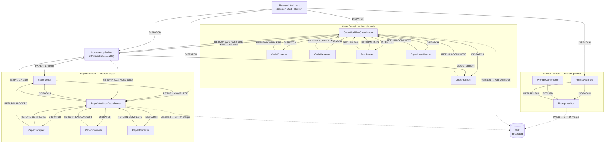

# prompts/ — 3-Layer, Domain-Oriented Architecture
# GENERATED — do NOT edit directly. Edit prompts/meta/*.md and regenerate.

────────────────────────────────────────────────────────
## 1. Architecture Principle

```
Layer 1 — Abstract Meta:   prompts/meta/             ← WHY and HOW (concepts, structure, logic)
Layer 2 — Concrete SSoT:   docs/00_GLOBAL_RULES.md   ← WHAT (project-independent rules, authoritative)
Layer 3 — Project Context: docs/01_PROJECT_MAP.md     ← WHERE/WHICH (module map, ASM-IDs)
                           docs/02_ACTIVE_LEDGER.md   ← WHEN/STATUS (phase, CHK/KL registers)
```

**Authority rules:**
- `prompts/meta/` wins on axiom intent (A10, φ6)
- `docs/00_GLOBAL_RULES.md` wins on rule interpretation
- `docs/01–02` win on project state (module paths, CHK IDs, phase)

**No mixing rule:**
- `00_GLOBAL_RULES.md` contains zero project-specific state (no Phase, CHK, ASM, module paths)
- `01–02` contain zero rule content — exclusively fluid project data

────────────────────────────────────────────────────────
## 2. Directory Map

```
prompts/
├── meta/                          ← LAYER 1: Abstract Meta (edit here for axioms + structure)
│   ├── meta-core.md               ← Design philosophy φ1–φ7 + axioms A1–A10 (read first)
│   ├── meta-domains.md            ← Domain registry: branches, storage, lock protocol
│   ├── meta-persona.md            ← Per-agent character + skills (WHO)
│   ├── meta-roles.md              ← Per-agent role contracts: PURPOSE/DELIVERABLES/AUTHORITY/CONSTRAINTS/STOP (WHAT)
│   ├── meta-workflow.md           ← P-E-V-A loop, domain pipelines, handoff rules (HOW)
│   ├── meta-ops.md                ← Canonical operations GIT/DOM/BUILD/TEST/EXP/AUDIT + HAND-01/02/03 (EXECUTE)
│   └── meta-deploy.md             ← EnvMetaBootstrapper: regenerates agents/ from meta/ (DEPLOY)
│
├── agents/                        ← GENERATED — do NOT edit directly (regenerate via EnvMetaBootstrapper)
│   ├── ResearchArchitect.md
│   ├── CodeWorkflowCoordinator.md
│   ├── CodeArchitect.md
│   ├── CodeCorrector.md
│   ├── CodeReviewer.md
│   ├── TestRunner.md
│   ├── ExperimentRunner.md
│   ├── PaperWorkflowCoordinator.md
│   ├── PaperWriter.md
│   ├── PaperReviewer.md
│   ├── PaperCompiler.md
│   ├── PaperCorrector.md
│   ├── ConsistencyAuditor.md
│   ├── PromptArchitect.md
│   ├── PromptCompressor.md
│   └── PromptAuditor.md
│
└── README.md                      ← this file (generated; do not edit directly)

docs/                              ← LAYER 2 + 3
├── 00_GLOBAL_RULES.md             ← LAYER 2: Concrete SSoT — project-independent constitutional rules
├── 01_PROJECT_MAP.md              ← LAYER 3: Project Context — module map, ASM-IDs, paper structure
└── 02_ACTIVE_LEDGER.md            ← LAYER 3: Project Context — phase, branch, CHK/KL registers
```

────────────────────────────────────────────────────────
## 3. Rule Ownership Map

| Rule | Abstract definition (meta file + §) | Concrete SSoT (00 §section) | Project context (01–02 §) |
|------|------------------------------------|-----------------------------|--------------------------|
| Axioms A1–A10 | `meta-core.md §AXIOMS` (intent) | `00_GLOBAL_RULES.md §A` | — |
| Design philosophy φ1–φ7 | `meta-core.md §DESIGN PHILOSOPHY` | — | — |
| Domain registry | `meta-domains.md §DOMAIN REGISTRY` | — | — |
| Domain Lock protocol | `meta-domains.md §DOMAIN LOCK PROTOCOL` | — | — |
| SOLID C1–C6 | `meta-roles.md §CODE DOMAIN` + `meta-core.md §A1–A5` | `00_GLOBAL_RULES.md §C` | `01_PROJECT_MAP.md §C2` (legacy register) |
| LaTeX P1–P4, KL-12 | `meta-roles.md §PAPER DOMAIN` | `00_GLOBAL_RULES.md §P` | `01_PROJECT_MAP.md §9–§10` (P3-D register) |
| Prompt rules Q1–Q4 | `meta-roles.md §PROMPT DOMAIN` | `00_GLOBAL_RULES.md §Q` | — |
| Audit gate AU1–AU3 | `meta-roles.md §AUDIT DOMAIN` | `00_GLOBAL_RULES.md §AU` | — |
| Git lifecycle (GIT-01–05) | `meta-ops.md §GIT OPERATIONS` | `00_GLOBAL_RULES.md §GIT` | `02_ACTIVE_LEDGER.md §ACTIVE STATE` |
| Handoff protocol HAND-01–03 | `meta-ops.md §HANDOFF PROTOCOL` | — | — |
| P-E-V-A loop | `meta-workflow.md §P-E-V-A` | `00_GLOBAL_RULES.md §P-E-V-A` | — |
| THEORY_ERR/IMPL_ERR (P9) | `meta-workflow.md §CONTROL PROTOCOLS P9` | — | — |
| Module map | — | — | `01_PROJECT_MAP.md §1–§8` |
| Numerical baselines | — | — | `01_PROJECT_MAP.md §6` |
| Phase / CHK / KL | — | — | `02_ACTIVE_LEDGER.md §CHECKLIST §LESSONS` |

────────────────────────────────────────────────────────
## 4. Core Axioms A1–A10 Quick Reference

| Axiom | Rule |
|-------|------|
| A1 Token Economy | diff > rewrite; reference > duplication; no redundancy |
| A2 External Memory First | all state in docs/02_ACTIVE_LEDGER.md and docs/01_PROJECT_MAP.md |
| A3 3-Layer Traceability | Equation → Discretization → Code mandatory |
| A4 Separation | never mix logic/content/tags; never mix solver/infra/theory/implementation |
| A5 Solver Purity | infrastructure must not affect numerical results |
| A6 Diff-First Output | no full file rewrites unless explicitly required |
| A7 Backward Compatibility | preserve semantics; upgrade by mapping, never by discarding |
| A8 Git Governance | 3-phase lifecycle: DRAFT → REVIEWED → VALIDATED → merge to main |
| A9 Core/System Sovereignty | Core is Master; System is Servant; System→Core import = CRITICAL_VIOLATION |
| A10 Meta-Governance | prompts/meta/ is single source of truth; docs/ are derived outputs — never edit docs/ to change a rule |

────────────────────────────────────────────────────────
## 5. Execution Loop

```
1. Execute ResearchArchitect     ← loads docs/02_ACTIVE_LEDGER.md + docs/01_PROJECT_MAP.md; routes intent
2. PLAN    → coordinator defines scope, records task spec in docs/02_ACTIVE_LEDGER.md
3. EXECUTE → specialist agent (one objective per step — P5); DRAFT commit
4. VERIFY  → TestRunner / PaperCompiler+Reviewer / PromptAuditor; REVIEWED commit on PASS
5. AUDIT   → ConsistencyAuditor gate (AU2: 10 items); VALIDATED commit + merge to main on PASS
```

────────────────────────────────────────────────────────
## 6. 3-Phase Domain Lifecycle

| Phase | Trigger | Auto-action (commit message) |
|-------|---------|------------------------------|
| DRAFT | Primary creation agent returns COMPLETE | `git commit -m "{branch}: draft — {summary}"` |
| REVIEWED | 0 blocking findings (TestRunner PASS / PaperReviewer 0 FATAL+0 MAJOR / PromptAuditor Q3 PASS) | `git commit -m "{branch}: reviewed — {summary}"` |
| VALIDATED | Gate auditor PASS (ConsistencyAuditor AU2 / PromptAuditor Q3) | `git commit -m "{branch}: validated — {summary}"` → `git merge {branch} → main --no-ff` |

────────────────────────────────────────────────────────
## 7. Agent Roster (16 agents)

| Domain | Agent | Role |
|--------|-------|------|
| Routing | ResearchArchitect | Session intake; intent → agent mapping; DISPATCHER |
| Code | CodeWorkflowCoordinator | Code pipeline orchestrator; DISPATCHER + ACCEPTOR |
| Code | CodeArchitect | Equation → Python module + MMS tests; RETURNER |
| Code | CodeCorrector | Staged debug protocols A–D; targeted fix; RETURNER |
| Code | CodeReviewer | Refactor plan (SAFE/LOW/HIGH_RISK) without numerical change; RETURNER |
| Code | TestRunner | Convergence analysis; PASS/FAIL verdict; RETURNER |
| Code | ExperimentRunner | Reproducible benchmark execution + 4 sanity checks; RETURNER |
| Paper | PaperWorkflowCoordinator | Paper pipeline orchestrator; review loop control; DISPATCHER + ACCEPTOR |
| Paper | PaperWriter | LaTeX authoring; skeptical verifier (P4 protocol); RETURNER |
| Paper | PaperReviewer | Peer review; FATAL/MAJOR/MINOR classification; output in Japanese; RETURNER |
| Paper | PaperCompiler | LaTeX compile + BUILD-01 KL-12 scan; RETURNER |
| Paper | PaperCorrector | Targeted fix from VERIFIED/LOGICAL_GAP findings only; RETURNER |
| Audit | ConsistencyAuditor | Independent re-deriver; AU2 domain gate (10 items); RETURNER |
| Prompt | PromptArchitect | Generates environment-optimized agent prompts from meta/; DISPATCHER + RETURNER |
| Prompt | PromptCompressor | Reduces token usage without semantic loss; RETURNER |
| Prompt | PromptAuditor | Q3 checklist validation (read-only); GIT-03 + GIT-04 on PASS; RETURNER |

────────────────────────────────────────────────────────
## 8. Agent Interaction Diagram



Legend:
- Solid `-->`: normal handoff (HAND-01 DISPATCH / HAND-02 RETURN)
- Dashed `-.->`: conditional flow (VALIDATED phase + GIT-04 merge to main only)
- `ConsistencyAuditor (Domain Gate — AU2)`: shared gate for Code and Paper domains
- `main (protected)`: merge only after AU2/Q3 PASS + VALIDATED commit (A8)

────────────────────────────────────────────────────────
## 9. Regeneration Instructions

**To rebuild all agents/ from meta/ (any change to meta files):**
```
Execute EnvMetaBootstrapper
Using prompts/meta/meta-deploy.md
Target Claude
```

**To update rules:** edit `prompts/meta/*.md` (authoritative — A10), then regenerate via EnvMetaBootstrapper.
**NEVER edit `docs/00_GLOBAL_RULES.md` directly** — it is a derived output, not the source (A10).

**To update project state:** append to `docs/01_PROJECT_MAP.md` or `docs/02_ACTIVE_LEDGER.md`.
These files are project state, not rules — they may be appended to directly.

**To change domain structure or axiom intent:** edit `prompts/meta/*.md` then regenerate.

**First command each session:** `Execute ResearchArchitect`
