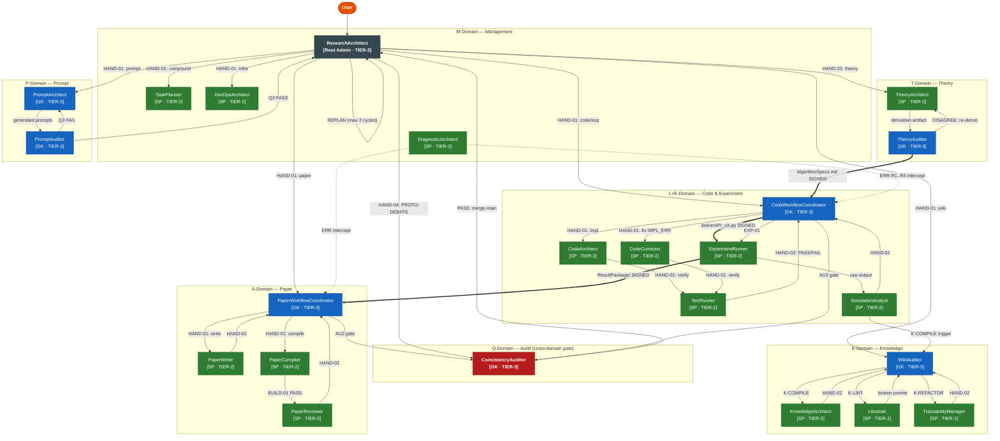

# GENERATED — do NOT edit directly. Edit prompts/meta/kernel-*.md and regenerate.
# Prompt System Architecture — v7.0.0 "Lean Kernel"
# Generated by EnvMetaBootstrapper v7.0.0 | Date: 2026-04-18

## 1. Architecture Principle

```
Layer 1 — Lean Kernel:     prompts/meta/             ← WHY and HOW (axioms, roles, ops)
Layer 2 — Concrete SSoT:   docs/00_GLOBAL_RULES.md   ← WHAT (project-independent rules)
Layer 3 — Project Context: docs/01_PROJECT_MAP.md     ← WHERE/WHICH (module map, ASM-IDs)
                           docs/02_ACTIVE_LEDGER.md   ← WHEN/STATUS (phase, CHK/KL registers)
```

**Authority rules:**
- `prompts/meta/` wins on axiom intent (A10)
- `docs/00_GLOBAL_RULES.md` wins on rule interpretation
- `docs/01–02` win on project state
- No mixing rule

## 2. Directory Map

### Kernel meta files (Layer 1 — source of truth)
```
prompts/meta/
  kernel-constitution.md  — φ1–φ7, A1–A11, LA-1–LA-5, <immutable_zone> axioms
  kernel-roles.md         — Agent Profile Table, SCHEMA-IN-CODE, HAND-04 payload
  kernel-domains.md       — 4×4 Matrix domain registry, DDA micro-agent rules
  kernel-ops.md           — Canonical ops + HAND/GIT/LOCK/OP-CONDENSE shorthand
  kernel-workflow.md      — P-E-V-A loop, DYNAMIC-REPLANNING, PROTO-DEBATE
  kernel-deploy.md        — EnvMetaBootstrapper v7.0.0 generation spec
  kernel-project.md       — Project-specific rules (PR-1–PR-6) [swap to retarget]
  kernel-antipatterns.md  — AP-01–AP-12 compact (detect/mitigate/severity/inject)
```

### Agent prompts (Layer 2 — generated output, per-environment)

```
prompts/agents-claude/    ← Claude: tiered verbosity (TIER-1/2/3), CoVe THOUGHT_PROTOCOL
prompts/agents-codex/     ← Codex: ultra-compact (~700B avg), diff-first, key:value format

  _base.yaml               — Universal agent foundation (v7.0.0 feature flags)

  # Management (M-Domain)
  ResearchArchitect.md      — Protocol Enforcer / Router / OP-CONDENSE trigger
  TaskPlanner.md            — Compound Task Decomposer

  # Theory (T-Domain)
  TheoryArchitect.md        — First-Principles Specialist
  TheoryAuditor.md          — Independent Re-Derivation Gate

  # Code (L-Domain)
  CodeWorkflowCoordinator.md — Domain Orchestrator + BLOCKED_REPLAN_REQUIRED
  CodeArchitect.md           — Equation-to-Code Specialist (CCD primacy)
  CodeCorrector.md           — Debug/Fix Specialist
  TestRunner.md              — Numerical Verifier (SC-1..SC-4)

  # Experiment (E-Domain)
  ExperimentRunner.md        — Simulation Executor + Validation Guard
  SimulationAnalyst.md       — Post-Processing Specialist

  # Paper (A-Domain)
  PaperWorkflowCoordinator.md — Paper Pipeline Orchestrator
  PaperWriter.md              — Academic Editor
  PaperReviewer.md            — Devil's Advocate Reviewer
  PaperCompiler.md            — LaTeX Compliance Engine

  # Audit (Q-Domain)
  ConsistencyAuditor.md      — AU2 Gate + R1–R4 Rubric (≥80=PASS) + HAND-04 arbiter

  # Prompt (P-Domain)
  PromptArchitect.md         — Sole kernel-*.md edit authority
  PromptAuditor.md           — Q3 10-item Checklist Auditor

  # Infrastructure (M-Domain)
  DevOpsArchitect.md         — Docker/CI/GPU Specialist
  DiagnosticArchitect.md     — ERR-R1..R4 Self-Healing Agent

  # Knowledge (K-Domain)
  KnowledgeArchitect.md      — Wiki Compiler
  WikiAuditor.md             — K-LINT Pointer Integrity Gate
  Librarian.md               — Search & Impact Analysis
  TraceabilityManager.md     — Pointer Maintenance
```

### Docs (Layer 3 — project context)
```
docs/
  00_GLOBAL_RULES.md       — Concrete SSoT (project-independent rules)
  01_PROJECT_MAP.md        — Module map, interface contracts, ASM register
  02_ACTIVE_LEDGER.md      — Phase, branch, CHK/KL registers
  03_PROJECT_RULES.md      — Project-specific rules (derived from kernel-project.md)
  wiki/                    — K-Domain compiled knowledge (100+ entries)
  memo/                    — Working memos
  interface/               — Cross-domain contracts (AlgorithmSpecs, SolverAPI, signals/)
```

## 3. Rule Ownership Map

| Rule | Kernel source | Concrete SSoT (00§) | Project (01–02§) |
|------|--------------|---------------------|-------------------|
| A1–A11 | kernel-constitution.md §AXIOMS | §A | — |
| φ1–φ7 | kernel-constitution.md §DESIGN PHILOSOPHY | — | — |
| C1–C4 | kernel-roles.md §CODE DOMAIN | §C | §1 (module map) |
| P1–P4 | kernel-roles.md §PAPER DOMAIN | §P | §9 (paper structure) |
| Q1–Q4 | kernel-deploy.md §Q2 | §Q | — |
| AU1–AU3 | kernel-roles.md §AUDIT DOMAIN | §AU | — |
| K-A1–K-A5 | kernel-domains.md §K-Domain Axioms | §A (A11) | — |
| Git lifecycle | kernel-workflow.md §GIT BRANCH GOVERNANCE | §GIT | §ACTIVE STATE |
| P-E-V-A | kernel-workflow.md §P-E-V-A | §P-E-V-A | — |
| PR-1–PR-6 | kernel-project.md §PR | — | docs/03_PROJECT_RULES.md |

### 3.1 Anti-Patterns (AP-01–AP-12)

| ID | Name | Severity | Inject |
|----|------|----------|--------|
| AP-01 | Reviewer Hallucination | HIGH | auditors |
| AP-02 | Scope Creep | MEDIUM | specialists |
| AP-03 | Verification Theater | CRITICAL | gatekeepers |
| AP-04 | Gate Paralysis | HIGH | gatekeepers |
| AP-05 | Convergence Fabrication | CRITICAL | runners |
| AP-06 | Context Contamination | HIGH | auditors |
| AP-07 | Premature Classification | MEDIUM | classifiers |
| AP-08 | Phantom State Tracking | MEDIUM | ALL |
| AP-09 | Context Collapse | HIGH | ALL |
| AP-10 | Recency Bias | MEDIUM | classifiers |
| AP-11 | Experiment Retry Abuse | MEDIUM | ExperimentRunner |
| AP-12 | REPLAN Escalation Avoidance | HIGH | coordinators, TaskPlanner |

Full catalogue: `prompts/meta/kernel-antipatterns.md`.

## 4. A1–A11 Quick Reference

| Axiom | Rule |
|-------|------|
| A1 | Token Economy — no redundancy; diff > rewrite; reference > duplication |
| A2 | External Memory First — state only in docs/ and git |
| A3 | 3-Layer Traceability — Equation → Discretization → Code |
| A4 | Separation — never mix logic/content/tags/style |
| A5 | Solver Purity — solver isolated from infrastructure |
| A6 | Diff-First Output — no full file output unless required |
| A7 | Backward Compatibility — preserve semantics when migrating |
| A8 | Git Governance — protected main; domain branches; dev/ workspaces |
| A9 | Core/System Sovereignty — solver core is master; infrastructure is servant |
| A10 | Meta-Governance — prompts/meta/ is the single source of truth |
| A11 | Knowledge-First Retrieval — prefer compiled wiki over internal reasoning |

## 4b. φ-Principles TL;DR

- **φ1 Truth Before Action** — evidence before action; stop and read before you fix.
- **φ2 Minimal Footprint** — do exactly what is authorized; scope creep is a traceability violation.
- **φ3 Layered Authority** — when sources conflict, the hierarchy resolves it; first principles win over code.
- **φ4 Stateless Agents** — if it is not in docs/ or git, it does not exist to the system.
- **φ5 Bounded Autonomy** — every workflow has hard gates; human judgment at decision boundaries.
- **φ6 Single Source, Derived Artifacts** — change the source in `prompts/meta/`; never patch a derived artifact.
- **φ7 Classification Precedes Action** — reviewers classify; correctors act; merging these roles destroys the audit trail.

Full text: `prompts/meta/kernel-constitution.md §DESIGN PHILOSOPHY`.

## 5. Execution Loop

```
1. ResearchArchitect  — Absorb state; classify intent; route to domain; CONDENSE() if ≥60% ctx
2. PLAN               — Coordinator defines scope, success criteria, stop conditions
3. EXECUTE            — Specialist produces artifact on dev/ branch
4. VERIFY             — Verifier confirms artifact meets spec (PASS/FAIL)
5. AUDIT              — ConsistencyAuditor AU2 gate + R1–R4 rubric (≥80=PASS)
```

v6.0.0 extensions: PROTO-DEBATE (HAND-04) for contested verdicts; DYNAMIC-REPLANNING (max 2 cycles, AP-12).

## 5b. Agent Interaction Map

Shows relationships and task handoffs across all 23 agents and 7 domains.

**Legend:**
- `-->` HAND-01/02 normal handoff
- `==>` cross-domain interface contract (signed artifact)
- `-.->` error intercept (DiagnosticArchitect)
- Node color: dark=Root Admin, blue=Gatekeeper (GK), green=Specialist (SP), red=Audit gate



**Cross-domain Interface Contract Chain (T → L → E → A → K):**

```
TheoryAuditor ══ AlgorithmSpecs.md ══► CodeWorkflowCoordinator
                                              ║
                                    SolverAPI_vX.py
                                              ║
                                       ExperimentRunner ══ ResultPackage/ ══► PaperWorkflowCoordinator
                                              ║                                         ║
                                    K-COMPILE trigger                           TechnicalReport.md
                                              ║                                         ║
                                         WikiAuditor ◄──────────────────────────────────┘
```

> Source: generated by EnvMetaBootstrapper Stage 2c from `kernel-roles.md §Agent Profile Table`, `kernel-domains.md §INTER-DOMAIN INTERFACES`, and role contracts — do not edit here.

## 6. Agent Roster (23 active)

| Domain | Agent | Tier | Role |
|--------|-------|------|------|
| M | ResearchArchitect | 3 | Protocol Enforcer / Router |
| M | TaskPlanner | 2 | Compound Task Decomposer |
| T | TheoryArchitect | 2 | First-Principles Specialist |
| T | TheoryAuditor | 3 | Independent Re-Derivation Gate |
| L | CodeWorkflowCoordinator | 3 | Domain Orchestrator |
| L | CodeArchitect | 2 | Equation-to-Code Specialist |
| L | CodeCorrector | 2 | Debug/Fix Specialist |
| L | TestRunner | 2 | Numerical Verifier |
| E | ExperimentRunner | 2 | Simulation Executor |
| E | SimulationAnalyst | 2 | Post-Processing Specialist |
| A | PaperWorkflowCoordinator | 3 | Paper Pipeline Orchestrator |
| A | PaperWriter | 2 | Academic Editor |
| A | PaperReviewer | 2 | Devil's Advocate Reviewer |
| A | PaperCompiler | 2 | LaTeX Compliance Engine |
| Q | ConsistencyAuditor | 3 | AU2 Gate + Rubric + HAND-04 arbiter |
| P | PromptArchitect | 3 | Sole kernel-*.md edit authority |
| P | PromptAuditor | 3 | Q3 Checklist Auditor |
| M | DevOpsArchitect | 2 | Docker/CI/GPU Specialist |
| M | DiagnosticArchitect | 2 | Self-Healing Agent |
| K | KnowledgeArchitect | 2 | Wiki Compiler |
| K | WikiAuditor | 3 | K-LINT Pointer Integrity Gate |
| K | Librarian | 1 | Search & Impact Analysis |
| K | TraceabilityManager | 1 | Pointer Maintenance |

**Removed from v5.1.0:** CodeReviewer (absorbed into CodeWorkflowCoordinator), VerificationRunner (demoted to DDA micro-agent in kernel-domains.md §DDA).

## 7. Regeneration Instructions

- **To rebuild agents/:** `Execute EnvMetaBootstrapper Using prompts/meta/kernel-deploy.md Target [env]`
- **To update rules:** edit `prompts/meta/kernel-*.md` (authoritative — A10); regenerate via EnvMetaBootstrapper. **Never edit docs/00_GLOBAL_RULES.md directly.**
- **To retarget project:** replace `prompts/meta/kernel-project.md`; regenerate `docs/03_PROJECT_RULES.md`.
- **To update project state:** append to `docs/01_PROJECT_MAP.md` or `docs/02_ACTIVE_LEDGER.md`.
- **Immutable zones:** `<immutable_zone>` blocks in kernel-constitution.md (φ1–φ7, A1–A11) and kernel-ops.md (HAND-03 7-checks) are byte-locked — no edits without MetaEvolutionArchitect CHK session.
- **Baseline:** CHK-132 (2026-04-18, v7.0.0). Bootstrap input: 8 files in `prompts/meta/kernel-*.md`.
