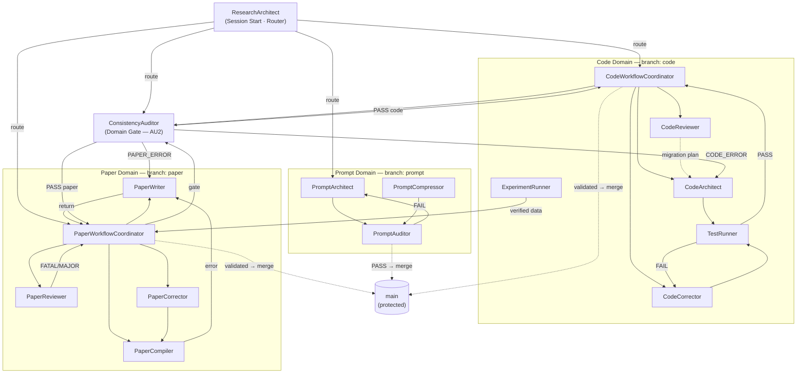

# prompts/ — 3-Layer, Domain-Oriented Architecture
# Three-layer separation: Abstract Meta → Concrete SSoT → Project Context.

────────────────────────────────────────────────────────
## 1. Architecture Principle

```
Layer 1 — Abstract Meta:   prompts/meta/        ← WHY and HOW (concepts, structure, logic)
Layer 2 — Concrete SSoT:   docs/00_GLOBAL_RULES.md  ← WHAT (project-independent rules, authoritative)
Layer 3 — Project Context: docs/01_PROJECT_MAP.md   ← WHERE/WHICH (module map, ASM-IDs)
                           docs/02_ACTIVE_LEDGER.md  ← WHEN/STATUS (phase, CHK/KL registers)
```

**Layer 1 → 2 relationship:** meta files define axiom intent and domain structure;
`00_GLOBAL_RULES.md` is the authoritative, project-independent implementation of those rules.
If meta/ conflicts with 00_GLOBAL_RULES.md on rule intent: **meta/ wins**.
If 00_GLOBAL_RULES.md conflicts with 01–02 on data: **00_GLOBAL_RULES.md wins for rules; 01–02 win for project state**.

**No mixing rule:** 00_GLOBAL_RULES.md contains zero project-specific state (no Phase, CHK, ASM, module paths).
01–02 contain zero rule content — exclusively fluid project data.

────────────────────────────────────────────────────────
## 2. Directory Map

```
prompts/
├── meta/                          ← LAYER 1: Abstract Meta (edit here for concepts + structure)
│   ├── meta-persona.md            ← Axioms A1–A8 (intent) + per-agent behavioral characteristics
│   ├── meta-tasks.md              ← 5 Domain definitions + agent task specs (PURPOSE/PROCEDURE/STOP)
│   ├── meta-workflow.md           ← P-E-V-A loop logic, Git governance, state machine, handoff map
│   └── meta-deploy.md             ← EnvMetaBootstrapper: regenerates agents/ from meta/
│
├── agents/                        ← GENERATED — do NOT edit directly (regenerate via EnvMetaBootstrapper)
│   ├── ResearchArchitect.md
│   ├── CodeWorkflowCoordinator.md
│   ├── CodeArchitect.md
│   ├── CodeCorrector.md
│   ├── CodeReviewer.md
│   ├── TestRunner.md
│   ├── ExperimentRunner.md
│   ├── PaperWorkflowCoordinator.md
│   ├── PaperWriter.md
│   ├── PaperReviewer.md
│   ├── PaperCompiler.md
│   ├── PaperCorrector.md
│   ├── ConsistencyAuditor.md
│   ├── PromptArchitect.md
│   ├── PromptCompressor.md
│   └── PromptAuditor.md
│
└── README.md                      ← this file

docs/                              ← LAYER 2 + 3
├── 00_GLOBAL_RULES.md             ← LAYER 2: Concrete SSoT — project-independent constitutional rules
├── 01_PROJECT_MAP.md              ← LAYER 3: Project Context — module map, ASM-IDs, paper structure
└── 02_ACTIVE_LEDGER.md            ← LAYER 3: Project Context — phase, branch, CHK/KL registers
```

────────────────────────────────────────────────────────
## 3. Rule Ownership Map

| Rule | Abstract definition | Concrete SSoT | Project context |
|------|--------------------|--------------|---------------------------------|
| Axioms A1–A8 | `meta-persona.md §AXIOMS` (intent) | `00_GLOBAL_RULES.md §A` | — |
| SOLID C1–C6 | `meta-tasks.md § Code Domain` (why) | `00_GLOBAL_RULES.md §C` | `01_PROJECT_MAP.md §C2` (legacy register) |
| LaTeX P1–P4, KL-12 | `meta-tasks.md § Paper Domain` (why) | `00_GLOBAL_RULES.md §P` | `01_PROJECT_MAP.md §9–§10` (P2, P3-D) |
| Prompt rules Q1–Q4 | `meta-tasks.md § Prompt Domain` (why) | `00_GLOBAL_RULES.md §Q` | — |
| Audit gate AU1–AU3 | `meta-tasks.md § Audit Domain` (why) | `00_GLOBAL_RULES.md §AU` | — |
| Git lifecycle | `meta-workflow.md §GIT` (logic) | `00_GLOBAL_RULES.md §GIT` | `02_ACTIVE_LEDGER.md` (state) |
| P-E-V-A loop | `meta-workflow.md §P-E-V-A` (logic) | `00_GLOBAL_RULES.md §P-E-V-A` | — |
| Module map | — | — | `01_PROJECT_MAP.md §1–§7` |
| Numerical baselines | — | — | `01_PROJECT_MAP.md §6` |
| Phase / CHK / KL | — | — | `02_ACTIVE_LEDGER.md` |

────────────────────────────────────────────────────────
## 4. Core Axioms A1–A8 — Quick Reference

| Axiom | Rule |
|-------|------|
| A1 Token Economy | diff > rewrite; reference > duplication; no redundancy |
| A2 External Memory First | all state in docs/02_ACTIVE_LEDGER.md and 01_PROJECT_MAP.md |
| A3 3-Layer Traceability | Equation → Discretization → Code mandatory |
| A4 Separation | never mix logic/content/tags; never mix solver/infra |
| A5 Solver Purity | infrastructure must not affect numerical results |
| A6 Diff-First Output | no full file rewrites unless explicitly required |
| A7 Backward Compatibility | preserve semantics; upgrade by mapping, never by discarding |
| A8 Git Governance | 3-phase lifecycle: DRAFT → REVIEWED → VALIDATED → auto-merge |

────────────────────────────────────────────────────────
## 5. Execution Loop

```
1. Execute ResearchArchitect     ← loads 02_ACTIVE_LEDGER + 01_PROJECT_MAP; routes intent
2. PLAN    → define scope, record in 02_ACTIVE_LEDGER
3. EXECUTE → specialist agent (one objective, one step)
4. VERIFY  → TestRunner / PaperCompiler+Reviewer / PromptAuditor
5. AUDIT   → ConsistencyAuditor gate (AU2: 10 items) → auto-merge on PASS
```

────────────────────────────────────────────────────────
## 6. 3-Phase Domain Lifecycle

| Phase | Trigger | Auto-action |
|-------|---------|-------------|
| DRAFT | creation agent returns | `git commit -m "{branch}: draft — {summary}"` |
| REVIEWED | no blocking findings | `git commit -m "{branch}: reviewed — {summary}"` |
| VALIDATED | gate auditor PASS | `git commit -m "{branch}: validated — {summary}"` → merge |

────────────────────────────────────────────────────────
## 7. Agent Roster (16 agents)

| Domain | Agent | Role |
|--------|-------|------|
| Routing | ResearchArchitect | Session start, intent → agent mapping |
| Code | CodeWorkflowCoordinator | Code pipeline orchestrator |
| Code | CodeArchitect | Equation → Python + MMS tests |
| Code | CodeCorrector | Staged debug (protocols A–D) |
| Code | CodeReviewer | Refactor without numerical change |
| Code | TestRunner | Convergence analysis, PASS/FAIL halt |
| Code | ExperimentRunner | Reproducible benchmark execution |
| Paper | PaperWorkflowCoordinator | Paper pipeline orchestrator + review loop |
| Paper | PaperWriter | LaTeX authoring (skeptical verifier) |
| Paper | PaperReviewer | Peer review — output in Japanese |
| Paper | PaperCompiler | LaTeX compile + KL-12 guard |
| Paper | PaperCorrector | Targeted fix from VERIFIED/LOGICAL_GAP only |
| Audit | ConsistencyAuditor | Independent re-deriver; domain gate |
| Prompt | PromptArchitect | Generates role-specific agent prompts |
| Prompt | PromptCompressor | Reduces token usage without semantic loss |
| Prompt | PromptAuditor | Validates prompts (read-only) |

────────────────────────────────────────────────────────
## 8. Agent Interaction Diagram



**凡例:**
- 実線 `-->` : 通常のハンドオフ（結果を渡して次のエージェントへ）
- 破線 `-.->` : 条件付きフロー（検証後のマージ、計画の提示など）
- `(Domain Gate — AU2)` : ConsistencyAuditor は Code・Paper 両ドメインの統合ゲート
- `main (protected)` : マージはゲート監査 PASS 後のみ

────────────────────────────────────────────────────────
## 9. Regeneration

To rebuild all agents/ from meta/:
```
Execute EnvMetaBootstrapper
Using prompts/meta/meta-deploy.md
Target Claude
```

To update 00_GLOBAL_RULES.md: edit directly (it is authoritative, not generated).
To update 01–02: append project state entries; never add rule content.
