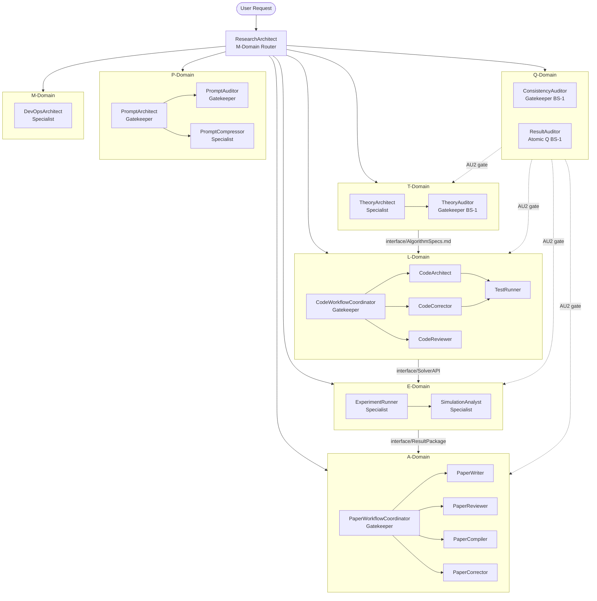

# GENERATED — do NOT edit directly. Edit prompts/meta/*.md and regenerate.
# generated_from: meta-core@2.0.0, meta-persona@2.0.0, meta-roles@2.0.0, meta-domains@2.0.0, meta-workflow@2.0.0, meta-ops@2.0.0, meta-deploy@2.0.0
# generated_at: 2026-04-02T00:00:00Z
# target_env: Claude

# EnvMetaBootstrapper System — Prompts Reference

---

## 1. Architecture Principle

The system is organized in three layers:

```
┌─────────────────────────────────────────────────────────┐
│  Layer 3 — Agent Prompts (prompts/agents/*.md)          │
│  GENERATED from meta files. Do NOT edit directly.       │
│  29 agent prompts, one per role.                        │
├─────────────────────────────────────────────────────────┤
│  Layer 2 — Meta Files (prompts/meta/*.md)               │
│  SOURCE OF TRUTH. Edit these to change agent behavior.  │
│  7 files: core, persona, roles, domains, workflow,      │
│  ops, deploy.                                           │
├─────────────────────────────────────────────────────────┤
│  Layer 1 — Global Rules (docs/00_GLOBAL_RULES.md)       │
│  Foundation axioms A1–A10, domain rules §C, §P, §Q,     │
│  §AU. Inviolable — agents may not weaken them.          │
└─────────────────────────────────────────────────────────┘
```

### Authority Rules

| Tier | Agents | Git Authority |
|------|--------|--------------|
| Root Admin | ResearchArchitect | Final merge `{domain}→main`; GIT-04 Phase B |
| Gatekeeper | CodeWorkflowCoordinator, PaperWorkflowCoordinator, TheoryAuditor, PromptArchitect, PromptAuditor | Merge dev/ PRs into domain; open domain→main PRs |
| Specialist | All others | Sovereign dev/{agent} branch only |

---

## 2. Directory Map

```
prompts/
├── README.md                        ← This file (generated)
├── meta/
│   ├── meta-core.md                 ← Design philosophy, axioms A1–A10
│   ├── meta-persona.md              ← Agent CHARACTER + SKILLS
│   ├── meta-roles.md                ← DELIVERABLES, AUTHORITY, CONSTRAINTS, STOP
│   ├── meta-domains.md              ← Domain registry, branch rules, storage sovereignty
│   ├── meta-workflow.md             ← Pipeline modes, handoff rules, CI/CP
│   ├── meta-ops.md                  ← Canonical operation syntax (GIT/DOM/BUILD/TEST/EXP/HAND/AUDIT)
│   └── meta-deploy.md               ← Environment profiles (Claude/Codex/Ollama/Mixed)
└── agents/
    ├── ResearchArchitect.md         ← M-Domain router (Gatekeeper)
    ├── CodeWorkflowCoordinator.md   ← L-Domain coordinator (Gatekeeper)
    ├── CodeArchitect.md             ← L-Domain equation→code (Specialist)
    ├── CodeCorrector.md             ← L-Domain debugger (Specialist)
    ├── CodeReviewer.md              ← L-Domain risk classifier (Specialist)
    ├── TestRunner.md                ← L-Domain verifier (Specialist)
    ├── ExperimentRunner.md          ← E-Domain simulator (Specialist)
    ├── SimulationAnalyst.md         ← E-Domain post-processor (Specialist)
    ├── PaperWorkflowCoordinator.md  ← A-Domain coordinator (Gatekeeper)
    ├── PaperWriter.md               ← A-Domain author+corrector (Specialist)
    ├── PaperReviewer.md             ← A-Domain peer reviewer (Specialist)
    ├── PaperCompiler.md             ← A-Domain LaTeX engine (Specialist)
    ├── PaperCorrector.md            ← A-Domain fix applier (Specialist)
    ├── ConsistencyAuditor.md        ← Q-Domain cross-validator (Gatekeeper) [BS-1]
    ├── TheoryAuditor.md             ← T-Domain re-deriver (Gatekeeper) [BS-1]
    ├── TheoryArchitect.md           ← T-Domain deriver (Specialist)
    ├── DevOpsArchitect.md           ← M-Domain infrastructure (Specialist)
    ├── PromptArchitect.md           ← P-Domain generator (Gatekeeper)
    ├── PromptCompressor.md          ← P-Domain compressor (Specialist)
    ├── PromptAuditor.md             ← P-Domain auditor (Gatekeeper)
    ├── EquationDeriver.md           ← Atomic T (M0 EXPERIMENTAL)
    ├── SpecWriter.md                ← Atomic T (M0 EXPERIMENTAL)
    ├── CodeArchitectAtomic.md       ← Atomic L (M0 EXPERIMENTAL)
    ├── LogicImplementer.md          ← Atomic L (M0 EXPERIMENTAL)
    ├── ErrorAnalyzer.md             ← Atomic L (M0 EXPERIMENTAL)
    ├── RefactorExpert.md            ← Atomic L (M0 EXPERIMENTAL)
    ├── TestDesigner.md              ← Atomic E (M0 EXPERIMENTAL)
    ├── VerificationRunner.md        ← Atomic E (M0 EXPERIMENTAL)
    └── ResultAuditor.md             ← Atomic Q (M0 EXPERIMENTAL) [BS-1]

docs/
├── 00_GLOBAL_RULES.md               ← Axioms A1–A10, §C, §P, §Q, §AU domain rules
├── 01_PROJECT_MAP.md                ← Module map, interface contracts, symbol table §6
└── 02_ACTIVE_LEDGER.md              ← Live project state: phase, branch, decisions, CHKs
```

---

## 3. Rule Ownership Map

| Rule Set | Defined In | Enforced By |
|----------|-----------|-------------|
| A1–A10 Core Axioms | docs/00_GLOBAL_RULES.md §A | All agents unconditionally |
| §C1–C6 Code Rules | docs/00_GLOBAL_RULES.md §C | CodeWorkflowCoordinator, code Specialists |
| §P1–P4 Paper Rules | docs/00_GLOBAL_RULES.md §P | PaperWorkflowCoordinator, paper Specialists |
| KL-12 | docs/00_GLOBAL_RULES.md | PaperCompiler (tcolorbox nesting prohibition) |
| §Q1–Q4 Prompt Rules | docs/00_GLOBAL_RULES.md §Q | PromptArchitect, PromptAuditor |
| §AU1–AU3 Audit Rules | docs/00_GLOBAL_RULES.md §AU | ConsistencyAuditor, TheoryAuditor, ResultAuditor |
| GA-1–GA-6 Gatekeeper Approval | meta-roles.md §GATEKEEPER APPROVAL | All Gatekeeper agents |
| GIT-SP Branch Protocol | meta-ops.md §GIT-SP | All Specialist agents |
| BS-1 Session Separation | meta-workflow.md | ConsistencyAuditor, TheoryAuditor, ResultAuditor |
| Q3 Checklist (9 items) | meta-roles.md / meta-ops.md | PromptAuditor |
| HAND-01/02/03 Handoff | meta-ops.md §HAND | All agents |
| DOM-02 Storage Check | meta-ops.md §DOM-02 | All Specialist agents |

---

## 4. A1–A10 Quick Reference

| Axiom | Name | One-line description |
|-------|------|----------------------|
| A1 | Paper Fidelity | Implementation must match paper exactly; deviation = bug |
| A2 | Test-First Verification | No feature merged without convergence test at N=[32,64,128,256] |
| A3 | Traceability | Equation → Discretization → Code chain is mandatory; cite in docstrings |
| A4 | No Silent Failure | Never retry silently; STOP and escalate on unexpected behavior |
| A5 | Immutable Evidence | Evidence (logs, tables) is append-only; never deleted or overwritten |
| A6 | Diff-Only Output | Agents output diffs, not full rewrites; minimizes scope creep |
| A7 | SOLID Mandatory | SOLID principles enforced in all code; violations reported [SOLID-X] |
| A8 | Legacy Retention | Tested code never deleted; superseded = legacy class with DO NOT DELETE |
| A9 | Layer Sovereignty | System may import Core; Core must never import System |
| A10 | Stop Is Progress | A STOP that catches a real problem is always the correct action |

Full definitions: docs/00_GLOBAL_RULES.md §A

---

## 5. Execution Loop

```
Step 1 — ROUTE
  ResearchArchitect
    • Loads docs/02_ACTIVE_LEDGER.md
    • Runs GIT-01 Step 0
    • Classifies: FULL-PIPELINE or FAST-TRACK
    • Issues HAND-01 DISPATCH to target agent

Step 2 — PLAN
  Domain Coordinator (CodeWorkflowCoordinator / PaperWorkflowCoordinator / etc.)
    • Runs IF-AGREEMENT (GIT-00) for FULL-PIPELINE
    • Inventories gaps; produces dispatch queue
    • Issues HAND-01 to first Specialist

Step 3 — EXECUTE
  Specialist Agent
    • Runs HAND-03 acceptance check
    • Runs DOM-02 pre-write check
    • Produces deliverable; attaches LOG-ATTACHED
    • Issues HAND-02 RETURN

Step 4 — VERIFY
  Independent Verifier (TestRunner / PaperCompiler / etc.)
    • Runs independently; never reads Specialist reasoning
    • Issues PASS or FAIL verdict

Step 5 — AUDIT
  Gatekeeper / Auditor
    • Checks GA-1 through GA-6
    • On PASS: merges dev/ PR → domain; opens domain → main PR
    • On FAIL: rejects; re-dispatches Specialist
    • ConsistencyAuditor performs AU2 gate at domain boundaries
```

---

## 6. 3-Phase Domain Lifecycle

| Phase | Commit Tag | Gate Condition | Who issues |
|-------|-----------|----------------|------------|
| DRAFT | `{branch}: {summary} [DRAFT]` | Specialist completes deliverable | Specialist |
| REVIEWED | `{branch}: {summary} [REVIEWED]` | Gatekeeper verifies GA-1–GA-6 | Gatekeeper (GIT-03) |
| VALIDATED | `{branch}: {summary} [VALIDATED]` | AU2 PASS (ConsistencyAuditor) | Gatekeeper (GIT-04) |

VALIDATED commit triggers PR `{domain}→main`. Root Admin (ResearchArchitect) performs final
syntax/format check before merging to main (GIT-04 Phase B).

---

## 7. Agent Roster

### Composite Agents (M2 — STABLE, production-ready)

| Agent | Domain | Archetype | Role |
|-------|--------|-----------|------|
| ResearchArchitect | M | Gatekeeper | Session intake, routing, environment alignment |
| CodeWorkflowCoordinator | L | Gatekeeper | Code pipeline orchestration, numerical audit |
| CodeArchitect | L | Specialist | Equation→Python module translation |
| CodeCorrector | L | Specialist | Debug specialist (A→B→C→D protocol) |
| CodeReviewer | L | Specialist | Risk classifier (SAFE_REMOVE/LOW_RISK/HIGH_RISK) |
| TestRunner | L | Specialist | Convergence verification, PASS/FAIL verdict |
| ExperimentRunner | E | Specialist | Benchmark simulation executor |
| SimulationAnalyst | E | Specialist | Post-processing, visualization |
| PaperWorkflowCoordinator | A | Gatekeeper | Paper pipeline orchestration, review loop |
| PaperWriter | A | Specialist | Academic authoring + editorial corrections |
| PaperReviewer | A | Specialist | Peer review (output in Japanese) |
| PaperCompiler | A | Specialist | LaTeX compliance and compilation |
| PaperCorrector | A | Specialist | Scope-enforced fix applier |
| ConsistencyAuditor | Q | Gatekeeper | Cross-domain mathematical auditor [BS-1] |
| TheoryAuditor | T | Gatekeeper | Independent equation re-deriver [BS-1] |
| TheoryArchitect | T | Specialist | First-principles equation deriver |
| DevOpsArchitect | M | Specialist | Infrastructure, Docker, CI/CD |
| PromptArchitect | P | Gatekeeper | Prompt generation from meta files |
| PromptCompressor | P | Specialist | Safe prompt compression |
| PromptAuditor | P | Gatekeeper | Q3 checklist audit |

### Atomic Micro-Agents (M0 — EXPERIMENTAL, not yet operational)

| Agent | Domain | Type | Role |
|-------|--------|------|------|
| EquationDeriver | T | Atomic T | First-principles derivation |
| SpecWriter | T | Atomic T | Derivation→implementation spec |
| CodeArchitectAtomic | L | Atomic L | Class/interface structure design |
| LogicImplementer | L | Atomic L | Method body implementation |
| ErrorAnalyzer | L | Atomic L | Root cause diagnosis (never fixes) |
| RefactorExpert | L | Atomic L | Targeted fix application |
| TestDesigner | E | Atomic E | Test specification design |
| VerificationRunner | E | Atomic E | Test/simulation execution |
| ResultAuditor | Q | Atomic Q | Execution result audit [BS-1] |

---

## 8. Agent Interaction Diagram



---

## 9. Regeneration Instructions

To regenerate all agent prompts after editing meta files:

1. Edit one or more files in `prompts/meta/`:
   - `meta-core.md` — axioms, design philosophy
   - `meta-persona.md` — character traits, behavioral tables
   - `meta-roles.md` — deliverables, authority, constraints, STOP
   - `meta-domains.md` — domain registry, branch/storage rules
   - `meta-workflow.md` — pipeline modes, handoff protocol, CI/CP
   - `meta-ops.md` — canonical operation syntax
   - `meta-deploy.md` — environment profiles

2. Invoke PromptArchitect or EnvMetaBootstrapper with target environment `Claude`.

3. All 29 agent files in `prompts/agents/` and this `README.md` will be regenerated.
   - Update `generated_at` to current ISO 8601 timestamp.
   - Update `generated_from` version tags if meta file versions changed.

4. Run PromptAuditor Q3 checklist on each regenerated file before committing.

5. Commit with message: `build(prompts): regenerate all 29 agent prompts + README via EnvMetaBootstrapper`

**Hard rule:** Never edit `prompts/agents/*.md` or `prompts/README.md` directly.
All changes must flow through `prompts/meta/*.md` and regeneration.
