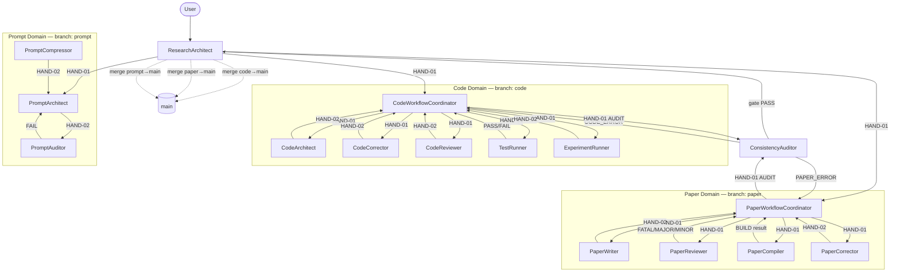

# GENERATED — do NOT edit directly. Edit prompts/meta/*.md and regenerate.

# Prompt System — 3-Layer Architecture

## Section 1 — Architecture Principle

```
Layer 1 — Abstract Meta:   prompts/meta/             ← WHY and HOW (concepts, structure, logic)
Layer 2 — Concrete SSoT:   docs/00_GLOBAL_RULES.md   ← WHAT (project-independent rules)
Layer 3 — Project Context: docs/01_PROJECT_MAP.md     ← WHERE/WHICH (module map, ASM-IDs)
                           docs/02_ACTIVE_LEDGER.md   ← WHEN/STATUS (phase, CHK/KL registers)
```

Authority rules:
- `meta/` wins on axiom intent
- `00_GLOBAL_RULES.md` wins on rule interpretation
- `01_PROJECT_MAP.md` and `02_ACTIVE_LEDGER.md` win on project state
- No mixing rule (A10): do not embed project-specific state in meta files

---

## Section 2 — Directory Map

```
prompts/
├── README.md                         ← this file
├── meta/
│   ├── meta-roles.md                 ← role definitions for all 16 agents
│   ├── meta-persona.md               ← character + skills per agent
│   ├── meta-workflow.md              ← coordination process (HAND, GIT, DOM protocols)
│   ├── meta-ops.md                   ← operations: GIT-00–GIT-SP, HAND-01–03, EXP, AUDIT
│   ├── meta-core.md                  ← A1–A10 axioms (abstract)
│   └── meta-deploy.md                ← environment profiles (Claude, Codex, Ollama, Mixed)
└── agents/
    ├── ResearchArchitect.md          ← Routing domain
    │
    ├── CodeWorkflowCoordinator.md    ← Code domain — orchestrator
    ├── CodeArchitect.md              ← Code domain — implementer
    ├── CodeCorrector.md              ← Code domain — debugger
    ├── CodeReviewer.md               ← Code domain — refactorer
    ├── TestRunner.md                 ← Code domain — verifier
    ├── ExperimentRunner.md           ← Code domain — experiment executor
    │
    ├── PaperWorkflowCoordinator.md   ← Paper domain — orchestrator
    ├── PaperWriter.md                ← Paper domain — author/editor
    ├── PaperReviewer.md              ← Paper domain — peer reviewer
    ├── PaperCompiler.md              ← Paper domain — LaTeX compiler
    ├── PaperCorrector.md             ← Paper domain — fix executor
    │
    ├── ConsistencyAuditor.md         ← Audit domain — release gate
    │
    ├── PromptArchitect.md            ← Prompt domain — generator
    ├── PromptCompressor.md           ← Prompt domain — compressor
    └── PromptAuditor.md              ← Prompt domain — auditor

docs/
├── 00_GLOBAL_RULES.md               ← Concrete SSoT for all rules
├── 01_PROJECT_MAP.md                ← Module map, symbol table, ASM-IDs, C2 registry
└── 02_ACTIVE_LEDGER.md              ← Phase, CHK register, KL register, decision log
```

---

## Section 3 — Rule Ownership Map

| Rule | Abstract definition (meta file + §) | Concrete SSoT (`00_GLOBAL_RULES.md` §) | Project context (`01`–`02` §) |
|------|-------------------------------------|----------------------------------------|-------------------------------|
| A1–A10 | `meta-core.md` §A | `00` §A | `02_ACTIVE_LEDGER.md` §ACTIVE STATE |
| C1 (SOLID) | `meta-roles.md` §Code | `00` §C1 | `01_PROJECT_MAP.md` §C1 |
| C2 (legacy retention) | `meta-roles.md` §Code | `00` §C2 | `01_PROJECT_MAP.md` §C2 |
| C3–C6 (code rules) | `meta-roles.md` §Code | `00` §C3–C6 | `01_PROJECT_MAP.md` §6 |
| P1 (LAYER_STASIS) | `meta-roles.md` §Paper | `00` §P1 | `paper/sections/*.tex` |
| P2–P3 (paper rules) | `meta-roles.md` §Paper | `00` §P2–P3 | `01_PROJECT_MAP.md` §6 |
| P4 (skepticism) | `meta-persona.md` §PaperWriter | `00` §P4 | `02_ACTIVE_LEDGER.md` §B |
| KL-12 (LaTeX math) | `meta-ops.md` §KL | `00` §KL-12 | `paper/sections/*.tex` |
| Q1 (template) | `meta-deploy.md` §Q1 | `00` §Q1 | `prompts/agents/*.md` |
| Q2 (env profile) | `meta-deploy.md` §Q2 | `00` §Q2 | target environment |
| Q3 (audit checklist) | `meta-deploy.md` §Q3 | `00` §Q3 | `prompts/agents/*.md` |
| Q4 (compression-exempt) | `meta-deploy.md` §Q4 | `00` §Q4 | `prompts/agents/*.md` |
| AU1–AU3 (audit rules) | `meta-roles.md` §Audit | `00` §AU1–AU3 | `02_ACTIVE_LEDGER.md` |
| Git lifecycle (GIT-00–SP) | `meta-ops.md` §GIT | `00` §GIT | `02_ACTIVE_LEDGER.md` §GIT |
| P-E-V-A phases | `meta-workflow.md` §phases | `00` §PLAN–AUDIT | `02_ACTIVE_LEDGER.md` §phase |

---

## Section 4 — A1–A10 Quick Reference

| Axiom | Rule |
|-------|------|
| A1 | Single source of truth: one authoritative definition per concept |
| A2 | Explicit over implicit: all rules, inputs, and outputs stated directly |
| A3 | 3-layer traceability: paper equation → stencil → code line |
| A4 | No silent promotion: assumptions must be explicitly activated |
| A5 | Infrastructure non-interference: infra changes must not alter numerical results |
| A6 | Diff-only edits: never rewrite a full section when a patch suffices |
| A7 | Backward compatibility: schema changes must preserve existing interfaces |
| A8 | Branch discipline: no direct commits on main |
| A9 | Core/System sovereignty: infrastructure must not directly access solver core internals |
| A10 | No mixing: project-specific state must not be embedded in meta files |

---

## Section 5 — Execution Loop

```
1. ResearchArchitect  — intake, parse intent, align git (GIT-01 Step 0), route
2. PLAN               — coordinator reads docs/02_ACTIVE_LEDGER.md, identifies gaps
3. EXECUTE            — specialist produces artifact on dev/ branch
4. VERIFY             — TestRunner / PaperCompiler+PaperReviewer / PromptAuditor issues PASS/FAIL
5. AUDIT              — ConsistencyAuditor runs AUDIT-01 (10 items); PASS → merge to main
```

Key invariants:
- ResearchArchitect must load `docs/02_ACTIVE_LEDGER.md` before every routing decision
- No specialist may commit directly to a domain branch — all work on `dev/` branches
- No merge to main without ConsistencyAuditor PASS (VALIDATED phase)
- Every STOP condition is explicit and unambiguous

---

## Section 6 — 3-Phase Domain Lifecycle

| Phase | Trigger | Commit message format |
|-------|---------|----------------------|
| DRAFT | Specialist produces artifact | `dev/{AgentName}: {summary} [LOG-ATTACHED]` |
| REVIEWED | TestRunner PASS / PaperReviewer 0 FATAL+0 MAJOR / PromptAuditor Q3 PASS | `review({domain}): {summary} — REVIEWED` |
| VALIDATED | ConsistencyAuditor AU2 gate PASS | `validate({domain}): {summary} — VALIDATED` |

Merge sequence:
1. `dev/{AgentName}` → `{domain}` (GIT-04 Phase A — Gatekeeper)
2. `{domain}` → `main` (GIT-04 Phase B — Root Admin / ResearchArchitect)

---

## Section 7 — Agent Roster

| Domain | Agent | Role |
|--------|-------|------|
| Routing | ResearchArchitect | Session intake, project state loader, intent router |
| Code | CodeWorkflowCoordinator | Code pipeline master orchestrator |
| Code | CodeArchitect | Translates paper equations into Python modules |
| Code | CodeCorrector | Isolates and fixes numerical failures |
| Code | CodeReviewer | Risk-classified refactoring without altering numerical behavior |
| Code | TestRunner | Convergence verification and formal PASS/FAIL verdict |
| Code | ExperimentRunner | Reproducible benchmark simulation executor |
| Paper | PaperWorkflowCoordinator | Paper pipeline master orchestrator |
| Paper | PaperWriter | LaTeX manuscript editor with P4 skepticism protocol |
| Paper | PaperReviewer | Peer reviewer (classification-only, output in Japanese) |
| Paper | PaperCompiler | LaTeX compilation and KL-12 compliance checker |
| Paper | PaperCorrector | Targeted fix executor for VERIFIED/LOGICAL_GAP findings |
| Audit | ConsistencyAuditor | Mathematical auditor and cross-system release gate |
| Prompt | PromptArchitect | Agent prompt generator from meta files |
| Prompt | PromptCompressor | Token reduction with semantic equivalence verification |
| Prompt | PromptAuditor | Q3 checklist auditor (read-only, report-only) |

---

## Section 8 — Agent Interaction Diagram



---

## Section 9 — Regeneration Instructions

- **To rebuild `agents/`:** Execute `EnvMetaBootstrapper` using `prompts/meta/meta-deploy.md` for the target environment (Claude | Codex | Ollama | Mixed).
- **To update rules:** edit `prompts/meta/*.md` (authoritative — A10), then regenerate. Never edit `docs/00_GLOBAL_RULES.md` directly — it is derived output, not source.
- **To update project state:** append to `docs/01_PROJECT_MAP.md` (module map, ASM-IDs) or `docs/02_ACTIVE_LEDGER.md` (phase, CHK/KL registers, decisions).
- **To change domain structure or axiom intent:** edit `prompts/meta/*.md` then regenerate.
- **Never edit `docs/00_GLOBAL_RULES.md` directly** — derived output, not source (A10).
