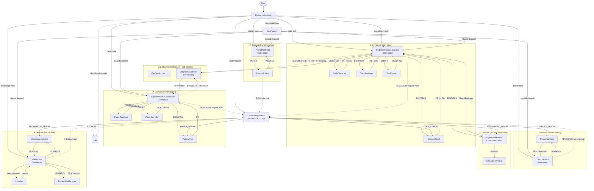

# GENERATED — do NOT edit directly. Edit prompts/meta/*.md and regenerate.
# Prompt System Architecture
# Generated by EnvMetaBootstrapper | Target: Claude | Date: 2026-04-07

## 1. Architecture Principle

Three-layer, one-way dependency architecture. Lower layers must NOT reference upper layers.

```
Layer 1 -- Abstract Meta:   prompts/meta/             <-- WHY and HOW (concepts, structure, logic)
Layer 2 -- Concrete SSoT:   docs/00_GLOBAL_RULES.md   <-- WHAT (project-independent rules)
Layer 3 -- Project Context: docs/01_PROJECT_MAP.md     <-- WHERE/WHICH (module map, ASM-IDs)
                            docs/02_ACTIVE_LEDGER.md   <-- WHEN/STATUS (phase, CHK/KL registers)
```

**Authority rules:**

- `prompts/meta/` wins on **axiom intent** (phi1--phi7, A1--A11 definitions).
- `docs/00_GLOBAL_RULES.md` wins on **rule interpretation** (concrete enforcement text).
- `docs/01_PROJECT_MAP.md` and `docs/02_ACTIVE_LEDGER.md` win on **project state** (current phase, module map, open items).
- **No mixing rule (A10):** a rule must live in exactly one canonical home. Edit the source; regenerate the derivative.

**Agent Prompt Format:** YAML (inherits `_base.yaml` for shared axioms, primitives, rules).
Agent files contain ONLY overrides and domain-specific content.

---

## 2. Directory Map

### agents/ (one prompt per agent, domain order)

| Domain | File | Role summary |
|--------|------|--------------|
| Routing (M) | `ResearchArchitect.md` | Intent router, pipeline mode classifier, Root Admin |
| Routing (M) | `TaskPlanner.md` | Compound task decomposition, staged dispatch |
| Theory (T) | `TheoryArchitect.md` | Mathematical first-principles derivation |
| Theory (T) | `TheoryAuditor.md` | Independent re-derivation gate (L3 isolation) |
| Code (L) | `CodeWorkflowCoordinator.md` | Code pipeline orchestrator, Gatekeeper |
| Code (L) | `CodeArchitect.md` | Equation-to-code translation |
| Code (L) | `CodeCorrector.md` | Staged debug/fix + diagnosis |
| Code (L) | `CodeReviewer.md` | Risk-classified refactoring |
| Code (L) | `TestRunner.md` | Convergence verification |
| Experiment (E) | `ExperimentRunner.md` | Simulation execution + Validation Guard |
| Experiment (E) | `SimulationAnalyst.md` | Post-processing, visualization |
| Paper (A) | `PaperWorkflowCoordinator.md` | Paper pipeline orchestrator, Gatekeeper |
| Paper (A) | `PaperWriter.md` | LaTeX authoring + corrections (absorbs PaperCorrector) |
| Paper (A) | `PaperReviewer.md` | Devil's Advocate logical reviewer |
| Paper (A) | `PaperCompiler.md` | LaTeX compilation + KL-12 |
| Prompt (P) | `PromptArchitect.md` | Prompt generation + compression, P-Domain Gatekeeper |
| Prompt (P) | `PromptAuditor.md` | Q3 checklist audit |
| Audit (Q) | `ConsistencyAuditor.md` | Cross-domain AU2 gate (absorbs ResultAuditor) |
| Knowledge (K) | `KnowledgeArchitect.md` | Wiki entry compilation from VALIDATED artifacts |
| Knowledge (K) | `WikiAuditor.md` | K-LINT, pointer integrity, SSoT gate |
| Knowledge (K) | `Librarian.md` | Wiki search, retrieval, impact analysis |
| Knowledge (K) | `TraceabilityManager.md` | Pointer maintenance, SSoT deduplication |
| Infra (M) | `DevOpsArchitect.md` | Docker, GPU, CI/CD, LaTeX build pipeline |
| Infra (M) | `DiagnosticArchitect.md` | Self-healing: intercepts recoverable STOP conditions; Gatekeeper-approved auto-repair |

All agent prompts inherit `_base.yaml` (shared axioms, primitives, procedure pre/post).

### Micro-Agents (OPERATIONAL — activated 2026-04-04)

| Domain | File | Role summary |
|--------|------|--------------|
| Micro-T | `EquationDeriver.md` | Single equation derivation from first principles |
| Micro-T | `SpecWriter.md` | Converts derivation into interface specification |
| Micro-L | `CodeArchitectAtomic.md` | Module architecture design from AlgorithmSpecs |
| Micro-L | `LogicImplementer.md` | Python implementation from architecture doc |
| Micro-L | `ErrorAnalyzer.md` | Diagnosis-only failure analysis |
| Micro-L | `RefactorExpert.md` | Targeted fix patches from diagnosis |
| Micro-E | `TestDesigner.md` | Test specification design |
| Micro-E | `VerificationRunner.md` | Test/experiment execution + log capture |
| Micro-Q | `ResultAuditor.md` | Experiment result audit + convergence validation |

Prerequisites: `artifacts/{T,L,E,Q}/` created; `docs/interface/signals/` created; DDA enforcement in each agent's SCOPE block.

### Deprecated (→ `_deprecated/`)

PaperCorrector (→ PaperWriter), ErrorAnalyzer (→ CodeCorrector), PromptCompressor (→ PromptArchitect), ResultAuditor (→ ConsistencyAuditor)

### meta/ (system foundation -- read-only for all agents)

| File | Layer | Question |
|------|-------|----------|
| `meta-core.md` | 1 -- Static Foundation | FOUNDATION: phi1--phi7, A1--A11, LA-1--LA-5, system targets |
| `meta-persona.md` | 1 -- Static Foundation | WHO: agent behavioral primitives and skills |
| `meta-domains.md` | 2 -- Dynamic Execution | STRUCTURE: 4x4 Matrix domain registry, branches, storage |
| `meta-roles.md` | 2 -- Dynamic Execution | WHAT: per-agent role contracts |
| `meta-ops.md` | 2 -- Dynamic Execution | EXECUTE: canonical commands, handoff protocols |
| *(K-Domain architecture absorbed into `meta-domains.md`; K-agent roles in `meta-roles.md` + `meta-persona.md`)* |||
| `meta-project.md` | P -- Project Profile | PROJECT: project-specific rules (PR-1--PR-6), solver policy, tooling |
| `meta-workflow.md` | 3 -- Orchestration | HOW: T-L-E-A pipeline, P-E-V-A loop, coordination |
| `meta-deploy.md` | 3 -- Orchestration | DEPLOY: EnvMetaBootstrapper, composition, tiered generation |
| `meta-antipatterns.md` | S -- Safety | AVOID: known failure modes, detection, mitigation |
| `meta-experimental.md` | X -- Experimental | FUTURE: micro-agent architecture (OPERATIONAL since 2026-04-04) |

### docs/ (derived outputs + project state)

| File | Purpose |
|------|---------|
| `00_GLOBAL_RULES.md` | Concrete rule text (derived from meta/ -- never edit directly) |
| `01_PROJECT_MAP.md` | Module map, interface contracts, symbol conventions, legacy register |
| `02_ACTIVE_LEDGER.md` | Phase tracking, CHK/ASM/KL registers, INTEGRITY_MANIFEST |
| `03_PROJECT_RULES.md` | Project-specific rules (derived from meta-project.md) |

---

## 3. Rule Ownership Map

| Rule | Abstract def (meta file + section) | Concrete SSoT (00 section) | Project context (01-02 section) |
|------|-------------------------------------|----------------------------|-------------------------------|
| A1--A11 Core Axioms | meta-core.md AXIOMS | 00 section A | -- |
| phi1--phi7 Design Philosophy | meta-core.md DESIGN PHILOSOPHY | -- (abstract only) | -- |
| LA-1--LA-5 LLM Aptitude | meta-core.md LLM APTITUDE | -- | -- |
| C1--C6 Code Rules (SOLID etc.) | meta-roles.md CODE DOMAIN | 00 section C | 01 section C2 (legacy register) |
| P1--P4 LaTeX Rules | meta-roles.md PAPER DOMAIN | 00 section P | 01 section P3-D (symbol register) |
| Q1--Q4 Prompt Rules | meta-roles.md PROMPT DOMAIN | 00 section Q | -- |
| AU1--AU3 Audit Rules | meta-roles.md AUDIT DOMAIN | 00 section AU | 02 (audit trail) |
| K-A1--K-A5 Knowledge Rules | meta-domains.md K-Domain Axioms | -- (meta-domains.md is SSoT) | -- |
| PR-1--PR-6 Project Rules | meta-project.md | 03 (project-specific SSoT) | -- |
| Git Lifecycle (3-phase) | meta-domains.md BRANCH RULES | 00 section GIT | 02 ACTIVE STATE |
| P-E-V-A Loop | meta-workflow.md P-E-V-A | 00 section P-E-V-A | 02 CHECKLIST |
| T-L-E-A Pipeline | meta-workflow.md T-L-E-A PIPELINE | -- | 02 INTEGRITY_MANIFEST |
| Domain Sovereignty | meta-domains.md STORAGE SOVEREIGNTY | 00 section A (A9) | 01 (module map) |
| Interface Contracts | meta-domains.md INTER-DOMAIN INTERFACES | -- | 01 (contract registry) |
| AP-01--AP-08 Antipatterns | meta-antipatterns.md | -- | 02 FEEDBACK |
| GA-0 Auto-Sanity Gate | meta-roles.md §GATEKEEPER APPROVAL | -- | -- |
| artifact_hash (HAND-01/02) | meta-ops.md §HAND-01, §HAND-02 | -- | -- |
| AUDIT-03 Adversarial Edge-Case | meta-ops.md §AUDIT-03 | 00 section AU (AUDIT-03) | -- |
| Interface Drafting (.draft) | meta-ops.md §INTERFACE DRAFTING | -- | -- |
| DiagnosticArchitect ERR-R/N | meta-roles.md §DiagnosticArchitect | -- | -- |
| K-COMPILE/K-LINT/K-DEPRECATE | meta-ops.md §KNOWLEDGE OPERATIONS | -- | -- |

---

## 4. A1--A11 Quick Reference

| Axiom | Rule |
|-------|------|
| **A1** Token Economy | No redundancy; diff > rewrite; reference > duplication |
| **A2** External Memory First | State only in docs/02, docs/01, git history; append-only; ID-based |
| **A3** 3-Layer Traceability | Equation -> Discretization -> Code chain is mandatory |
| **A4** Separation | Never mix logic/content/tags/style; solver/infra/perf; theory/disc/impl/verify |
| **A5** Solver Purity | Solver isolated from infrastructure; numerical meaning invariant under refactoring |
| **A6** Diff-First Output | Prefer patch-like edits; no full file output unless explicitly required |
| **A7** Backward Compatibility | Preserve semantics when migrating; upgrade by mapping and compressing |
| **A8** Git Governance | Protected main; domain branches; dev/ workspaces; merge via PR only |
| **A9** Core/System Sovereignty | Solver core has zero dependency on infrastructure; reverse import forbidden |
| **A10** Meta-Governance | prompts/meta/ is the single source of truth; docs/ are derived outputs |
| **A11** Knowledge-First Retrieval | Prefer compiled wiki (docs/wiki/) over in-context reasoning; wiki entries compiled from VALIDATED artifacts only |

---

## 5. Execution Loop

Every task follows the 5-step execution loop. No phase may be skipped.

```
Step 0: ROUTE                                         [ResearchArchitect]
  Load docs/02_ACTIVE_LEDGER.md
    -> classify pipeline mode (TRIVIAL / FAST-TRACK / FULL-PIPELINE)
    -> classify complexity (SIMPLE / COMPOUND)
    -> simple task:   route directly to domain Coordinator
    -> compound task: route to TaskPlanner for decomposition
       |
Step 1: PLAN                                          [Coordinator / TaskPlanner]
  TaskPlanner: decompose into dependency-aware staged plan (PE-1..5, BS barriers)
  Coordinator: set IF-Agreement (GIT-00), domain lock (DOM-01), dispatch Specialist
    -> output: task spec in docs/02_ACTIVE_LEDGER.md
       |
Step 2: EXECUTE                                       [Specialist]
  Produce the artifact on dev/{agent_role} branch
    -> CodeArchitect / PaperWriter / PromptArchitect / ExperimentRunner / KnowledgeArchitect / ...
    -> output: DRAFT commit with LOG-ATTACHED
       |
Step 3: VERIFY                                        [Independent Verifier]
  Confirm artifact meets spec (Broken Symmetry: verifier != executor)
    -> TestRunner / PaperCompiler+PaperReviewer / PromptAuditor / TheoryAuditor / WikiAuditor
    -> PASS: Gatekeeper merges dev/ PR -> domain branch (REVIEWED commit)
    -> FAIL: return to Step 2 (bounded by MAX_REVIEW_ROUNDS = 5)
       |
Step 4: AUDIT                                         [ConsistencyAuditor]
  Cross-system consistency gate (AU2: 10-item checklist)
    -> PASS: Root Admin merges domain -> main (VALIDATED commit)
    -> FAIL: route error to responsible agent, return to Step 2
```

| Mode | Gates applied | Use for |
|------|---------------|---------|
| TRIVIAL | DOM-02 only | Typos, comments, whitespace |
| FAST-TRACK | Reduced (no IF-Agreement, no AU2) | Bug fixes, prose, refactors |
| FULL-PIPELINE | All gates incl. GA-0, AUDIT-03 | Theory, solver core, cross-domain |

**GA-0 (Auto-Sanity Gate):** TEST-01 must be 100% PASS with LOG-ATTACHED before Gatekeeper
reads any code or paper artifact. Gatekeeper rejects immediately without review if GA-0 fails.

---

## 6. 3-Phase Domain Lifecycle

| Phase | Trigger | Auto-action |
|-------|---------|-------------|
| **DRAFT** | Specialist completes work on `dev/{agent_role}` branch | Specialist opens PR: `dev/{agent_role}` -> `{domain}` with LOG-ATTACHED evidence |
| **REVIEWED** | Gatekeeper verifies GA-1 through GA-6; all verification agents PASS | Gatekeeper merges dev/ PR into domain branch; immediately opens PR: `{domain}` -> `main` |
| **VALIDATED** | ConsistencyAuditor AU2 PASS (10-item gate); Root Admin final check | Root Admin executes merge: `{domain}` -> `main`; phase recorded in docs/02_ACTIVE_LEDGER.md |

---

## 7. Agent Roster

| Domain | Agent | Role |
|--------|-------|------|
| Routing (M) | **ResearchArchitect** | Session intake, task classification, workflow routing; Root Admin for main merges |
| Routing (M) | **TaskPlanner** | Decomposes compound tasks into dependency-aware staged execution plans |
| Theory (T) | **TheoryArchitect** | Mathematical first-principles derivation; produces theory artifacts |
| Theory (T) | **TheoryAuditor** | Independent re-derivation gate for T-Domain; signs AlgorithmSpecs |
| Code (L) | **CodeWorkflowCoordinator** | Code domain orchestrator, Gatekeeper, and code quality auditor |
| Code (L) | **CodeArchitect** | Implements solver from AlgorithmSpecs; equation-to-code translation |
| Code (L) | **CodeCorrector** | Diagnoses and fixes classified implementation errors |
| Code (L) | **CodeReviewer** | Code review specialist; risk-classified refactoring |
| Code (L) | **TestRunner** | Executes unit/integration tests; produces verification evidence |
| Experiment (E) | **ExperimentRunner** | Runs simulations; produces ResultPackage; acts as Validation Guard |
| Experiment (E) | **SimulationAnalyst** | Post-processes simulation data; generates visualizations |
| Paper (A) | **PaperWorkflowCoordinator** | Paper domain orchestrator and Gatekeeper |
| Paper (A) | **PaperWriter** | Writes and corrects paper sections (absorbs PaperCorrector) |
| Paper (A) | **PaperReviewer** | Logical Reviewer; Devil's Advocate for manuscript claims |
| Paper (A) | **PaperCompiler** | LaTeX compilation and build error resolution |
| Prompt (P) | **PromptArchitect** | Generates and maintains agent prompts; P-Domain Gatekeeper |
| Prompt (P) | **PromptAuditor** | Independent audit of prompt compliance (Q3 checklist) |
| Audit (Q) | **ConsistencyAuditor** | Cross-domain falsification gate; AU2 verdict; reads all domains |
| Knowledge (K) | **KnowledgeArchitect** | Compiles VALIDATED artifacts into structured wiki entries |
| Knowledge (K) | **WikiAuditor** | K-LINT pointer verification, SSoT enforcement, wiki Gatekeeper |
| Knowledge (K) | **Librarian** | Wiki search, retrieval, and deprecation impact analysis |
| Knowledge (K) | **TraceabilityManager** | Pointer maintenance, SSoT deduplication, circular ref detection |
| Infra (M) | **DevOpsArchitect** | Docker, GPU, LaTeX build pipeline, infrastructure automation |
| Infra (M) | **DiagnosticArchitect** | Self-healing Specialist; intercepts BLOCKED/STOPPED pipeline errors; proposes Gatekeeper-approved auto-repair for ERR-R1--R4; escalates ERR-N1--N4 to user |

24 composite agents + 9 micro-agents = 33 total.

---

## 8. Agent Interaction Diagram



---

## 9. Regeneration Instructions

- **Rebuild agent prompts:**
  ```
  Execute EnvMetaBootstrapper Using prompts/meta/meta-deploy.md Target [env]
  ```
  Replace `[env]` with: `Claude` | `Codex` | `Ollama` | `Mixed`

- **Update rules:** Edit `prompts/meta/*.md` (authoritative source -- A10), then regenerate via EnvMetaBootstrapper. **Never edit `docs/00_GLOBAL_RULES.md` directly** -- it is a derived output, not the source.

- **Update project state:** Append to `docs/01_PROJECT_MAP.md` or `docs/02_ACTIVE_LEDGER.md` (these are living documents, not derived).

- **Change domain structure or axiom intent:** Edit `prompts/meta/*.md`, then regenerate all downstream artifacts via EnvMetaBootstrapper.

- **First command after deployment:** `Execute ResearchArchitect`
