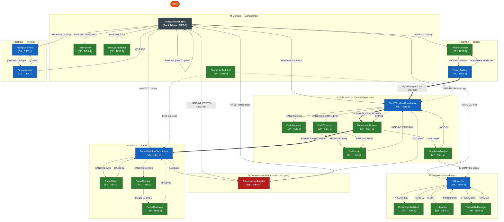

# kernel-domains.md — Domain Registry v7.0.0
# Replaces: meta-domains.md (50KB) + meta-experimental.md (15KB) → ~22KB combined.
# FOUNDATION: kernel-constitution.md §φ, §A ← READ FIRST
# Role contracts: kernel-roles.md | Operations: kernel-ops.md | Workflow: kernel-workflow.md

<meta_section id="META-DOMAINS" version="7.0.0" axiom_refs="A4,A9,phi3,phi5">
<purpose>Authoritative 4×4 domain registry. Defines branch ownership, write territories, agent membership, and DOM-02 guards. JIT-consulted when a Coordinator establishes a domain lock.</purpose>
<rules>
- MUST NOT extend 4×4 matrix outside a CHK-tracked MetaEvolutionArchitect session.
- write_territory entries are EXCLUSIVE — overlap = STOP-03 Domain Lock violation.
- MUST NOT create new top-level matrix cells — 4×4 shape is constitutional.
</rules>
</meta_section>

────────────────────────────────────────────────────────
# § 4×4 MATRIX ARCHITECTURE

## Vertical Domains (each owns one "Truth")

| ID | Domain | Truth Type | Dir | Specialist | Gatekeeper |
|----|--------|-----------|-----|------------|------------|
| T | Theory & Analysis | Mathematical | docs/memo/ | TheoryArchitect | TheoryAuditor |
| L | Core Library | Functional | src/ | CodeArchitect, CodeCorrector, TestRunner | CodeWorkflowCoordinator |
| E | Experiment | Empirical | experiment/ | ExperimentRunner | CodeWorkflowCoordinator |
| A | Academic Writing | Logical | paper/ | PaperWriter, PaperCompiler | PaperWorkflowCoordinator |

## Horizontal Domains (Governance — span all verticals)

| ID | Domain | Role | Key Agent(s) |
|----|--------|------|--------------|
| M | Meta-Logic | The Judiciary | ResearchArchitect, TaskPlanner, DiagnosticArchitect |
| P | Prompt & Environment | The Infrastructure | PromptArchitect, PromptAuditor |
| Q | QA & Audit | Internal Affairs | ConsistencyAuditor |
| K | Knowledge/Wiki | The Standard Library | KnowledgeArchitect, WikiAuditor, Librarian, TraceabilityManager |

**Sovereignty rule:** All inter-domain communication → Gatekeeper-approved Interface Contract.
**Broken Symmetry:** Gatekeeper ≠ Specialist within each domain (→ kernel-constitution.md §B).

────────────────────────────────────────────────────────
# § INTER-DOMAIN INTERFACES

| Transfer | Contract Artifact | Precondition |
|----------|-----------------|--------------|
| T → L | `docs/interface/AlgorithmSpecs.md` | TheoryAuditor PASS |
| L → E | `docs/interface/SolverAPI_vX.py` | TestRunner PASS |
| E → A | `docs/interface/ResultPackage/` | Validation Guard PASS; raw logs included |
| T/E → A | `docs/interface/TechnicalReport.md` | Both T-Auditor and Validation Guard sign |
| T → K | `docs/wiki/theory/{REF-ID}.md` | Theory Auditor PASS; VALIDATED |
| L → K | `docs/wiki/code/{REF-ID}.md` | TestRunner PASS; VALIDATED |
| E → K | `docs/wiki/experiment/{REF-ID}.md` | Validation Guard PASS; VALIDATED |
| A → K | `docs/wiki/paper/{REF-ID}.md` | Logical Reviewer PASS; VALIDATED |
| K → all | `docs/wiki/{category}/{REF-ID}.md` | WikiAuditor PASS; ACTIVE (read-only, A11) |

**Contract immutability:** Once a Specialist's dev/ branch is created from a contract, the contract
is immutable. Change → close dev/ → update contract → new IF-AGREEMENT → new dev/ branch.

────────────────────────────────────────────────────────
# § DOMAIN REGISTRY (compact format)

```yaml
domain: Routing
branch: none (stateless; reads main)
coordinator: ResearchArchitect
write: []      # NONE — strictly no-write
read: [docs/02_ACTIVE_LEDGER.md, docs/01_PROJECT_MAP.md]
lifecycle: entry point only; routes to a domain then exits

domain: T
branch: theory (sub: theory/{topic})
coordinator: TheoryAuditor (Gatekeeper)
specialists: [TheoryArchitect, CodeArchitect(discretization), PaperWriter(math formulation)]
write: [docs/memo/, docs/02_ACTIVE_LEDGER.md]
read: [paper/sections/*.tex, docs/01_PROJECT_MAP.md §6]
forbidden: [src/, experiment/, paper/sections/, prompts/meta/]
produces: docs/interface/AlgorithmSpecs.md (T→L)
rules: [A3, AU1-AU3]
lifecycle: DRAFT(Specialist formalizes) → REVIEWED(TheoryAuditor re-derives independently) → VALIDATED(AU2 PASS)
note: TheoryAuditor must derive BEFORE reading Specialist work (MH-3). Conflict → STOP.

domain: L
branch: code (sub: code/{feature})
coordinator: CodeWorkflowCoordinator (Gatekeeper)
specialists: [CodeArchitect, CodeCorrector, TestRunner]
write: [src/twophase/, tests/, docs/02_ACTIVE_LEDGER.md]
read: [paper/sections/*.tex (A3 only), docs/01_PROJECT_MAP.md, docs/interface/AlgorithmSpecs.md]
forbidden: [paper/, experiment/, prompts/meta/, docs/interface/ (without IF-COMMIT)]
consumes: docs/interface/AlgorithmSpecs.md (T→L)
produces: docs/interface/SolverAPI_vX.py (L→E)
rules: [C1-C4, PR-1..PR-6]
lifecycle: DRAFT → REVIEWED(TestRunner PASS + IF-Agreement) → VALIDATED(AU2 PASS)
note: Legacy register docs/01_PROJECT_MAP.md §C2 — must consult before removing any class.

domain: E
branch: experiment (sub: experiment/{run})
coordinator: CodeWorkflowCoordinator (orchestration); ExperimentRunner (Validation Guard)
specialists: [ExperimentRunner, SimulationAnalyst]
write: [experiment/, docs/02_ACTIVE_LEDGER.md]
read: [docs/interface/SolverAPI_vX.py, src/twophase/ (invocation only)]
forbidden: [src/, paper/, prompts/meta/]
dir_name: experiment/ — NEVER experiments/ or variants
consumes: docs/interface/SolverAPI_vX.py (L→E — requires TestRunner PASS)
produces: [docs/interface/ResultPackage/, docs/interface/TechnicalReport.md]
rules: [A3, EXP sanity checks SC-1..SC-4]
lifecycle: DRAFT(simulation runs) → REVIEWED(4 sanity checks PASS) → VALIDATED(AU2 PASS)

domain: A
branch: paper (sub: paper/{section})
coordinator: PaperWorkflowCoordinator (Gatekeeper); PaperReviewer (Logical Reviewer)
specialists: [PaperWriter, PaperCompiler]
write: [paper/sections/*.tex, paper/bibliography.bib, docs/02_ACTIVE_LEDGER.md]
read: [src/twophase/ (consistency checks via TechnicalReport.md), docs/interface/ResultPackage/, docs/interface/TechnicalReport.md]
forbidden: [src/, experiment/, prompts/meta/, docs/interface/ (without IF-COMMIT)]
consumes: [docs/interface/ResultPackage/, docs/interface/TechnicalReport.md]
rules: [P1-P4, KL-12]
lifecycle: DRAFT(PaperWriter patch) → REVIEWED(0 FATAL+MAJOR + BUILD-SUCCESS) → VALIDATED(AU2 PASS)
note: PaperReviewer derives claims independently before accepting (MH-3).

domain: M
branch: none (operates on current branch)
coordinator: ResearchArchitect (Root Admin)
specialists: [TaskPlanner, DiagnosticArchitect, DevOpsArchitect]
write: [docs/02_ACTIVE_LEDGER.md (TaskPlanner/Diagnostic), artifacts/M/]
forbidden: [src/, paper/, experiment/, prompts/meta/]
rules: [A1-A11 only — no domain-specific section]

domain: P
branch: prompt
coordinator: PromptArchitect (Gatekeeper + executor)
specialists: [PromptAuditor]
write: [prompts/agents-claude/*.md, prompts/agents-codex/*.md]
read: [prompts/meta/kernel-*.md]
forbidden: [prompts/meta/kernel-*.md (write), src/, paper/, experiment/]
rules: [Q1-Q4]
lifecycle: DRAFT(PromptArchitect generates) → REVIEWED(PromptAuditor Q3 PASS) → VALIDATED(merge)

domain: Q
branch: none (operates on calling domain's branch)
coordinator: ConsistencyAuditor (direct gate)
write: [docs/02_ACTIVE_LEDGER.md (audit trail, append-only)]
read: ALL domains — paper/, src/, docs/memo/, experiment/, docs/interface/, docs/01_PROJECT_MAP.md
forbidden: all primary artifact directories (read-only gate)
rules: [AU1-AU3, AU2 10 items, verification procedures A-E]
note: Triggers VALIDATED phase for ALL domains on AU2 PASS. Finding contradiction = high-value success.

domain: K
branch: wiki (sub: wiki/{topic})
coordinator: WikiAuditor (Gatekeeper); KnowledgeArchitect (executor)
specialists: [KnowledgeArchitect, Librarian, TraceabilityManager]
write: [docs/wiki/, docs/02_ACTIVE_LEDGER.md (compilation trail, append-only)]
read: ALL domains (compilation scope); docs/wiki/
forbidden: all primary artifact directories (write)
rules: [K-A1..K-A5, A2, A11]
lifecycle: DRAFT(KnowledgeArchitect compiles) → REVIEWED(WikiAuditor K-LINT + SSoT) → VALIDATED(WikiAuditor approves)
```

────────────────────────────────────────────────────────
# § K-DOMAIN AXIOMS (K-A1..K-A5)

**K-A1 No Unstructured Raw Text:** Direct writes to docs/wiki/ forbidden. All knowledge passes through:
Source artifact (VALIDATED) → K-COMPILE → Compiled Entry.

**K-A2 Pointer Integrity:** Every `[[REF-ID]]` MUST resolve to an existing, ACTIVE entry.
Broken reference = STOP-HARD. Maps to φ1 (Truth Before Action).

**K-A3 Single Source of Truth:** Every concept defined in exactly one wiki entry.
All other references use `[[REF-ID]]` pointers. Duplication = φ6 violation.

**K-A4 Empirical Grounding:** Every entry carries: source artifact path, git hash, domain of origin, dependent theory IDs.

**K-A5 Knowledge Mutability:** On error: transition to `DEPRECATED` or `SUPERSEDED` (never delete).
DEPRECATED retains pointer `superseded_by: [[REF-ID]]`. Status transitions trigger RE-VERIFY signals to consumers.

────────────────────────────────────────────────────────
# § WIKI ENTRY FORMAT

```yaml
WIKI-ENTRY:
  ref_id:         {e.g., WIKI-T-001}
  title:          {concise title}
  domain:         {T | L | E | A | cross-domain}
  status:         {ACTIVE | DEPRECATED | SUPERSEDED}
  superseded_by:  {[[REF-ID]] or null}
  sources:
    - path: {artifact path}
      git_hash: {short hash}
      description: {what was extracted}
  consumers:
    - domain: {domain ID}
      usage: {how used}
  depends_on: [[[REF-ID]], ...]
  compiled_by: KnowledgeArchitect
  verified_by: WikiAuditor
  compiled_at: {ISO date}
---
{structured Markdown body with [[REF-ID]] pointers}
```

Wiki directories: `docs/wiki/{theory|code|experiment|paper|cross-domain|changelog}/`
Naming: `{REF-ID}.md` — e.g., `docs/wiki/theory/WIKI-T-001.md`

────────────────────────────────────────────────────────
# § ARTIFACT & DIRECTORY CONVENTIONS

## Top-Level Map

```
src/twophase/     L-Domain — solver library (Python)
experiment/       E-Domain — scripts + results (chapter-based: ch10, ch11, ch12)
paper/            A-Domain — LaTeX manuscript (sections/, figures/, bibliography.bib)
docs/             governance (00_GLOBAL_RULES, 01_PROJECT_MAP, 02_ACTIVE_LEDGER, memo/, interface/, wiki/)
prompts/meta/     M-Domain — kernel-*.md (SSoT per A10)
prompts/agents-{env}/ P-Domain — 23 agents + _base.yaml per env
artifacts/{T,L,E,Q,M}/ micro-agent intermediates
```

## Experiment Conventions (E-Domain)

| Convention | Rule |
|-----------|------|
| Script location | `experiment/ch{N}/` — NEVER `experiments/` |
| Results | `experiment/ch{N}/results/{name}/` (NPZ data + PDF figures) |
| Graphs | **PDF ONLY** — `fig.savefig('*.pdf')` — PNG/EPS not accepted |
| Persistence | Scripts MUST save NPZ/CSV/JSON; MUST support `--plot-only` |
| Infrastructure | MUST use `twophase.experiment` toolkit (→ kernel-project.md §PR-4) |

## Branch Ownership

| Branch | Owned by | May commit | Merge target |
|--------|----------|------------|--------------|
| `main` | system | never directly | — |
| `theory` | TheoryAuditor | TheoryAuditor, CodeArchitect (on dev/) | main (Root Admin) |
| `code` | CodeWorkflowCoordinator | same | main (Root Admin) |
| `experiment` | CodeWorkflowCoordinator | same, ExperimentRunner (on dev/) | main (Root Admin) |
| `paper` | PaperWorkflowCoordinator | same | main (Root Admin) |
| `wiki` | WikiAuditor | WikiAuditor, KnowledgeArchitect (on dev/) | main (Root Admin) |
| `prompt` | PromptArchitect | PromptArchitect, PromptAuditor | main (Root Admin) |
| `dev/{agent}` | named agent | named agent only | `{domain}` (Gatekeeper PR) |

────────────────────────────────────────────────────────
# § MICRO-AGENT ARCHITECTURE (DDA Scope)

Load this section ONLY for micro-agent dispatch or atomic decomposition tasks.

## Isolation Policy

L0–L3 canonical definitions: kernel-constitution.md §B.1.
Cross-domain handoffs and AU2 MUST use L3. Intra-domain approval MAY use L1.

## Artifact-Mediated Handoff Principles

| # | Principle |
|---|-----------|
| IF-01 | No direct conversation — all data through `docs/interface/` or `artifacts/` files |
| IF-02 | HAND tokens reference artifact paths, not inline content |
| IF-03 | SIGNAL-based coordination via `docs/interface/signals/` |
| IF-04 | Once signed, artifact is read-only until new version produced |

## SIGNAL Protocol

Files in `docs/interface/signals/{domain}_{id}.signal.md`. Append-only.

| Type | Meaning | Receiver action |
|------|---------|-----------------|
| READY | Upstream artifact available | May begin work |
| BLOCKED | Cannot produce; blocker in body | Must wait |
| INVALIDATED | Previously signed artifact no longer valid | Discard cache; wait for new READY |
| COMPLETE | Domain pipeline fully done | Downstream may begin |

## Atomic Role Taxonomy (micro-agent decomposition)

```
T-Domain:
  EquationDeriver — derive equations from first principles
    READ: paper/sections/*.tex, docs/memo/ | WRITE: artifacts/T/ | CTX: ≤4000 tok
    DELIVER: artifacts/T/derivation_{id}.md (derivation + assumption register)
  SpecWriter — convert derivation to implementation-ready spec
    READ: artifacts/T/derivation_{id}.md | WRITE: docs/interface/AlgorithmSpecs.md, artifacts/T/ | CTX: ≤3000 tok
    DELIVER: artifacts/T/spec_{id}.md (symbol mapping, discretization recipe)

L-Domain:
  CodeArchitect(Atomic) — design class structures, interfaces (no method bodies)
    READ: AlgorithmSpecs.md, src/twophase/ (structure) | WRITE: artifacts/L/, src/ (interfaces only) | CTX: ≤5000 tok
    DELIVER: artifacts/L/architecture_{id}.md
  LogicImplementer — write method bodies from architecture (no class signatures)
    READ: architecture_{id}.md, AlgorithmSpecs.md, src/ (target) | WRITE: src/ (bodies only), artifacts/L/ | CTX: ≤5000 tok
    DELIVER: artifacts/L/impl_{id}.py
  ErrorAnalyzer — identify root causes from error logs (diagnose only)
    READ: tests/last_run.log, src/ (target only) | WRITE: artifacts/L/ | CTX: ≤3000 tok
    DELIVER: artifacts/L/diagnosis_{id}.md (THEORY_ERR/IMPL_ERR classification)
  RefactorExpert — apply targeted fixes from ErrorAnalyzer diagnosis
    READ: diagnosis_{id}.md, src/ (target) | WRITE: src/ (fix patches), artifacts/L/ | CTX: ≤4000 tok
    DELIVER: artifacts/L/fix_{id}.patch

E/Q-Domain:
  TestDesigner — design test cases and MMS solutions (never execute)
    READ: AlgorithmSpecs.md, src/ (API) | WRITE: tests/, artifacts/E/ | CTX: ≤4000 tok
    DELIVER: artifacts/E/test_spec_{id}.md
  VerificationRunner — execute tests; collect logs (no judgment)
    READ: tests/, src/, test_spec | WRITE: tests/last_run.log, experiment/, artifacts/E/ | CTX: ≤2000 tok
    DELIVER: artifacts/E/run_{id}.log
  ResultAuditor — audit results vs. expectations (verdicts only)
    READ: derivation_{id}.md, run_{id}.log, AlgorithmSpecs.md | WRITE: artifacts/Q/, LEDGER | CTX: ≤4000 tok
    DELIVER: artifacts/Q/audit_{id}.md (convergence table, PASS/FAIL, error routing)
```

## Branch Pattern

`dev/{domain}/{agent_id}/{task_id}` — NEVER commit to main or integration branches.
Violation → SYSTEM_PANIC (→ kernel-ops.md §STOP CONDITIONS).

## Merge Authority

| Micro-Agent | Merge Authority |
|-------------|----------------|
| EquationDeriver, SpecWriter | ConsistencyAuditor (T-Gate) |
| All L-Domain micro-agents | CodeWorkflowCoordinator |
| TestDesigner, VerificationRunner | CodeWorkflowCoordinator |
| ResultAuditor | ConsistencyAuditor |

## DDA Rules

Authorization enforced at tool-wrapper level — agents do NOT pre-check.

| Rule | Description |
|------|-------------|
| DDA-01 | READ limited to SCOPE.READ |
| DDA-02 | WRITE limited to SCOPE.WRITE |
| DDA-03 | SCOPE.FORBIDDEN path → immediate REJECT |
| DDA-04 | DDA checked before DOM-02 |
| DDA-05 | Violations logged to ACTIVE_LEDGER §AUDIT dda_violation_{date}.md |

**HAND-01-TE (Token Efficiency):** Load ONLY the artifact file from DISPATCH.inputs — not producing agent's logs or reasoning. Previous session context and intermediate files are INVISIBLE.

────────────────────────────────────────────────────────
# § AGENT INTERACTION MAP

Handoff graph and task routing for all 23 agents across 7 domains.
Included verbatim in `prompts/README.md §5b` by EnvMetaBootstrapper Stage 2c.

**Legend:**
- `-->` HAND-01/02 normal handoff
- `==>` cross-domain interface contract (signed artifact)
- `-.->` error intercept (DiagnosticArchitect)
- Node color: dark=Root Admin, blue=Gatekeeper (GK), green=Specialist (SP), red=Audit gate



**Cross-domain Interface Contract Chain (T → L → E → A → K):**

```
TheoryAuditor ══ AlgorithmSpecs.md ══► CodeWorkflowCoordinator
                                              ║
                                    SolverAPI_vX.py
                                              ║
                                       ExperimentRunner ══ ResultPackage/ ══► PaperWorkflowCoordinator
                                              ║                                         ║
                                    K-COMPILE trigger                           TechnicalReport.md
                                              ║                                         ║
                                         WikiAuditor ◄──────────────────────────────────┘
```
